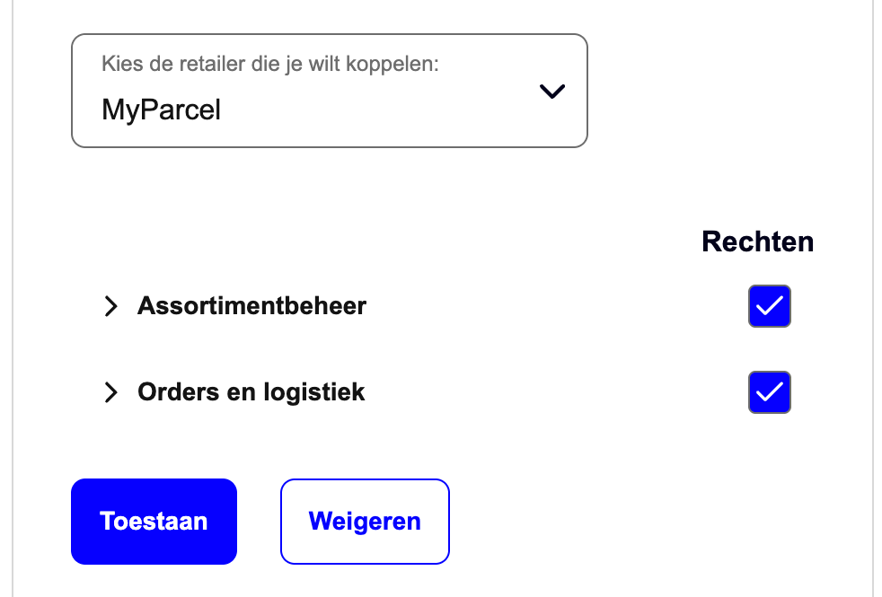
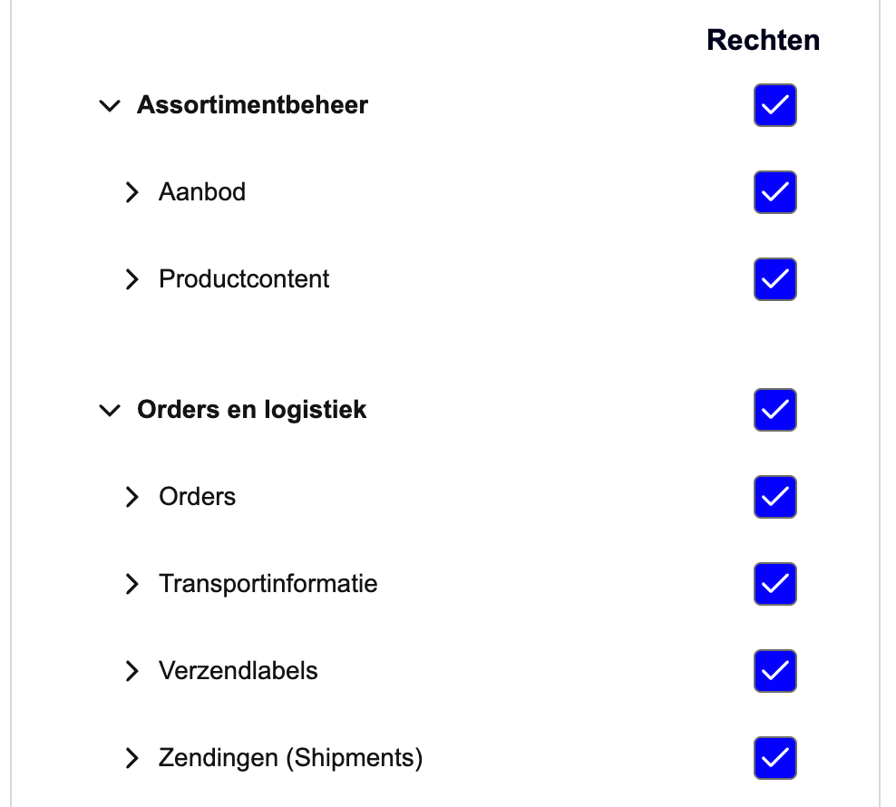

::: tip In breve
bol si collega a MyParcel tramite un **canale di vendita** (Sales channel) che crei nel backoffice MyParcel, non c'è nulla da installare. Autorizzi MyParcel una sola volta nel tuo account venditore bol. Da quel momento MyParcel importa i tuoi ordini bol aperti, restituisce il codice a barre Track & Trace e il corriere e imposta l'ordine bol su spedito. Dal **22 settembre 2026** non concedi più l'accesso all'intera API bol: autorizzi **per componente API e per diritto**. I componenti usati da MyParcel sono già selezionati, lascia invariata quella preselezione.
:::

## Avvio rapido, i tuoi primi ordini bol in 10 minuti
Abbastanza per collegare bol a MyParcel oggi stesso. Per i dettagli, vedi [Cosa stai cercando?](#cosa-stai-cercando) più sotto.

1. **Account.** Non hai ancora un account MyParcel? Creane uno su [myparcel.nl/register](https://www.myparcel.nl/register).
2. **Aggiungi il canale di vendita.** In [backoffice.myparcel.nl](https://backoffice.myparcel.nl) vai su *Shop settings → Sales Channels* → **Add sales channel** → scegli **bol** → inserisci un nome → **Save**.
3. **Avvia l'autorizzazione da MyParcel.** Apri il nuovo canale e avvia lì l'autorizzazione. Non partire mai da bol.
4. **Accedi a bol** sulla pagina a cui vieni reindirizzato e seleziona l'account bol da collegare.
5. **Lascia stare la preselezione.** Controlla i componenti API preselezionati e i loro diritti, non cambiare nulla e clicca su **Toestaan** (Consenti).
6. **Scegli come importare.** Tornato in MyParcel, imposta l'importazione su manuale o automatica e salva.

::: tip Hai finito quando vedi questo
- Il canale non chiede più l'autorizzazione e mostra l'account bol collegato.
- **MyParcel** compare nel tuo account venditore bol sotto *Authorized parties*, con una data di scadenza.
- Il pulsante **Importa ordini esterni** compare nella tua panoramica *Spedizioni* di MyParcel.
:::

## Cosa stai cercando?
| Cosa vuoi fare? | Vai a |
| --- | --- |
| Capire come funziona il collegamento | [1 · Come funziona il collegamento](#1-come-funziona-il-collegamento) |
| Sapere cosa cambia nell'autorizzazione bol | [2 · Cosa cambia nell'autorizzazione bol](#2-cosa-cambia-nellautorizzazione-bol) |
| Creare il canale di vendita | [3 · Creare il canale di vendita bol](#3-creare-il-canale-di-vendita-bol) |
| Autorizzare il collegamento | [4 · Autorizzare il collegamento passo per passo](#4-autorizzare-il-collegamento-passo-per-passo) |
| Consultare i componenti da selezionare | [5 · Quali componenti API servono a MyParcel](#5-quali-componenti-api-servono-a-myparcel) |
| Controllare o rinnovare l'autorizzazione | [6 · Controllare e rinnovare l'autorizzazione](#6-controllare-e-rinnovare-lautorizzazione) |
| Importare manualmente o automaticamente | [7 · Impostazioni di importazione](#7-impostazioni-di-importazione) |
| Impostare il tipo di collo degli ordini importati | [8 · Regole di spedizione](#8-regole-di-spedizione) |
| Gestire gli ordini ogni giorno | [9 · Uso quotidiano](#9-uso-quotidiano) |
| Qualcosa non funziona | [10 · Qualcosa non funziona, diagnostica](#10-qualcosa-non-funziona-diagnostica) |
| Risposta a una domanda frequente | [11 · FAQ](#11-faq) |

## 1 · Come funziona il collegamento
bol è un marketplace, non una piattaforma e-commerce, quindi non esiste né un plugin né un'app. Registri il tuo account venditore bol una sola volta come **canale di vendita** (Sales channel) nel backoffice MyParcel e autorizzi MyParcel nel tuo account bol. Da quel momento MyParcel dialoga per tuo conto con la **bol Retailer API**.

MyParcel recupera i tuoi ordini bol aperti e li importa come spedizioni in bozza. Crei le etichette nel tuo backoffice MyParcel. MyParcel restituisce a bol il codice a barre Track & Trace e il corriere e imposta l'ordine su spedito.

::: warning Non impostare tu gli ordini su spedito in bol
MyParcel può aggiornare solo un ordine ancora aperto. Se hai già segnato la spedizione come spedita manualmente in bol, il codice a barre e il corriere non vengono restituiti.
:::

## 2 · Cosa cambia nell'autorizzazione bol
bol ha modificato il processo di autorizzazione. Per i clienti MyParcel vale dal **22 settembre 2026**.

- **Autorizzi per componente, non per API.** Non concedi più l'accesso all'intera API bol in una volta, ma per componente API (resource) e per diritto: lettura o gestione.
- **Vale per i collegamenti nuovi e rinnovati.** Ogni nuovo collegamento SSO e ogni collegamento SSO che rinnovi passa dalla nuova schermata. I collegamenti creati prima di questa data continuano a funzionare fino alla loro data di scadenza.
- **Vedi solo ciò che MyParcel usa.** bol divide la sua API in 5 ambiti principali: *Assortimentbeheer*, *Logistiek*, *Inzichten*, *Financiën* e *Subscriptions*. La schermata mostra solo i componenti che il tuo partner di integrazione usa davvero, e quelli sono già selezionati. Lascia invariata quella preselezione.

::: warning Deselezionare rompe il collegamento
Se deselezioni un componente di cui MyParcel ha bisogno, il collegamento smette di funzionare. bol rifiuta ogni chiamata per cui manca il diritto, con un *403 Forbidden*. Non puoi aggiungere un diritto in un secondo momento: per correggere devi rifare l'intera autorizzazione.
:::

I collegamenti tramite Client Credentials non sono ancora interessati. bol prevede di applicare lo stesso cambiamento nel quarto trimestre 2026 e lo annuncerà sul partnerplatform.

## 3 · Creare il canale di vendita bol
1. Accedi a [backoffice.myparcel.nl](https://backoffice.myparcel.nl) e vai su **Shop settings → Sales Channels**.
2. Clicca su **Add sales channel** (in alto a destra).
3. Inserisci un **Name** che ti aiuti a riconoscere il canale, per esempio *Il mio negozio bol*.
4. Sotto **Type of sales channel**, scegli **bol**.
5. Clicca su **Save**. Il canale è creato e deve ancora essere autorizzato, vedi [§4](#4-autorizzare-il-collegamento-passo-per-passo).

::: tip Un account bol per negozio
Colleghi un account bol a un negozio MyParcel. Vendi tramite più account bol? Crea un negozio MyParcel in più per ciascuno.
:::

## 4 · Autorizzare il collegamento passo per passo
Segui questi 6 passaggi per creare un collegamento o per rinnovarne uno esistente.

1. **Parti da MyParcel.** Apri il canale di vendita bol nel tuo backoffice MyParcel e avvia lì l'autorizzazione. Non partire da bol, MyParcel deve essere la parte che chiede.
2. **Accedi a bol.** MyParcel ti reindirizza alla pagina di login di bol. Accedi con l'account che gestisce il tuo account venditore bol.
3. **Seleziona l'account bol giusto.** Sotto *Kies de retailer die je wilt koppelen* (Scegli il rivenditore da collegare), scegli l'account da collegare a MyParcel.
4. **Controlla i componenti preselezionati.** I componenti usati da MyParcel sono già selezionati. Hai dei dubbi? Non selezionare nulla in più e non deselezionare nulla.

5. **Controlla i diritti per componente.** Clicca sulla freccia davanti a un gruppo per espanderlo e vedere i singoli componenti e i loro diritti: lettura, solo recuperare dati, oppure gestione, anche creare, modificare ed eliminare. Confrontali con [§5](#5-quali-componenti-api-servono-a-myparcel). L'icona di informazione accanto a un componente spiega cosa copre.

6. **Salva e controlla.** Clicca su **Toestaan** (Consenti) per salvare l'autorizzazione. Torni in MyParcel. Importa un ordine per verificare che il collegamento funzioni, vedi [§9](#9-uso-quotidiano).

## 5 · Quali componenti API servono a MyParcel
Questi sono i componenti della bol Retailer API usati dal collegamento MyParcel. Tutti gli altri componenti sono disattivati di default e non servono.

| Componente API | Mostrato in bol come | Diritti |
| --- | --- | --- |
| Assortment Management → Offers | *Assortimentbeheer → Aanbod* | Read e Read and Write |
| Assortment Management → Product Content | *Assortimentbeheer → Productcontent* | Read |
| Orders and logistics → Orders | *Orders en logistiek → Orders* | Read e Read and Write |
| Orders and logistics → Shipments | *Orders en logistiek → Zendingen* | Read e Read and Write |
| Orders and logistics → Shipping labels | *Orders en logistiek → Verzendlabels* | Read e Read and Write |
| Orders and logistics → Transport Information | *Orders en logistiek → Transportinformatie* | Read and Write |

I nomi mostrati da bol dipendono dalla lingua del tuo account bol. I nomi inglesi sono quelli che bol usa nella documentazione della Retailer API.

## 6 · Controllare e rinnovare l'autorizzazione
Ogni autorizzazione ha una data di scadenza. Controlli entrambe nel tuo account venditore bol tramite **Instellingen → Diensten → API-instellingen → Authorized parties** (Impostazioni → Servizi → Impostazioni API). MyParcel compare lì con la sua data di scadenza non appena il collegamento è attivo.

- **Rinnova in tempo.** Rinnova entro 2 mesi prima della data di scadenza, così il collegamento non si ferma mai in un giorno di spedizione.
- **Il rinnovo segue lo stesso percorso.** Parti da MyParcel e segui i 6 passaggi del [§4](#4-autorizzare-il-collegamento-passo-per-passo). Trattandosi di un rinnovo, ottieni la nuova schermata di autorizzazione con i componenti e i diritti.
- **I collegamenti esistenti continuano a funzionare.** Un collegamento creato prima del 22 settembre 2026 resta attivo fino alla data di scadenza. Da quel momento lo rinnovi con il nuovo processo.

## 7 · Impostazioni di importazione
Apri il canale di vendita bol nel tuo backoffice MyParcel per scegliere come arrivano gli ordini.

- **Handmatig** (Manuale), recuperi tu stesso i tuoi ordini bol aperti, vedi [§9](#9-uso-quotidiano).
- **Automatisch** (Automatico), MyParcel recupera i nuovi ordini aperti ogni 5 minuti.

::: tip Non dimenticare di salvare
Clicca su **Save** dopo aver modificato l'impostazione di importazione, altrimenti la modifica non viene applicata.
:::

Anche con l'importazione automatica attiva puoi sempre recuperare gli ordini manualmente.

## 8 · Regole di spedizione
Gli ordini bol importati seguono le regole di spedizione del tuo account MyParcel, quindi impostale prima della tua prima importazione. Vai su **Shop settings → Shipments → Shipping rules** e scegli un tipo di collo di default più le eventuali opzioni di consegna.

Ogni importazione usa queste regole. Non puoi indicare una preferenza di collo per singolo ordine durante l'importazione, ma puoi modificare una spedizione in seguito, vedi [§9](#9-uso-quotidiano).

## 9 · Uso quotidiano
Una volta autorizzato il canale, il pulsante **Importa ordini esterni** compare nella tua panoramica *Spedizioni*.

1. Clicca su **Importa ordini esterni** per vedere i tuoi ordini bol aperti. Hai più collegamenti esterni? Passa dall'uno all'altro con le schede.
2. Importa gli ordini singolarmente o in blocco.
3. Gli ordini importati arrivano come **spedizioni in bozza**. Clicca sulla matita accanto a una spedizione per modificarla.
4. Crea le etichette e consegna i colli al corriere. MyParcel restituisce a bol il codice a barre e il corriere e imposta l'ordine su spedito.

::: warning Modifica in MyParcel, non in bol
Non modificare un ordine nel portale bol prima di importarlo. I dati dell'ordine rischiano di arrivare errati e il codice a barre non viene restituito a bol durante l'elaborazione.
:::

Ti viene addebitato solo quando la spedizione viene effettivamente consegnata al corriere.

## 10 · Qualcosa non funziona, diagnostica
Scorri questa tabella dall'alto verso il basso, la maggior parte dei problemi si risolve in pochi minuti.

| Sintomo | Cosa controllare |
| --- | --- |
| **Il canale continua a chiedere l'autorizzazione** | L'autorizzazione non è stata completata. Riavviala da MyParcel e concludi con **Toestaan** ([§4](#4-autorizzare-il-collegamento-passo-per-passo)). |
| **Non viene importato alcun ordine** | Ci sono ordini aperti in bol? Verifica che il collegamento sia ancora elencato sotto *Authorized parties* nel tuo account bol e che non sia scaduto ([§6](#6-controllare-e-rinnovare-lautorizzazione)). |
| **Gli ordini arrivano, ma il codice a barre non viene restituito** | L'ordine è stato impostato su spedito manualmente in bol. MyParcel può aggiornare solo gli ordini ancora aperti ([§1](#1-come-funziona-il-collegamento)). |
| **Una parte del collegamento non funziona più** | Durante l'autorizzazione è stato deselezionato un componente, bol rifiuta quelle chiamate con un *403 Forbidden*. Confronta i tuoi diritti con [§5](#5-quali-componenti-api-servono-a-myparcel) e rifai l'autorizzazione, aggiungere un diritto in seguito non è possibile. |
| **Il collegamento si è fermato a una data fissa** | L'autorizzazione è scaduta. Rinnovala e controlla la data di scadenza sotto *Authorized parties* ([§6](#6-controllare-e-rinnovare-lautorizzazione)). |
| **Hai scelto l'account bol sbagliato** | Rifai l'autorizzazione da MyParcel e seleziona il rivenditore giusto al passaggio 3 ([§4](#4-autorizzare-il-collegamento-passo-per-passo)). |
| **Tipo di collo errato sugli ordini importati** | Gli ordini importati seguono le tue regole di spedizione. Modificale in *Shop settings → Shipments → Shipping rules* ([§8](#8-regole-di-spedizione)), oppure cambia la spedizione prima di elaborarla. |

## 11 · FAQ

### Devo rifare subito l'autorizzazione?
No. Un collegamento creato prima del 22 settembre 2026 continua a funzionare fino alla data di scadenza. Vedrai la nuova schermata la prima volta che crei o rinnovi un collegamento dopo quella data.

### Cosa succede se deseleziono un componente?
Le parti del collegamento che ne hanno bisogno smettono di funzionare. Un diritto non può essere aggiunto in seguito, quindi rifai l'intera autorizzazione da MyParcel e lascia invariata la preselezione ([§4](#4-autorizzare-il-collegamento-passo-per-passo)).

### Vale anche per Client Credentials?
Non ancora. I collegamenti tramite Client Credentials restano fuori da questo cambiamento. bol prevede di applicarlo anche lì nel quarto trimestre 2026 e lo annuncerà sul partnerplatform.

### Dove vedo quali parti hanno accesso al mio account bol?
Nel tuo account venditore bol tramite *Instellingen → Diensten → API-instellingen → Authorized parties*. Lì trovi anche la data di scadenza di ogni autorizzazione ([§6](#6-controllare-e-rinnovare-lautorizzazione)).

### Posso revocare l'autorizzazione?
Sì. Apri il canale di vendita bol nel tuo backoffice MyParcel e revoca lì l'autorizzazione. Puoi anche rimuovere MyParcel sotto *Authorized parties* nel tuo account bol.

### Con quale frequenza recuperate i nuovi ordini?
Con l'importazione automatica attiva, ogni 5 minuti. Puoi comunque recuperare gli ordini manualmente in qualsiasi momento ([§7](#7-impostazioni-di-importazione)).

### Posso collegare più account bol a MyParcel?
Colleghi un account bol a un negozio MyParcel. Crea un negozio in più per un account bol in più.

### Restituite il codice a barre a bol?
Sì. Dopo la creazione dell'etichetta, MyParcel restituisce a bol il codice a barre e il corriere e imposta l'ordine su spedito.

### Posso indicare una preferenza di collo per ordine prima dell'importazione?
No. Ogni importazione usa le tue regole di spedizione ([§8](#8-regole-di-spedizione)). Modifica la spedizione dopo l'importazione se un collo richiede qualcosa di diverso.

## Risorse e supporto
- [backoffice.myparcel.nl ↗](https://backoffice.myparcel.nl), canali di vendita, regole di spedizione, account, fatturazione.
- [partnerplatform bol ↗](https://partnerplatform.bol.com/nl/intermediair/myparcel/), MyParcel sul partnerplatform di bol.
- [Il nuovo processo di autorizzazione di bol ↗](https://partnerplatform.bol.com/nl/nadp/reboarding-api), la guida passo passo di bol per creare e rinnovare un collegamento.
- [Improved API authorization for SSO integrations ↗](https://developers.bol.com/en/news/improved-api-authorization-for-sso-integrations/), l'annuncio per gli sviluppatori.
- [Contatta il supporto MyParcel](../../contact.md), **023 - 30 30 315** · [info@myparcel.nl](mailto:info@myparcel.nl).

Questa guida descrive il canale di vendita bol nel backoffice MyParcel e l'autorizzazione bol così come funziona dal 22 settembre 2026. Le schermate dal lato bol possono apparire leggermente diverse a seconda della lingua dell'account.
