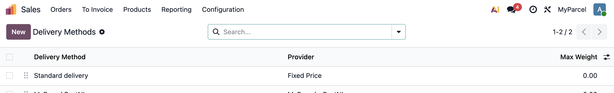
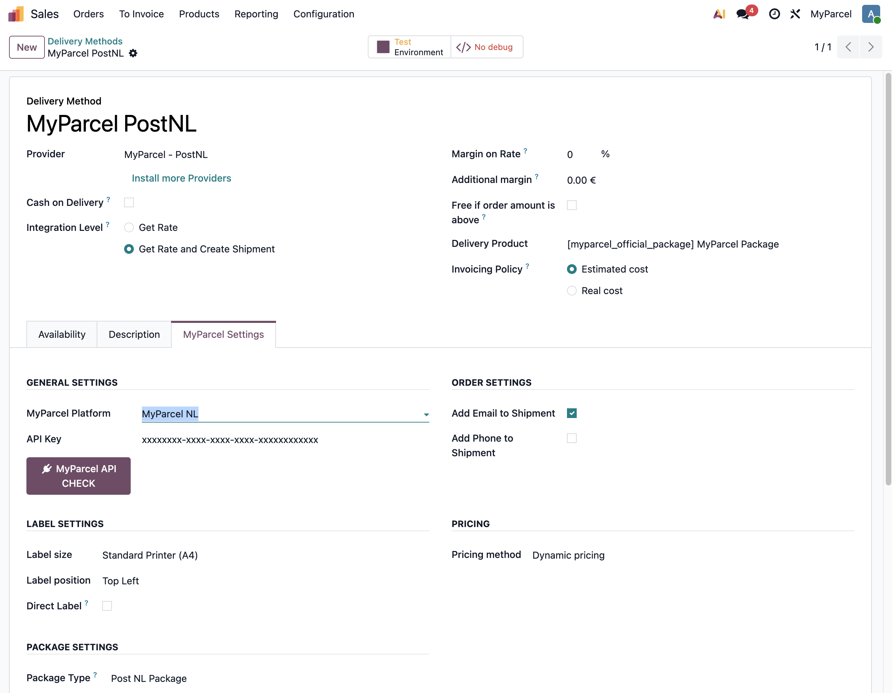
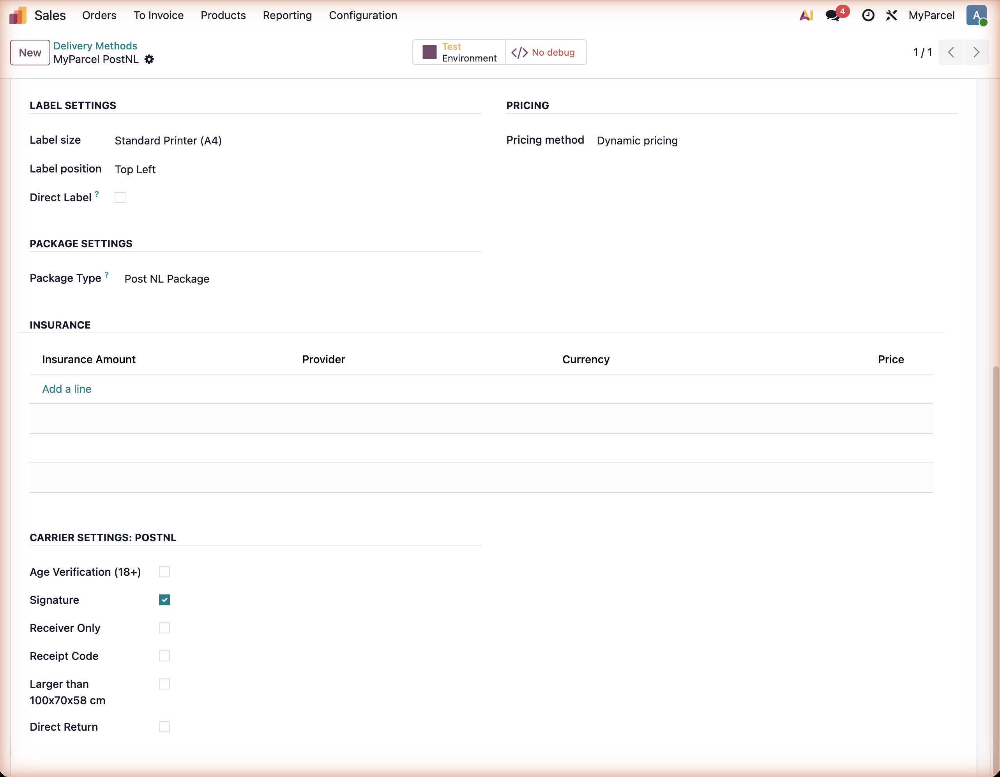
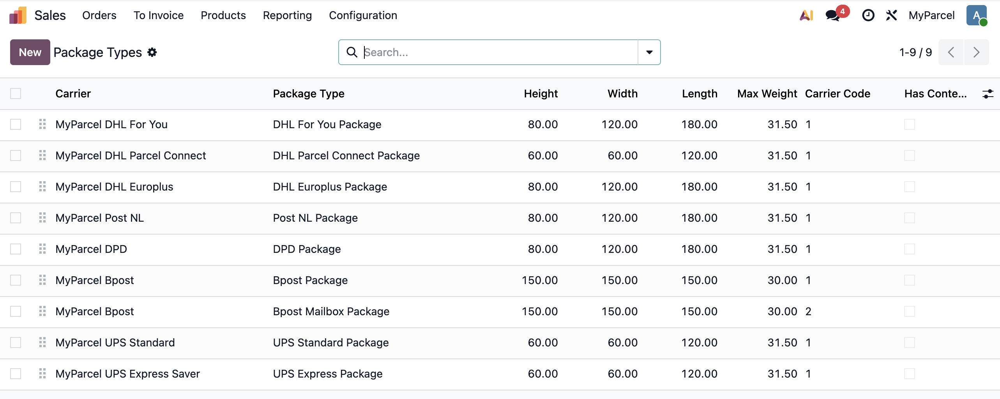
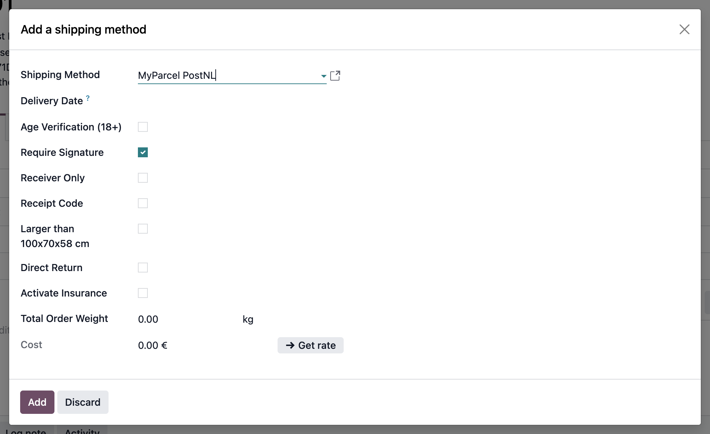
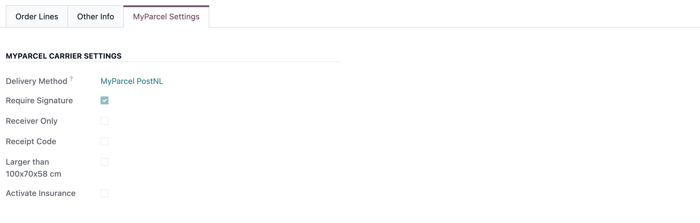
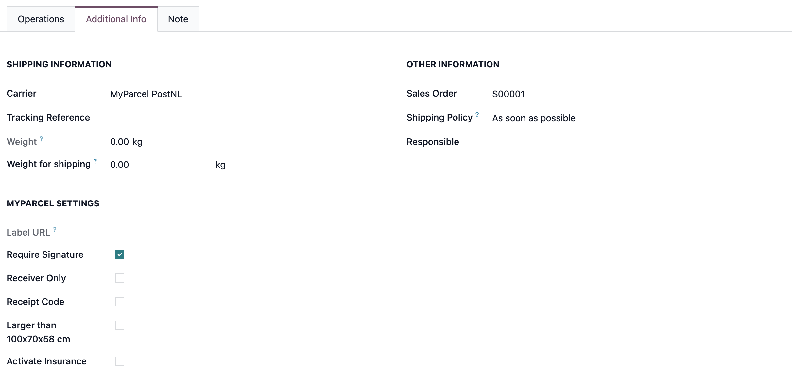

::: tip In breve
L'app MyParcel Shipping collega il tuo database Odoo a MyParcel. Crei un metodo di spedizione per ogni vettore, scegli le opzioni sull'ordine di vendita e, quando convalidi la consegna, Odoo crea la spedizione su MyParcel e recupera l'etichetta e il Track & Trace. Tutto avviene nelle schermate standard **Sales** e **Inventory**, senza scrivere codice.
:::

::: tip Sulle schermate
Le immagini mostrano l'interfaccia Odoo in inglese. Se il tuo Odoo è in italiano vedrai gli stessi campi con i nomi tradotti, ad esempio *Impostazioni MyParcel* al posto di **MyParcel Settings**.
:::

## Avvio rapido, il tuo primo pacco in 15 minuti
Quanto basta per spedire oggi il tuo primo ordine reale. Per una configurazione più approfondita vedi [Cosa stai cercando?](#cosa-stai-cercando) qui sotto.

1. **Recupera la tua API key.** Accedi a [backoffice.myparcel.com](https://backoffice.myparcel.com), vai su *Impostazioni negozio → Integrazioni* e copia la tua API key.
2. **Installa l'app.** In Odoo apri **Apps**, cerca *MyParcel Shipping* e clicca su **Activate**.
3. **Crea un metodo di spedizione.** Vai su **Sales → Configuration → Delivery Methods → New**. Dagli un nome, scegli un **Provider** come *MyParcel - PostNL* e imposta **Integration Level** su *Get Rate and Create Shipment*.
4. **Collega il tuo account.** Apri la scheda **MyParcel Settings**, scegli la **MyParcel Platform**, incolla la tua **API Key**, scegli un **Package Type** e clicca su **MyParcel API CHECK**.
5. **Spedisci un ordine.** Su un ordine di vendita clicca su **Add shipping**, scegli il tuo metodo MyParcel, clicca su **Get rate** e poi su **Add**. Conferma l'ordine, apri la consegna e clicca su **Validate**.

::: tip Hai finito quando vedi questo
- **MyParcel API CHECK** risponde *Connection Successful*
- Il tuo metodo compare nella finestra **Add shipping** con sotto le opzioni MyParcel
- Dopo aver convalidato la consegna, **Tracking Reference** e **Label URL** sono compilati nella scheda **Additional Info**
:::

## Cosa stai cercando?
| Cosa vuoi fare? | Vai a |
| --- | --- |
| Configurazione iniziale | [Avvio rapido](#avvio-rapido-il-tuo-primo-pacco-in-15-minuti) |
| Installare l'app | [2 · Installare l'app](#2-installare-lapp) |
| Creare un metodo per ogni vettore | [3 · Creare un metodo di spedizione](#3-creare-un-metodo-di-spedizione) |
| Inserire o testare l'API key | [4 · Impostazioni · Generali e ordini](#4-impostazioni-generali-e-ordini) |
| Scegliere tra etichette A4 e A6 | [5 · Impostazioni · Etichette](#5-impostazioni-etichette) |
| Decidere come calcolare le spese di spedizione | [6 · Impostazioni · Prezzi](#6-impostazioni-prezzi) |
| Impostare tipo di collo e assicurazione | [7 · Impostazioni · Tipo di collo e assicurazione](#7-impostazioni-tipo-di-collo-e-assicurazione) |
| Impostare le opzioni predefinite per vettore | [8 · Impostazioni · Opzioni per vettore](#8-impostazioni-opzioni-per-vettore) |
| Vedere quali opzioni supporta un vettore | [9 · Cosa supporta ogni vettore](#9-cosa-supporta-ogni-vettore) |
| Inserire i dati doganali sui prodotti | [10 · Impostazioni prodotto](#10-impostazioni-prodotto) |
| Modificare le opzioni di un singolo ordine | [11 · Opzioni di spedizione per ordine](#11-opzioni-di-spedizione-per-ordine) |
| Stampare un'etichetta e trovare il Track & Trace | [12 · La consegna, l'etichetta e il Track & Trace](#12-la-consegna-letichetta-e-il-track-trace) |
| Qualcosa non funziona | [14 · Qualcosa non funziona, diagnostica](#14-qualcosa-non-funziona-diagnostica) |
| Risposta a una domanda frequente | [15 · Domande frequenti](#15-domande-frequenti) |

## 1 · Preparare il tuo account MyParcel
Prima di iniziare in Odoo, sistema tre cose nel tuo backoffice MyParcel:

1. **Indirizzo di fatturazione e di reso**, in *Impostazioni negozio → Generale*. Compare su ogni etichetta.
2. **Attiva i tuoi vettori**, in *Impostazioni negozio → Vettori*. Puoi spedire solo con i vettori attivi sul tuo account.
3. **Copia la tua API key**, in *Impostazioni negozio → Integrazioni*. Serve una key per ogni negozio.

Ti serve inoltre un database Odoo con **Inventory** e **Sales** installati, e un utente con diritti di amministratore per accedere alle schermate di configurazione.

## 2 · Installare l'app
1. Apri **Apps** dalla schermata iniziale di Odoo.
2. Cerca **MyParcel Shipping** e clicca su **Activate**.
3. Odoo installa l'app insieme a **Inventory** e alle funzioni di spedizione necessarie.

L'app aggiunge una scheda **MyParcel Settings** ai metodi di spedizione, agli ordini di vendita e alle consegne, e crea un tipo di collo per ogni vettore.

::: tip Passare dal modulo precedente
Se in passato usavi il modulo `delivery_myparcel`, l'app attuale lo sostituisce con il nome `delivery_myparcel_official`. Segui i passaggi di migrazione nel changelog dell'app prima di installare, così i metodi di spedizione esistenti continuano a funzionare.
:::

## 3 · Creare un metodo di spedizione
Crei **un metodo di spedizione per ogni vettore**. Un metodo chiamato *MyParcel PostNL* spedisce con PostNL, un secondo metodo spedisce con DHL, e così via.

Vai su **Sales → Configuration → Delivery Methods** e clicca su **New**.

Compila la parte alta del modulo:

| Campo | Cosa impostare |
| --- | --- |
| **Delivery Method** | Il nome che il tuo team vede sugli ordini, ad esempio *MyParcel PostNL*. |
| **Provider** | Il vettore MyParcel, ad esempio *MyParcel - PostNL*. Questa scelta determina quali opzioni compaiono più in basso. |
| **Integration Level** | *Get Rate and Create Shipment*. Con il solo *Get Rate*, Odoo chiede il prezzo a MyParcel ma non crea mai la spedizione né l'etichetta. |
| **Delivery Product** | Lascia *MyParcel Package*. È il prodotto che Odoo aggiunge all'ordine per addebitare la spedizione. |
| **Invoicing Policy** | *Estimated cost* addebita il prezzo mostrato sull'ordine. *Real cost* addebita quanto la spedizione è costata davvero. |

Nella scheda **Availability** decidi per quali ordini vale un metodo, per paese, prefisso CAP, peso o volume. È il comportamento standard di Odoo e funziona allo stesso modo per i metodi MyParcel.

## 4 · Impostazioni · Generali e ordini
Apri la scheda **MyParcel Settings** sul metodo di spedizione.

| Impostazione | Cosa fa |
| --- | --- |
| **MyParcel Platform** | *MyParcel NL* per un account myparcel.nl, *MyParcel BE* per un account SendMyParcel. Determina anche quali opzioni di spedizione puoi usare, alcune esistono su una sola piattaforma. |
| **API Key** | La key dal tuo backoffice MyParcel. Incollala qui e salva. |
| **MyParcel API CHECK** | Verifica la connessione. *Connection Successful* significa che la key funziona, *Connection Error* che devi controllarla. |
| **Add Email to Shipment** | Invia l'indirizzo email del cliente insieme alla spedizione, così MyParcel può mandare il Track & Trace. Attivalo se vuoi che il cliente riceva la notifica. L'indirizzo diventa obbligatorio su ogni ordine con questo metodo. |
| **Add Phone to Shipment** | Invia il numero di telefono del cliente. Alcuni vettori e tipi di consegna lo richiedono. Il numero diventa obbligatorio su ogni ordine con questo metodo. |

::: warning Obbligatori appena li attivi
**Add Email to Shipment** e **Add Phone to Shipment** rendono quei campi obbligatori. Un ordine senza email o numero di telefono si blocca con un messaggio chiaro quando provi a spedirlo.
:::

## 5 · Impostazioni · Etichette
| Impostazione | Cosa fa | Consigliato |
| --- | --- | --- |
| **Label size** | *Standard Printer (A4)* mette fino a quattro etichette su un foglio A4. *Labelprinter (A6)* stampa un'etichetta per adesivo. | A6 se hai una stampante per etichette |
| **Label position** | In quale quarto del foglio A4 finisce la prima etichetta, da *Top Left* a *Bottom Right*. Visibile solo con A4. | Top Left |
| **Direct Label** | Se attivo, Odoo recupera l'etichetta e il codice Track & Trace non appena la spedizione viene creata, e allega il PDF alla consegna. Se disattivo, la spedizione viene creata ma l'etichetta la recuperi tu dopo. | Attivo |

## 6 · Impostazioni · Prezzi
| Impostazione | Cosa fa |
| --- | --- |
| **Pricing method** | *Dynamic pricing* chiede a MyParcel quanto costa esattamente questa spedizione e mette quell'importo sull'ordine. *Fixed Price* addebita un importo che decidi tu. |
| **Fixed Price** | Il prezzo di spedizione che applichi. Visibile solo quando Pricing method è *Fixed Price*. |

Con **Fixed Price** puoi anche applicare un supplemento per ogni opzione. Accanto a ogni opzione attivata in [Opzioni per vettore](#8-impostazioni-opzioni-per-vettore) compare un campo prezzo, ad esempio *Age Verification Price (18+)* o *Signature Price*, e quegli importi si sommano al prezzo fisso.

::: tip Come funziona il prezzo dinamico
Per indicare un prezzo reale, MyParcel crea brevemente la spedizione, ne legge il prezzo e la rimuove. Non viene spedito nulla e quella verifica non comporta alcun addebito.
:::

## 7 · Impostazioni · Tipo di collo e assicurazione

**Package Type** è obbligatorio. Ogni vettore ha i propri tipi di collo e l'elenco propone solo quelli del provider scelto. Li trovi tutti in **Inventory → Configuration → Package Types**.

Sotto **Insurance** costruisci il tuo listino. Aggiungi una riga per ogni valore assicurato che vuoi offrire e indica quanto lo fai pagare:

- **Insurance Amount** è il valore assicurato in euro: 85, 100, 250, 500, 1000, 1500, 2000, 2500, 3000, 3500, 4000, 4500 o 5000.
- **Price** è quanto addebiti al cliente per quella copertura.

Lascia l'elenco vuoto se non offri assicurazione. Il tuo team sceglie un importo da questo elenco direttamente sull'ordine.

## 8 · Impostazioni · Opzioni per vettore
Il blocco finale, **Carrier settings**, definisce le opzioni **predefinite** per ogni spedizione con questo metodo. Il tuo team può comunque modificarle per singolo ordine.

| Opzione | Cosa fa |
| --- | --- |
| **Age Verification (18+)** | Il vettore controlla il documento del destinatario e consegna solo a chi ha almeno 18 anni. Usala per alcolici, tabacco o altri articoli soggetti a limiti di età. |
| **Signature** | Il vettore richiede una firma alla consegna. Utile per ordini di valore. |
| **Receiver Only** | Il pacco va solo al destinatario, non a un vicino. |
| **Receipt Code** | Il destinatario ha bisogno di un codice per ritirare il pacco. Solo PostNL, per indirizzi olandesi e belgi, e solo insieme all'assicurazione. |
| **Larger than 100x70x58 cm** | Segna il pacco come fuori misura. Solo PostNL, per indirizzi europei. |
| **Direct Return** | Aggiunge un'etichetta di reso così il cliente può rispedire subito l'ordine. Solo PostNL su MyParcel NL. |
| **Hide Sender** | Lascia i tuoi dati fuori dall'etichetta, ad esempio se spedisci per conto di qualcun altro. Solo DHL For You e DHL Europlus. |
| **Same-day Delivery** | Offre la consegna in giornata. Solo DHL For You. |

::: warning Combinazioni che PostNL non consente
**Receipt Code** non si può combinare con Age Verification, Signature o Receiver Only, e richiede sempre l'assicurazione. Fuori da Paesi Bassi e Belgio anche **Signature** richiede l'assicurazione. Odoo blocca la combinazione con un messaggio prima che la spedizione parta.
:::

## 9 · Cosa supporta ogni vettore
Non tutti i vettori offrono tutte le opzioni, e alcune esistono su una sola piattaforma. Ecco cosa puoi usare per vettore:

| Vettore | 18+ | Firma | Solo destinatario | Codice di ritiro | Fuori misura | Reso diretto | Nascondi mittente | Assicurazione |
| --- | --- | --- | --- | --- | --- | --- | --- | --- |
| **PostNL** | solo NL | sì | sì | NL e BE | solo UE | solo NL | no | sì |
| **DHL For You** | solo NL | sì | sì | no | no | no | sì | sì |
| **DHL Europlus** | no | sì | no | no | no | no | sì | sì |
| **DHL Parcel Connect** | no | no | no | no | no | no | no | sì |
| **DPD** | no | no | no | no | no | no | no | no |
| **Bpost** | no | sì | no | no | no | no | no | no |
| **UPS Standard** | solo NL | sì | sì | no | no | no | no | sì |
| **UPS Express Saver** | solo NL | sì | sì | no | no | no | no | sì |

*Solo NL* significa che l'opzione compare quando **MyParcel Platform** è impostata su *MyParcel NL*. Su un metodo *MyParcel BE* quelle opzioni sono nascoste.

## 10 · Impostazioni prodotto
L'app non aggiunge campi MyParcel alla schermata prodotto. Tutto il comportamento di spedizione si governa dal metodo di spedizione (vedi [4 · Impostazioni · Generali e ordini](#4-impostazioni-generali-e-ordini)) e dall'ordine stesso.

Tre campi prodotto standard di Odoo contano però, perché MyParcel li usa:

| Campo | Dove | Perché è importante |
| --- | --- | --- |
| **Weight** | Prodotto → scheda *Inventory* | Determina il prezzo di spedizione e quale tipo di collo è adatto. Senza peso l'app ripiega su un minimo di 10 grammi, rendendo i preventivi poco realistici. |
| **HS Code** | Prodotto → scheda *Accounting* o *Purchase* | Obbligatorio per spedizioni fuori dall'UE. Deve avere 6, 8 o 10 cifre, e per gli Stati Uniti sono obbligatorie 10 cifre. |
| **Country of Origin** | Accanto all'HS Code | Obbligatorio per spedizioni fuori dall'UE, finisce sulla dichiarazione doganale. |

Per ordini all'interno dell'UE puoi lasciare HS Code e Country of Origin vuoti.

## 11 · Opzioni di spedizione per ordine
Su un ordine di vendita clicca su **Add shipping** sotto i totali. Scegli il tuo metodo MyParcel e compaiono le opzioni per questa spedizione.

1. Scegli lo **Shipping Method**. L'elenco delle opzioni si adatta al vettore.
2. Imposta la **Delivery Date**. PostNL la richiede, gli altri vettori no.
3. Spunta le opzioni che vuoi per questo ordine. Partono dai valori predefiniti del metodo di spedizione.
4. Spunta **Activate Insurance** e scegli un importo se vuoi assicurare il pacco.
5. Clicca su **Get rate** per recuperare il prezzo reale, poi su **Add** per aggiungere la riga di spedizione all'ordine.

Una volta che il metodo è sull'ordine, una scheda **MyParcel Settings** mostra cosa è stato scelto. È in sola lettura, usa **Update shipping cost** o rimuovi la riga di spedizione se devi cambiare qualcosa.

::: tip Aggiungere la spedizione senza prezzo
Se clicchi su **Add** senza recuperare una tariffa, Odoo chiede se la consegna debba davvero essere gratuita. Va bene se applichi un prezzo fisso o spedisci gratis, la spedizione viene comunque creata normalmente.
:::

## 12 · La consegna, l'etichetta e il Track & Trace
Confermando l'ordine di vendita, Odoo crea una consegna. Aprila dal pulsante **Delivery** sull'ordine.

Tutto ciò che riguarda MyParcel si trova nella scheda **Additional Info**, sotto **MyParcel Settings**. Puoi ancora modificare le opzioni qui, fino al momento in cui convalidi.

Clicca su **Validate** quando il pacco è pronto. Odoo allora:

1. Crea la spedizione su MyParcel con le opzioni di questa consegna.
2. Recupera l'etichetta PDF e la allega alla consegna come `LabelMyParcel.pdf`, se **Direct Label** è attivo.
3. Compila **Tracking Reference** e **Label URL**, e salva il link Track & Trace.

La pagina Track & Trace per il tuo cliente si trova su `myparcel.me/track-trace`, e Odoo costruisce il link a partire dal barcode, dal CAP e dal paese.

::: tip Più colli per un ordine PostNL
PostNL supporta il multicollo. Quando una spedizione viene divisa in più colli, Odoo somma i prezzi di tutti e tiene le etichette insieme sulla stessa consegna.
:::

## 13 · Uso quotidiano
Una giornata tipo di spedizioni:

1. Apri **Sales → Orders** e conferma gli ordini che stai per spedire.
2. Controlla su ogni ordine il metodo di spedizione e le opzioni, e correggili dove un cliente ha chiesto qualcosa di specifico.
3. Apri **Inventory → Delivery Orders**, imballa la merce e usa **Put in Pack** se spedisci più colli.
4. Clicca su **Validate**. La spedizione viene creata e l'etichetta allegata.
5. Stampa le etichette dall'allegato di ogni consegna e consegna i pacchi al vettore.

## 14 · Qualcosa non funziona, diagnostica
| Sintomo | Causa probabile e soluzione |
| --- | --- |
| **Toegang geweigerd / Access Denied** | L'API key è sbagliata, scaduta o appartiene a un altro account MyParcel. Ricopiala da *Impostazioni negozio → Integrazioni* e verifica con **MyParcel API CHECK**. |
| **MyParcel API CHECK segnala Connection Error** | Stessa causa. Controlla di aver incollato la key intera, senza spazi. |
| **Street number not found in street field** | Il numero civico deve stare in fondo al campo **Street**, oppure in **Street 2** per indirizzi non belgi. Correggi l'indirizzo di consegna sul contatto. |
| **State is required for creating a shipment** | Odoo richiede una provincia o regione per ogni indirizzo fuori dal Belgio. Compilala sul contatto. |
| **City / Postal code / Recipient name is required** | L'indirizzo di consegna è incompleto. Completalo sul contatto, non solo sull'ordine. |
| **Email address is required** | **Add Email to Shipment** è attivo per questo metodo, ma il contatto non ha un indirizzo email. Aggiungilo, oppure disattiva l'impostazione. |
| **Phone number is required** | Lo stesso, per **Add Phone to Shipment**. |
| **Invalid email address provided** | L'indirizzo email del contatto non è valido. Correggilo sul contatto. |
| **The HS Code does not have the correct amount of digits** | I codici HS devono avere 6, 8 o 10 cifre, e per gli Stati Uniti sono obbligatorie 10 cifre. Correggi il codice sul prodotto. |
| **No country of origin found for this product** | Imposta **Country of Origin** su ogni prodotto di una spedizione che lascia l'UE. |
| **Package type needed for MyParcel carriers** | **Package Type** è vuoto sul metodo di spedizione. Scegline uno nella scheda MyParcel Settings. |
| **Receipt code can not be selected with any other option** | Il codice di ritiro funziona solo da solo, e solo insieme all'assicurazione. Disattiva le altre opzioni. |
| **This delivery method is not available as no shipment ID was found** | L'indirizzo o la combinazione di opzioni scelta è stata rifiutata da MyParcel. Controlla l'indirizzo di consegna e disattiva le opzioni una per una. |
| **Un nuovo metodo chiede campi MyParcel che non servono** | Un metodo di spedizione non MyParcel può comunque chiedere campi MyParcel. Scegli prima il provider, poi compila il resto del modulo. |

## 15 · Domande frequenti
**Serve un metodo di spedizione per ogni vettore?**
Sì. Ogni metodo ha un provider, un proprio tipo di collo e proprie opzioni predefinite. Creane uno per ogni vettore con cui spedisci.

**Dove trovo la mia API key?**
Nel tuo backoffice MyParcel, in *Impostazioni negozio → Integrazioni*. Usa la key del negozio da cui vuoi spedire.

**Qual è la differenza tra MyParcel NL e MyParcel BE?**
*MyParcel NL* è per gli account myparcel.nl, *MyParcel BE* per gli account SendMyParcel. La piattaforma determina quali vettori e quali opzioni puoi usare, Age Verification e Direct Return esistono solo su MyParcel NL.

**Get rate crea già una spedizione?**
Ne crea una per un istante per leggere il prezzo reale, poi la rimuove. Non viene spedito nulla e la verifica in sé non comporta addebiti.

**I miei clienti possono scegliere da soli un momento di consegna o un punto di ritiro?**
Non in questa versione. Le opzioni di consegna le imposta il tuo team sull'ordine, non il cliente durante l'acquisto.

**Posso inviare al cliente un'etichetta di reso?**
Non automaticamente. **Direct Return** aggiunge un'etichetta di reso a una spedizione PostNL su MyParcel NL, da mettere insieme al pacco.

**Quali vettori posso usare?**
PostNL, DHL For You, DHL Parcel Connect, DHL Europlus, DPD, Bpost, UPS Standard e UPS Express Saver. Solo i vettori attivi sul tuo account MyParcel accettano davvero le spedizioni.

**Perché il prezzo di spedizione è 0,00?**
Hai aggiunto il metodo di spedizione senza recuperare una tariffa, oppure la richiesta è fallita. Usa **Update shipping cost** sull'ordine per riprovare.

## Risorse & supporto
- [backoffice.myparcel.com ↗](https://backoffice.myparcel.com), il tuo account, l'API key e i vettori.
- [myparcel.nl/contact ↗](https://www.myparcel.nl/contact), supporto per il tuo account MyParcel.
- Questa guida descrive l'app MyParcel Shipping per **Odoo 19**, versione `19.0.0.5.0`.
