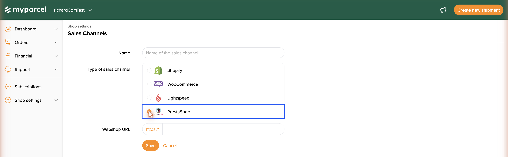
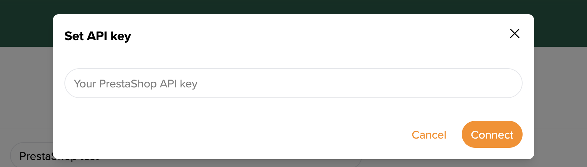

::: tip In breve
Il plugin MyParcel collega il tuo shop PrestaShop a MyParcel. I clienti scelgono al checkout un momento di consegna o un pickup point, tu stampi le etichette da PrestaShop e il Track & Trace va automaticamente al cliente. Nessun codice necessario — tutto tramite il back-office.
:::

## Avvio rapido — il primo pacco in 15 minuti
Sufficiente per spedire oggi stesso il tuo primo ordine reale. Per configurazioni più approfondite vedi più avanti [Cosa stai cercando?](#cosa-stai-cercando) qui sotto.

1. **Account.** Non hai ancora un account MyParcel? Creane uno su [myparcel.nl/register](https://www.myparcel.nl/register).
2. **Copia API key.** Accedi a [backoffice.myparcel.nl](https://backoffice.myparcel.nl) → *Impostazioni shop → Integrazione* → copia l'API key.
3. **Installa il plugin.** Scarica lo ZIP della release da [github.com/myparcelnl/prestashop/releases](https://github.com/myparcelnl/prestashop/releases). In PrestaShop: **Moduli → Module manager → Carica un modulo** → trascina lo ZIP.
4. **Collega il plugin.** Dopo l'installazione cerca `myparcel`, clicca **Configura**, incolla la tua API key sotto *Modifica API key* e clicca **Salva**. Il badge di stato in alto deve mostrare *Collegato a MyParcel*.
5. **Prima etichetta.** Apri un ordine pagato, vai al blocco MyParcel in fondo, clicca **Esporta** e poi **Stampa etichetta**. Il tuo PDF esce subito.

::: tip Hai finito quando vedi questo
- In alto nel plugin: stato verde *Collegato a MyParcel*
- Un ordine di test puoi esportarlo a MyParcel
- L'etichetta PDF si apre (o finisce nella cartella download)
:::

## Cosa stai cercando?
| Cosa vuoi fare? | Vai a |
| --- | --- |
| Configurazione iniziale | [Avvio rapido](#avvio-rapido-il-primo-pacco-in-15-minuti) |
| Collegare anche dal backoffice (sales channel) | [Canale di vendita tramite il Backoffice MyParcel](#canale-di-vendita-tramite-il-backoffice-myparcel) |
| Impostazioni consigliate per il tuo tipo di shop | [4 · Qual è il tuo profilo shop?](#4-qual-e-il-tuo-profilo-shop) |
| Cercare un'impostazione specifica | [5 · Impostazioni · Ordini](#5-impostazioni-ordini) fino a [9 · Impostazioni · Vettori](#9-impostazioni-vettori) |
| Un'impostazione diversa per prodotto | [10 · Impostazioni prodotto](#10-impostazioni-prodotto) |
| Cosa vede un cliente al checkout | [12 · L'esperienza di checkout](#12-l-esperienza-di-checkout) |
| Elaborare 50+ ordini al giorno | [13 · Uso quotidiano](#13-uso-quotidiano) |
| Qualcosa non funziona | [14 · Qualcosa non funziona — diagnostica](#14-qualcosa-non-funziona-diagnostica) |
| Risposta a una domanda frequente | [15 · FAQ](#15-faq) |

## 1 · Preparare il tuo account MyParcel
Prima di iniziare in PrestaShop, sistema quattro cose nel tuo backoffice MyParcel:

1. **Indirizzo di fatturazione e reso** — *Impostazioni shop → Generale*. Appare su tutte le etichette.
2. **Attivare i vettori** — *Impostazioni shop → Vettori*. Solo i vettori spuntati appariranno poi nel plugin.
3. **Generare API key** — *Impostazioni shop → Integrazione*.
4. **Importa informazioni ordine** (opzionale) — attiva se vuoi usare la [Modalità ordine](#5-impostazioni-ordini).

## 2 · Installare il plugin
::: warning Requisiti di versione
Plugin 5.0.x funziona su **PrestaShop 1.7.8 fino a 8.x** con **PHP 7.4+** (consigliato 8.1/8.2). PrestaShop 9 non è ancora supportato — vedi [issue #415](https://github.com/myparcelnl/prestashop/issues/415).
:::

1. Scarica lo ZIP della release da [github.com/myparcelnl/prestashop/releases](https://github.com/myparcelnl/prestashop/releases).
2. **Moduli → Module manager → Carica un modulo** → trascina lo ZIP.
3. Aspetta che l'installazione sia finita, cerca `myparcel` e clicca **Configura**.

::: details Installazione fallita con "Pdk instance must be set to use facades"
Rimuovi completamente i moduli MyParcel precedenti (incluse le tabelle del database tramite *Module Manager → Disinstalla*). Fai prima un backup del database, svuota poi manualmente le tabelle che iniziano con `ps_myparcelnl_` e installa di nuovo 5.0.x.
:::

## Canale di vendita tramite il Backoffice MyParcel
Oltre a collegare il plugin con la tua API key (vedi [Collegare il plugin](#3-collegare-il-plugin-api-key)), registri PrestaShop come **canale di vendita** (Sales channel) nel tuo backoffice MyParcel — usi entrambi. Il plugin gestisce il checkout e le impostazioni di PrestaShop, mentre il canale di vendita consente a MyParcel di comunicare direttamente con il tuo negozio tramite la sua API webservice e importare i tuoi ordini.

::: tip Cosa fa ogni collegamento
- Il **plugin + API key** (vedi [Collegare il plugin](#3-collegare-il-plugin-api-key)) aggiunge le opzioni di consegna al checkout di PrestaShop e ti permette di gestire le spedizioni dal tuo back office PrestaShop.
- Il **canale di vendita** (questa sezione) consente a MyParcel di prelevare i tuoi ordini direttamente da PrestaShop e si gestisce dal backoffice.
:::

### Creare il canale di vendita
1. Accedi a [backoffice.myparcel.com](https://backoffice.myparcel.com) e vai su **Shop settings → Sales Channels** (Impostazioni negozio → Canali di vendita).
2. Clicca in alto a destra su **Add sales channel** (Aggiungi canale di vendita).

3. Inserisci un **Name** (Nome) che ti aiuti a riconoscere il canale (es. *Il mio negozio PrestaShop*).
4. In **Type of sales channel** (Tipo di canale di vendita) scegli **PrestaShop**.
5. Inserisci la tua **Webshop URL** — l'indirizzo del tuo negozio PrestaShop (per esempio `https://il-tuo-negozio.com`).
6. Clicca **Save** (Salva). Il canale viene creato e mostra l'etichetta **Missing data** (Dati mancanti) finché non aggiungi la API key.

### Autenticare il canale (API key)
PrestaShop consente a MyParcel di leggere i tuoi ordini con una **API key del webservice**.

1. Nel tuo back office **PrestaShop**, vai su **Advanced Parameters → Webservice** (Parametri avanzati → Webservice), attiva il webservice e clicca **Add new webservice key**. Genera una chiave, assegnale le risorse di cui MyParcel ha bisogno e salva. Copia la chiave generata.
2. Nel backoffice, apri il canale e clicca **Set credentials** (Imposta credenziali).
3. Nella finestra **Set API key** (Imposta API key) incolla la tua **PrestaShop API key**.
4. Clicca **Connect** (Connetti).

Una volta connesso, l'etichetta **Missing data** scompare, il canale mostra **Connected** (Connesso) e MyParcel inizia a sincronizzare i tuoi ordini PrestaShop.

::: warning La connessione non riesce?
Cause più comuni: uno spazio extra incollato con la key · il webservice non è attivo in PrestaShop · la chiave non ha i permessi per le risorse richieste · la **Webshop URL** punta a un altro negozio o manca `https://`.
:::

## 3 · Collegare il plugin (API key)
Apri **Moduli → Module manager → MyParcelNL → Configura**. In alto vedi tre pulsanti — *Modifica API key*, *Modifica webhook*, *Opzioni di debug* — più il badge di stato.

 La barra di collegamento appare su ogni pagina del plugin.

1. Clicca **Modifica API key**.
2. Incolla la key dal tuo backoffice MyParcel.
3. Clicca **Salva** — entro pochi secondi lo stato cambia in *Collegato a MyParcel*.

::: warning Non funziona?
Cause più comuni: non hai cliccato *Salva* · spazio copiato prima/dopo la key · key di un altro shop · shop gira su un ambiente diverso (live vs sandbox) rispetto al tuo account MyParcel.
:::

## 4 · Qual è il tuo profilo shop?
Tre profili tipici con impostazioni consigliate. Scegline uno, applica le impostazioni, poi affina con [5 · Impostazioni](#5-impostazioni-ordini).

### Piccolo — 1–10 ordini/giorno, solo NL
| Impostazione | Consigliato | Perché |
| --- | --- | --- |
| Modalità ordine | On | Ordine completo a MyParcel — meglio per pickup point ed estero in seguito |
| Spedizioni concept | On | Ti tiene sotto controllo mentre impari |
| Elaborazione automatica | Nessuna | Clicca tu *Esporta* per ogni ordine |
| Formato etichetta | A4 (4 per pagina) | Nessuna stampante etichette necessaria |
| Track & Trace nell'email | On | Il cliente riceve automaticamente il tracking |
| PostNL — *Attiva opzioni di consegna* | On | Vettore standard NL |
| Assicurazione — *Assicurare da €* | 250 | Pacchi sopra €250 assicurati automaticamente |

### Medio — 10–50 ordini/giorno, NL + BE
| Impostazione | Consigliato | Perché |
| --- | --- | --- |
| Spedizioni concept | Off | Più veloce — etichette subito definitive |
| Elaborazione automatica | *In elaborazione* (dopo pagamento) | Niente più click per ordine |
| Formato etichetta | A6 (stampante etichette) | Stampante etichette Brother/Zebra |
| Stampa subito | On | Flusso di stampa senza click |
| PostNL + DHL Parcel Connect | Entrambi attivi | NL e BE coperti |
| Assicurazione | Da €250, fino a €500 | Scala con il valore ordine |

### Solo cassetta postale — caffè, cartoline, cosmetici
| Impostazione | Consigliato | Perché |
| --- | --- | --- |
| Per prodotto *Tipo di pacco* | Pacco da cassetta postale | Obbligatorio — altrimenti tutto va come pacco |
| Per prodotto *in cassetta* | Realistico (es. 5) | Numero di pezzi per pacco da cassetta postale |
| Peso predefinito *pacco da cassetta postale* | 50–100 g | Non impostarlo troppo alto — altrimenti MyParcel torna al pacco |
| Opzioni di consegna | Off | Per cassetta postale niente scelta di orario |
| Assicurazione | Off | Non disponibile per pacco da cassetta postale |

::: tip Altri scenari?
Per gioielli costosi, internazionale o requisiti speciali — vedi [15 · FAQ](#15-faq) o i profili shop nel [manuale WooCommerce](./woocommerce.html#14-veelvoorkomende-scenarios) (applicabili a tutte le piattaforme).
:::

## 5 · Impostazioni · Ordini
Il primo tab — qui decidi come gli ordini fluiscono attraverso il tuo shop.

### Generale
- **Modalità ordine** — On: ordine completo (dati cliente, righe prodotto, note) a MyParcel. Off: solo un'etichetta. *Consigliato on*, a patto che *Importa informazioni ordine* nel tuo account MyParcel sia attivo.
- **Spedizioni concept** — On: la spedizione resta concept in MyParcel, puoi ancora modificare. Off: registrazione diretta presso il vettore. *On durante il setup, off quando tutto gira stabile.*
- **Elaborazione automatica** — Quale stato ordine PrestaShop attiva l'esportazione? *Nessuno* / *In attesa di pagamento* / *In elaborazione* / *Spedito*. Inizia con *Nessuno*.
- **Invia email di reso** — Il cliente riceve automaticamente un link di reso.
- **Salva indirizzo cliente nella rubrica** — Gli indirizzi finiscono nella tua rubrica MyParcel.
- **Condividi informazioni cliente** — Email + numero di telefono a MyParcel. Necessario per email Track & Trace da MyParcel e per spedizioni internazionali. *Consigliato on.*

### Automazione stato ordine
Collega gli eventi MyParcel agli stati PrestaShop — lo stato del pacco resta sincronizzato senza lavoro manuale.

- **Stato ordine alla creazione etichetta** — spesso *Spedizione in preparazione*.
- **Stato ordine alla scansione etichetta** — spesso *Spedito*.
- **Stato ordine alla consegna** — spesso *Consegnato*.
- **Invia notifica dopo** — da quale stato parte un'email al cliente. Imposta su *Spedito* così i clienti ricevono subito il loro Track & Trace.

### Track & Trace
- **Track & Trace nell'email** — link nelle email ordine PrestaShop. *Consigliato on.*
- **Track & Trace nell'account** — visibile anche nell'account cliente sul webshop.

### Pesi predefiniti
Rete di sicurezza per prodotti senza peso nel catalogo.

| Tipo di pacco | Peso a vuoto tipico |
| --- | --- |
| Pacco | 200 – 400 g |
| Pacco piccolo | 100 – 200 g |
| Pacco da cassetta postale | 50 – 100 g |
| Francobollo digitale | 10 – 30 g |

### Note ordine
- **Barcode in nota** — barcode Track & Trace automaticamente nella nota ordine. Utile per i picker in magazzino.
- **Titolo del barcode in nota** — intestazione sopra il barcode, es. *Track & Trace*.

## 6 · Impostazioni · Etichette
Come appaiono le etichette di spedizione e come vengono stampate.

### Descrizione sull'etichetta
- **Descrizione** — testo libero, es. numero ordine o riferimento interno.

### Comportamento di stampa
- **Stampa subito** — etichetta direttamente al tuo gruppo stampante appena esporti una spedizione. *Consigliato on* con stampante etichette.
- **Richiedi posizione etichetta** — prompt per formato, output e posizione per etichetta. On per flessibilità; off per velocità con formato fisso.

### Valori predefiniti
- **Output etichetta** — *Apri in nuova scheda* (più veloce per manuale) o *Scarica etichetta*.
- **Formato etichetta** — *A4 (4 per pagina)* o *A6 (stampante etichette)*.
- **Posizione/i etichetta su A4** — selezione multipla *In alto a sinistra*/*In alto a destra*/*In basso a sinistra*/*In basso a destra* per sfruttare al massimo i fogli.

## 7 · Impostazioni · Dogana
Obbligatorio per spedizioni fuori dall'UE. Sovrascrivibile per prodotto — vedi [10 · Impostazioni prodotto](#10-impostazioni-prodotto).

- **Contenuto pacco** — *Merci* (predefinito per webshop), *Documenti*, *Regalo*, *Campione commerciale*, *Reso*.
- **HS code** — codice doganale armonizzato. Cerca su [tarief.douane.nl](https://tarief.douane.nl). Esempi: `6109.10` (T-shirt), `9503.00` (giocattoli), `3304.99` (make-up).
- **Paese di origine** — da dove proviene il prodotto (non dove lo conservi).

## 8 · Impostazioni · Checkout
Cosa il tuo cliente vede al checkout — o piuttosto non vede.

### Opzioni di consegna
- **Mostrare opzioni di consegna** — interruttore principale per il widget di checkout MyParcel. *Consigliato on.*
- **Mostrare opzioni di consegna per backorder** — off: per prodotti non a magazzino il plugin nasconde le opzioni di consegna. On se i tempi di consegna sono certi.
- **Tipo di prezzo** — *Incluso* (nel prezzo totale) o *Separato* (mostrato a parte). *Incluso evita sorprese.*
- **Titolo opzioni di consegna** — intestazione sopra il blocco MyParcel. Es. *Come vuoi ricevere il tuo pacco?*
- **Mostrare campi fiscali al checkout** — campi IVA per ordini business.
- **Giorni chiusi** — selettore date per festività. In questi giorni il checkout nasconde le opzioni di consegna.

### Pickup point
- **Visualizzazione predefinita** — *Lista* (chiara) o *Mappa* (più visiva).
- **Gli utenti possono passare tra lista e mappa** — *Consigliato on.*
- **Escludi automatici** — nascondi automatici come opzione di consegna. On se i prodotti sono troppo grandi.

## 9 · Impostazioni · Vettori
Il tab più grande. Sub-tab per ogni vettore che il tuo account MyParcel supporta: PostNL, DHL Parcel Connect, DHL Europlus, UPS Standard, UPS Express Saver, più eventualmente DHL For You / DPD / Bol Parcel Carrier a seconda del tuo contratto.

::: tip Tutti i vettori strutturati allo stesso modo
Illustro **PostNL** come esempio — gli altri vettori seguono esattamente la stessa struttura, con le proprie opzioni specifiche (es. DHL ha *Tracked*, Trunkrs ha *Fresh*).
:::

### Impostazioni di esportazione predefinite
Quali opzioni vengono passate per default a ogni nuova spedizione.

- **Attiva controllo età (18+)** — per alcol/tabacco/coltelli.
- **Attiva firma** — per spedizioni di valore.
- **Attiva solo destinatario** — niente vicini.
- **Attiva codice di ricezione** — sicurezza extra.
- **Attiva più grande di 100 × 70 × 58 cm** — segna oversize; possibile supplemento vettore.
- **Attiva ritorno diretto** — etichetta di reso automatica per abbigliamento/elettronica.
- **Attiva assicurazione** — attiva l'assicurazione.

### Assicurazione
- **Assicurare da (€)** — importo soglia.
- **Assicurare fino a** / **(NL)** / **(EU)** / **(EU + Resto del mondo)** — massimi per regione.
- **Assicurare per percentuale** — es. 100% del valore ordine.

### Impostazioni di esportazione predefinite per resi
- **Tipo di pacco predefinito** — Pacco / Pacco piccolo / Pacco da cassetta postale / Francobollo digitale.
- **Attiva più grande di 100 × 70 × 58 cm** — per resi oversize.

### Opzioni di consegna (interruttore principale)
- **Attiva opzioni di consegna** — senza questo toggle questo vettore non appare affatto al checkout.

::: details Opzioni per consegna a domicilio — tutti i campi
- **Attiva consegna a domicilio** — mostra consegna a domicilio come opzione.
- **Tipo di pacco predefinito** — di solito *Pacco*.
- **Prezzo pacco piccolo**, **Prezzo pacco da cassetta postale**, **Prezzo francobollo digitale** — prezzi di spedizione per tipo.
- **Attiva pacco da cassetta postale internazionale** + **Prezzo** — per pacchi da cassetta postale fuori NL/BE.
- **Finestra giorni di consegna** — numero di giorni in avanti tra cui sceglie il cliente.
- **Tempo di elaborazione** — giorni lavorativi che ti servono; conta nella finestra.
- **Possibilità di spedizione** — spunta i giorni in cui spedisci effettivamente.
- **Consegna standard** + prezzo — opzione base senza scelta di orario.
- **Consegna mattutina** + prezzo — prima delle 12:00.
- **Consegna serale** + prezzo — 18:00–22:00.
- **Consegna lunedì** + prezzo — per consegna sabato.
- **Consegna sabato** + prezzo.
- **Firma** + prezzo — firma con eventuale supplemento.
- **Solo destinatario** + prezzo — solo destinatario con eventuale supplemento.
:::

::: details Opzioni per pickup point
- **Attiva pickup point** — i clienti possono scegliere un pickup point.
- **Prezzo ritiro** — spesso più basso della consegna a domicilio.
:::

::: warning Non dimenticare di salvare
Clicca sempre **Salva** in fondo a ogni tab vettore prima di passare a un'altra tab. Altrimenti le tue modifiche sono perse.
:::

## 10 · Impostazioni prodotto
Apri un prodotto, vai a **Moduli** e clicca **Configura** su MyParcelNL. Qui sovrascrivi le impostazioni globali di [Vettori](#9-impostazioni-vettori) e [Dogana](#7-impostazioni-dogana) per prodotto.

### Opzioni MyParcel
- **Tipo di pacco** — *Standard* o forza un tipo per questo prodotto.
- **in cassetta** — quanti di questo prodotto stanno in un pacco da cassetta postale. `5` = ne stanno cinque. `-1` = usa il default. Se il cliente ne ordina più di quanti ne stanno, l'ordine va automaticamente come Pacco.

### Opzioni di consegna prodotto
- **Ritarda spedizione** — giorni lavorativi extra per prodotti su ordinazione / dropship / made-to-order.
- **Disattiva opzioni di spedizione** — nasconde tutto il widget di consegna MyParcel se questo prodotto è nel carrello. Per gift card o prodotti digitali.
- **Escludi automatici** — esclude automatici per questo prodotto.

### Opzioni dogana prodotto
- **Paese di origine** — sovrascrive [§7](#7-impostazioni-dogana). Es. globale *Paesi Bassi*, prodotto dropship *Cina*.
- **Codice dogana** — HS code specifico del prodotto.

### Opzioni export prodotto
- **Attiva controllo età (18+)**, **Attiva assicurazione**, **Attiva più grande di 100 × 70 × 58 cm**, **Attiva solo destinatario**, **Attiva firma**, **Attiva ritorno diretto** — forza per prodotto.

::: tip Lucchetto dietro un'opzione?
Quell'opzione è disponibile solo presso vettori o contratti specifici. Clicca il lucchetto per la spiegazione.
:::

## 11 · La pagina dettaglio ordine
Apri un singolo ordine. Sotto i dati standard PrestaShop vedi un blocco **MyParcel** con:

- Vettore e tipo di pacco per questa spedizione
- Assicurazione on/off + importo assicurato
- Opzioni di consegna selezionate (consegna serale, firma, solo destinatario…)
- Pulsanti: *Esporta* · *Stampa etichetta* · *Visualizza Track & Trace*

::: warning Salva le modifiche prima di stampare
Modifichi un campo? **Salva** prima di stampare un'etichetta — altrimenti MyParcel elabora i vecchi valori.
:::

## 12 · L'esperienza di checkout
Il widget di checkout MyParcel appare dopo aver compilato l'indirizzo di consegna, appena almeno un vettore è attivato e i vettori PrestaShop sono collegati alla zona di spedizione corretta — vedi [diagnostica](#14-qualcosa-non-funziona-diagnostica).

Sopra il widget il cliente sceglie un vettore + servizio (es. *PostNL — Consegna super veloce — €9,95 IVA inclusa*). Sotto si apre **Consegna a casa o al lavoro** con:

- **Carosello di date** con i prossimi giorni lavorativi.
- **Fascia oraria** per la consegna (es. *10:45–13:15*).
- **Opzioni extra** come *Firma (€2,00)* o *Solo destinatario* con supplementi separati.

Sotto la consegna a domicilio c'è un secondo blocco **Ritiro presso un pickup point**, contrassegnato *Più sostenibile*. All'apertura appare una mappa interattiva con punti PostNL/DHL nelle vicinanze, con orari di apertura per giorno. Il cliente può passare tra *Lista* e *Mappa* (se attivato in [§8](#8-impostazioni-checkout)).

## 13 · Uso quotidiano

### Workflow 1 — per ordine
1. Apri la pagina dettaglio ordine.
2. Controlla tipo di pacco e opzioni di consegna nel blocco MyParcel.
3. Clicca **Esporta** (concept) → controlla in MyParcel → clicca **Stampa etichetta**.

### Workflow 2 — bulk (10+ ordini/giorno)
1. Su **Ordini** filtri un periodo (es. *Pagati oggi*).
2. Per ordine tramite il menu azione scegli **Esporta**.
3. In MyParcel elabora le spedizioni (manualmente o con *Elaborazione automatica* da [§5](#5-impostazioni-ordini)).
4. Stampa le etichette in bulk tramite MyParcel.

::: tip Spedizione completamente automatica
Con *Elaborazione automatica* su *In elaborazione* e *Spedizioni concept* off, ogni ordine pagato viene creato direttamente come etichetta senza passaggi intermedi.
:::

### Resi
- **Attiva ritorno diretto** ([§9](#9-impostazioni-vettori)) o l'[override prodotto](#10-impostazioni-prodotto) → etichetta di reso automatica con ogni spedizione.
- **Invia email di reso** ([§5](#5-impostazioni-ordini)) → il cliente può richiedere autonomamente un'etichetta di reso.

## 14 · Qualcosa non funziona — diagnostica
Qualcosa non funziona come previsto? Scorri questa tabella dall'alto in basso — tre problemi su quattro si risolvono entro 5 minuti.

| Sintomo | Cosa controllare |
| --- | --- |
| **Checkout: "Nessun vettore disponibile"** | Vettori PrestaShop collegati a una zona di spedizione con prezzi per l'indirizzo di consegna? Vai a *Spedizione → Vettori*. Solo dopo appaiono le opzioni di consegna MyParcel. |
| **Nessuna opzione di consegna visibile** | (1) [§8](#8-impostazioni-checkout): *Mostrare opzioni di consegna* on? (2) [§9](#9-impostazioni-vettori): almeno un vettore con *Attiva opzioni di consegna* on? |
| **Installazione fallita — *"Pdk instance must be set to use facades"*** | Rimuovi completamente i moduli MyParcel più vecchi (incl. tabelle database `ps_myparcelnl_*`) e installa di nuovo 5.0.x. |
| **Errore provincia: *"state must be at most 2 characters"*** | Il pacchetto lingua NL crea province come `NL-LI` (4 caratteri). Modifica in *Internazionale → Località → Province* i codici iso a 2 caratteri. Vedi [issue #509](https://github.com/myparcelnl/prestashop/issues/509). |
| **"Invalid API key" mentre il collegamento funziona** | Chiudi completamente la config plugin e riapri. Se persiste: ricopia la key da *backoffice.myparcel.nl → Impostazioni shop → Integrazione*. |
| **Le impostazioni PostNL non vengono salvate** | Clicca **Salva** in fondo a ogni tab prima di cambiare. Altrimenti controlla *Opzioni di debug* per messaggi di errore. |
| **Le etichette non vengono create** | (1) [§5](#5-impostazioni-ordini): *Spedizioni concept* off per creazione diretta. (2) [§6](#6-impostazioni-etichette): gruppo stampante corretto? (3) [§9](#9-impostazioni-vettori): vettore selezionato e *Attiva opzioni di consegna* on? |
| **Track & Trace non nell'email** | (1) *Track & Trace nell'email* on ([§5](#5-impostazioni-ordini)). (2) *Invia notifica dopo* sullo stato giusto (spesso *Spedito*). (3) *Condividi informazioni cliente* on — altrimenti MyParcel non riceve l'indirizzo email. |
| **Tutto diventa Pacco, mai Cassetta postale** | (1) [§10](#10-impostazioni-prodotto): *Tipo di pacco* su *Pacco da cassetta postale* + *in cassetta* su numero realistico. (2) [§5](#5-impostazioni-ordini): *Peso predefinito pacco da cassetta postale* non troppo alto (altrimenti MyParcel torna al pacco). |

## 15 · FAQ

### Il plugin funziona su PrestaShop 9?
Non ancora. La versione 5.0.x supporta PrestaShop 1.7.8 fino a 8.x. Il supporto a PrestaShop 9 è in roadmap; segui [issue #415](https://github.com/myparcelnl/prestashop/issues/415).

### Posso usare più vettori contemporaneamente?
Sì. Attiva per vettore sotto *Vettori → \[Nome vettore\] → Opzioni di consegna → Attiva opzioni di consegna*.

### Come cambio il mio indirizzo mittente sull'etichetta?
L'indirizzo mittente proviene dal tuo backoffice MyParcel (*Impostazioni shop → Generale*), non da PrestaShop.

### Quali stati per "Elaborazione automatica"?
*In elaborazione* o *In attesa di pagamento* funzionano per la maggior parte degli shop. Inizia su *Nessuno* durante il setup; attivalo quando il workflow gira stabile.

### Il cliente sceglie un pickup point — come lo vedo sull'etichetta?
Il pickup point appare automaticamente come indirizzo di consegna sull'etichetta MyParcel e nel blocco MyParcel sulla pagina dettaglio ordine ([§11](#11-la-pagina-dettaglio-ordine)). In alcuni temi PrestaShop il pickup point non torna sulla fattura PDF — issue del tema, non bug del plugin ([issue #390](https://github.com/myparcelnl/prestashop/issues/390)).

### Update plugin fatto e ora qualcosa non funziona più
Riapri il plugin, controlla il badge di stato e segui [§14](#14-qualcosa-non-funziona-diagnostica). Gli issue di update si risolvono spesso facendo logout/login o svuotando la cache browser.

### Il plugin costa?
No. Il plugin è gratuito. Paghi solo per le spedizioni alla tua tariffa MyParcel.

## Risorse e supporto
- [github.com/myparcelnl/prestashop ↗](https://github.com/myparcelnl/prestashop) — codice sorgente, release, issue.
- [github.com/myparcelnl/prestashop/releases ↗](https://github.com/myparcelnl/prestashop/releases) — changelog e download ZIP.
- [backoffice.myparcel.nl ↗](https://backoffice.myparcel.nl) — account, API key, fatturazione.
- [Contatta il supporto MyParcel](../../contact.md) — **023 - 30 30 315** · [info@myparcel.nl](mailto:info@myparcel.nl).

Questo manuale è scritto per la versione plugin **5.0.x**. In versioni più recenti i nomi o l'ordine dei campi possono variare leggermente; la struttura principale del plugin resta uguale.
