::: tip In breve
L'app MyParcel collega il tuo negozio Shopify a MyParcel. Colleghi i tuoi metodi di spedizione Shopify a un corriere e a un'opzione di consegna per ogni Paese, stampi le etichette direttamente da Shopify e il track & trace viene inviato automaticamente al cliente. Nessun codice — tutto dall'admin Shopify.
:::

## Avvio rapido — il tuo primo pacco in 15 minuti
Quanto basta per spedire oggi il tuo primo ordine reale. Per una configurazione più approfondita, vedi [Stai cercando…](#stai-cercando) qui sotto.

1. **Account.** Non hai ancora un account MyParcel? Creane uno su [myparcel.com/register](https://www.myparcel.com/register).
2. **Copia la API key.** Accedi a [backoffice.myparcel.com](https://backoffice.myparcel.com) → *Impostazioni negozio → Integrazioni* → copia la API key.
3. **Aggiungi l'app.** Nello [Shopify App Store](https://apps.shopify.com/), cerca *MyParcel* → **Aggiungi app** → segui i passaggi.
4. **Collega l'app.** Apri **App → MyParcel → Instellingen** (Impostazioni), incolla la chiave nel campo **API key** e salva.
5. **Prima etichetta.** Apri **App → MyParcel**, seleziona un ordine pagato e clicca **Printen** (Stampa). La tua etichetta PDF è pronta.

::: tip Hai finito quando vedi questo
- La API key è salvata in **Instellingen → Account**
- I tuoi metodi di spedizione sono collegati sotto **Standaard exportinstellingen** (nessun badge arancione *MyParcel niet actief*)
- Puoi stampare un ordine di prova e l'etichetta PDF si apre
:::

## Stai cercando…
| Cosa vuoi fare? | Vai a |
| --- | --- |
| Prima configurazione | [Avvio rapido](#avvio-rapido-il-tuo-primo-pacco-in-15-minuti) |
| Collegare il tuo account | [3 · Collegare l'app](#3-collegare-lapp-api-key) |
| Collegare tramite un sales channel | [Collegamento tramite un sales channel](#collegamento-tramite-un-sales-channel) |
| Cercare un'impostazione specifica | [4 · Impostazioni · Generale](#4-impostazioni-generale) fino a [7 · Impostazioni · Spedizioni mondiali](#7-impostazioni-spedizioni-mondiali) |
| Collegare un metodo di spedizione a un corriere | [5 · Impostazioni · Esportazione e zone](#5-impostazioni-esportazione-e-zone) |
| Un'impostazione diversa per prodotto | [8 · Impostazioni prodotto](#8-impostazioni-prodotto) |
| Cosa vede il cliente al checkout | [9 · L'esperienza di checkout](#9-lesperienza-di-checkout) |
| Stampare o esportare le etichette | [10 · Uso quotidiano](#10-uso-quotidiano) |
| Qualcosa non funziona | [11 · Qualcosa non funziona — diagnostica](#11-qualcosa-non-funziona-diagnostica) |
| Risposta a una domanda frequente | [12 · FAQ](#12-faq) |

## 1 · Preparare il tuo account MyParcel
Prima di iniziare in Shopify, sistema quattro cose nel tuo backoffice MyParcel:

1. **Indirizzo di fatturazione e di reso** — *Impostazioni negozio → Generale*. Appare su ogni etichetta.
2. **Attiva i corrieri** — *Impostazioni negozio → Corrieri*. Solo i corrieri attivati appaiono poi nell'app.
3. **Genera una API key** — *Impostazioni negozio → Integrazioni*.
4. **Configura i metodi di spedizione** in Shopify, in **Impostazioni → Spedizioni e consegna**. L'app si collega a questi metodi (vedi [§5](#5-impostazioni-esportazione-e-zone)).

## 2 · Installare l'app
1. Vai allo [Shopify App Store](https://apps.shopify.com/) e cerca *MyParcel*.
2. Clicca su **Aggiungi app** e segui i passaggi per aggiungerla al tuo negozio.
3. Apri l'app da **App → MyParcel**. Da quel momento si aggiorna automaticamente.

## 3 · Collegare l'app (API key)
Apri **App → MyParcel** e clicca su **Instellingen** (Impostazioni) in alto a destra. Tutte le impostazioni sono su un'unica pagina; il primo blocco è **Account**.

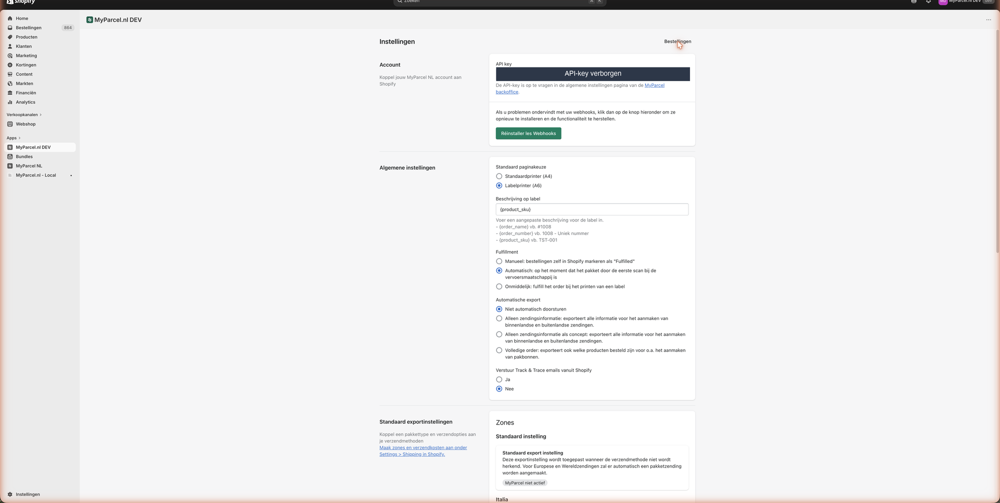 La API key è oscurata in questa schermata.

1. Incolla la chiave dal tuo backoffice MyParcel nel campo **API key**.
2. Scorri in basso e clicca su **Opslaan** (Salva).
3. Usa **Réinstaller les Webhooks** solo se gli aggiornamenti automatici di stato smettono di funzionare — ripristina il collegamento.

::: warning Non funziona?
Cause più comuni: non hai cliccato *Opslaan* (Salva) · uno spazio copiato prima/dopo la chiave · chiave di un altro negozio · chiave di un ambiente diverso (live vs sandbox) rispetto al tuo account MyParcel.
:::

### Collegamento tramite un sales channel
Invece di copiare la API key a mano nell'app, puoi collegarti tramite un **sales channel** nel tuo backoffice MyParcel. MyParcel si collega allora direttamente al tuo negozio Shopify.

1. Accedi a [backoffice.myparcel.com](https://backoffice.myparcel.com) e vai su **Shop settings → Sales Channels** (Impostazioni negozio → Canali di vendita).
2. Clicca in alto a destra su **Add sales channel** (Aggiungi canale di vendita).

3. Inserisci un **Name** (Nome) per il canale e scegli **Shopify** in **Type of sales channel** (Tipo di canale di vendita).
4. Inserisci il tuo **Store ID** — la prima parte del tuo indirizzo `.myshopify.com` (per il negozio `il-mio-negozio.myshopify.com` lo Store ID è `il-mio-negozio`).
5. Clicca **Save** (Salva). Il canale viene creato con l'etichetta **Missing data** (Dati mancanti).

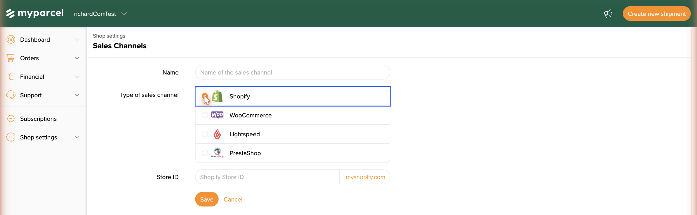

6. Apri il canale e clicca **Create connection** (Crea collegamento).
7. Accedi al tuo ambiente Shopify quando richiesto e approva il collegamento. Shopify ti rimanda al backoffice e il canale mostra **Connected** (Connesso).

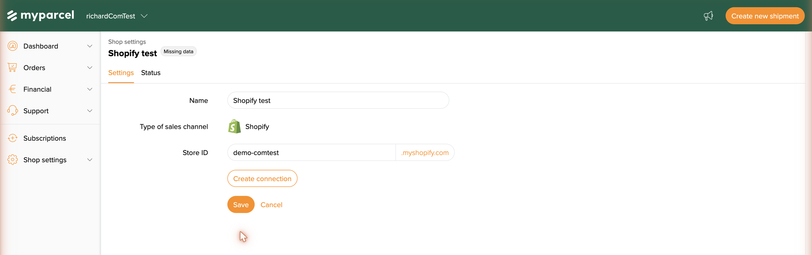

### Cosa fa l'app nel tuo admin Shopify?
| Dove? | Cosa puoi fare? |
| --- | --- |
| **App → MyParcel** | La schermata *Bestellingen* (Ordini) — seleziona ordini e stampa o esporta etichette. |
| **App → MyParcel → Instellingen** | Tutte le impostazioni: Account, Generale, Esportazione e zone, Punti di ritiro, Spedizioni mondiali. |
| **Prodotto → Verzending** (Spedizione) | Campi standard di Shopify (peso, Paese di origine, codice HS) che MyParcel legge. |

::: tip Due etichette MyParcel nell'elenco app?
Su un development store potresti vedere *MyParcel.nl DEV* o *MyParcel.nl - Local* accanto all'app pubblicata **MyParcel NL**. Usa l'app pubblicata per le spedizioni reali.
:::

## 4 · Impostazioni · Generale
In **Instellingen**, sotto Account, trovi **Algemene instellingen** (Impostazioni generali).

- **Standaard paginakeuze** (Formato pagina predefinito) — Imposta il formato dell'etichetta. *Standaardprinter (A4)* per una stampante normale, *Labelprinter (A6)* per una stampante per etichette Zebra/Brother.
- **Beschrijving op label** (Descrizione sull'etichetta) — Il testo sull'etichetta. Usa i segnaposto compilati automaticamente: `{order_name}` (es. #1008), `{order_number}` (es. 1008) o `{product_sku}` (es. TST-D01).
- **Fulfilment** (Evasione) — Quando un ordine viene contrassegnato come *Fulfilled* in Shopify. Scegli *Manueel* (tu), *Automatisch* (alla prima scansione del corriere) o *Onmiddellijk* (quando stampi un'etichetta).
- **Automatische export** (Esportazione automatica) — Se gli ordini vanno a MyParcel automaticamente. *Niet automatisch doorsturen* per farlo a mano, oppure un'opzione di esportazione per inviare le informazioni di spedizione (o l'ordine completo, inclusi i prodotti per le distinte) in automatico.
- **Verstuur Track & Trace emails vanuit Shopify** (Invia le email Track & Trace da Shopify) — *Nee* (No) fa inviare l'email a MyParcel; *Ja* (Sì) la fa inviare a Shopify.

## 5 · Impostazioni · Esportazione e zone
Qui colleghi i tuoi metodi di spedizione Shopify, per **zona** (Paese o regione), a un corriere MyParcel, un'opzione di consegna e un tipo di pacco. Crea prima le zone e le tariffe in Shopify, in **Impostazioni → Spedizioni e consegna**.

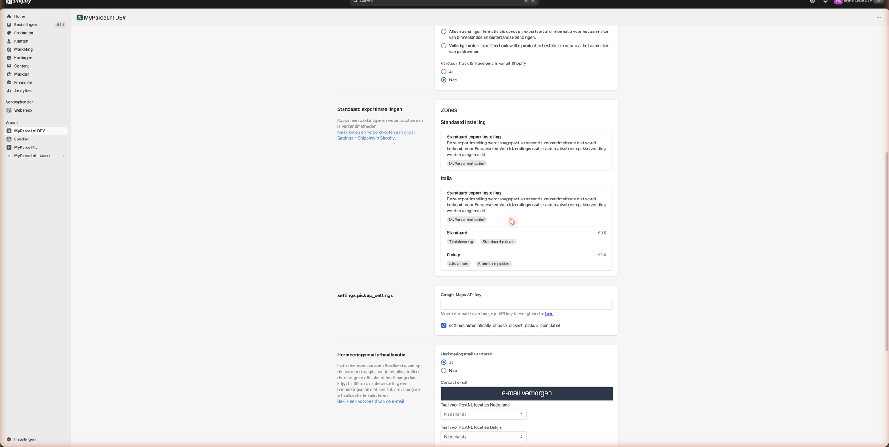

- **Standaard instelling** (Impostazione predefinita) — Il ripiego usato quando un metodo di spedizione non viene riconosciuto. Per le spedizioni europee e mondiali viene creata automaticamente una spedizione a pacco.
- **Per zona** — Ogni zona elenca i tuoi metodi di spedizione Shopify (es. *Standaard* e *Pickup*) con il prezzo e le opzioni MyParcel collegate (*Thuislevering*/consegna a domicilio o *Afhaalpunt*/punto di ritiro, più il tipo di pacco).

Clicca su un metodo di spedizione per aprire il collegamento:

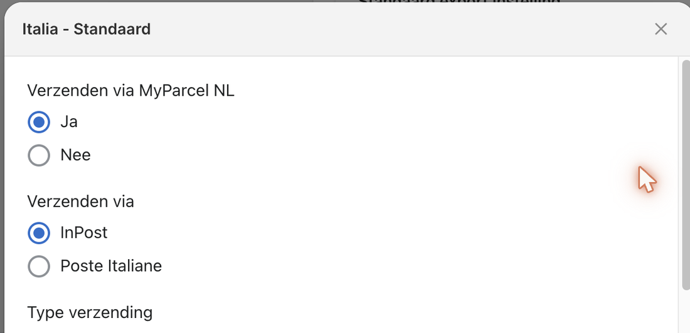

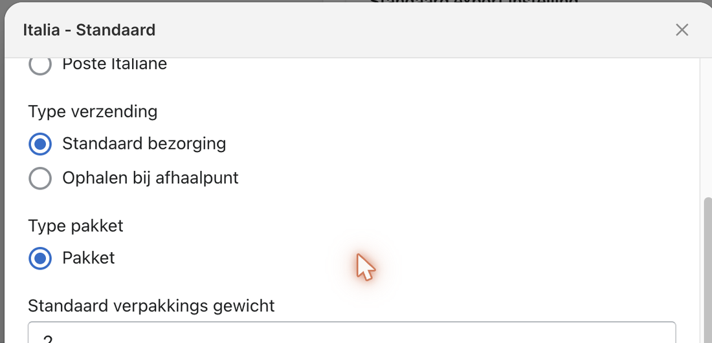

- **Verzenden via MyParcel NL** (Spedisci tramite MyParcel) — Imposta su *Ja* (Sì) per spedire questo metodo tramite MyParcel.
- **Verzenden via** (Spedisci tramite) — Il corriere per questo metodo. I corrieri disponibili dipendono dalla zona (es. PostNL, DHL e DPD nei Paesi Bassi; **InPost** e **Poste Italiane** in Italia).
- **Type verzending** (Tipo di spedizione) — *Standaard bezorging* (consegna a domicilio) o *Ophalen bij afhaalpunt* (punto di ritiro).
- **Type pakket** (Tipo di pacco) — es. *Pakket* (pacco). Scegli un'opzione per cassetta postale se la spedizione entra nella buca delle lettere.
- **Standaard verpakkings gewicht** (Peso predefinito dell'imballaggio) — Il peso dell'imballaggio in grammi. Si somma al peso del prodotto.

::: warning Non dimenticare di salvare
Dopo aver collegato i metodi, scorri in fondo alla pagina delle impostazioni e clicca su **Opslaan** (Salva).
:::

## 6 · Impostazioni · Punti di ritiro
Più in basso nella pagina delle impostazioni trovi le opzioni per i punti di ritiro e l'email di promemoria.

- **Scegli automaticamente il punto di ritiro più vicino** — Seleziona automaticamente il punto più vicino per il cliente.
- **Herinneringsmail afhaallocatie** (Email di promemoria punto di ritiro) — Se il cliente non ha scelto un punto di ritiro, MyParcel invia un'email di promemoria con un link 30 minuti dopo l'ordine. Imposta **Herinneringsmail versturen** su *Ja* (Sì), inserisci una **Contact email** per il tuo servizio clienti e scegli la **lingua per le località PostNL** (NL/BE).

## 7 · Impostazioni · Spedizioni mondiali
In fondo alla pagina delle impostazioni configuri i valori doganali predefiniti, usati per le spedizioni fuori dall'UE quando un prodotto non ha dati doganali propri.

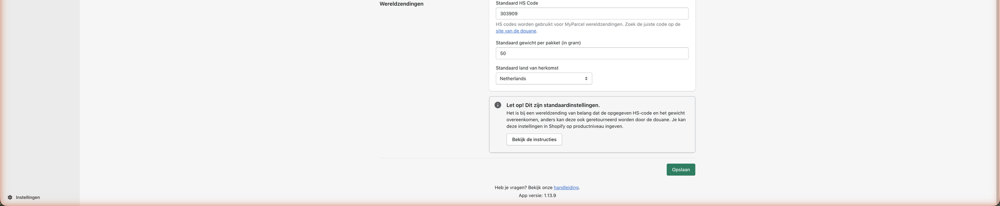

- **Standaard HS Code** (Codice HS predefinito) — Codice doganale dei tuoi prodotti. Cercalo su [tarief.douane.nl](https://tarief.douane.nl). Un codice errato può causare la restituzione del pacco dalla dogana.
- **Standaard gewicht per pakket (in gram)** (Peso predefinito per pacco, grammi) — Usato quando un prodotto non ha un peso. Scegli un valore vicino alla tua media.
- **Standaard land van herkomst** (Paese di origine predefinito) — Il Paese da cui spedisci.

## 8 · Impostazioni prodotto
L'app MyParcel **non** aggiunge campi alla pagina prodotto di Shopify. Imposti i dati di spedizione tramite i campi standard di Shopify sotto **Verzending** (Spedizione) nel prodotto o nella variante. MyParcel li legge.

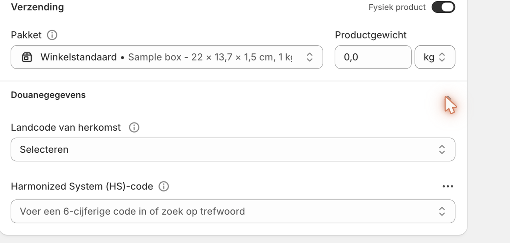

- **Pakket** (Pacco) — Il formato di pacco standard di Shopify per questo prodotto.
- **Productgewicht** (Peso del prodotto) — Inseriscilo sempre; influisce sul prezzo di spedizione.
- **Landcode van herkomst** (Paese di origine, sotto *Douanegegevens*/Dati doganali) — Da dove proviene il prodotto. Necessario fuori dall'UE.
- **Harmonized System (HS)-code** (sotto *Douanegegevens*) — Inserisci un codice a 6 cifre o cerca per parola chiave. Importante per le spedizioni mondiali.

## 9 · L'esperienza di checkout
Cosa vede il tuo cliente quando l'indirizzo di consegna è compilato. Le opzioni dipendono dalle tue impostazioni in [§5](#5-impostazioni-esportazione-e-zone).

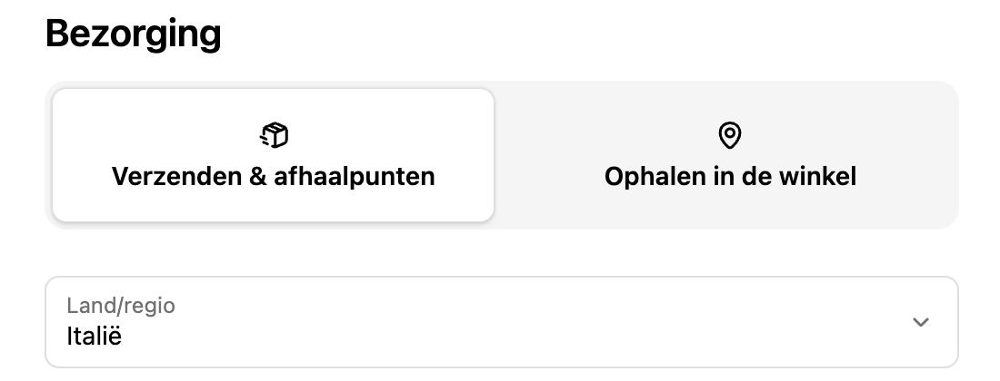

Il cliente sceglie prima **Verzenden & afhaalpunten** (Spedizione e punti di ritiro) o **Ophalen in de winkel** (Ritiro in negozio). Compaiono poi i metodi di spedizione del Paese scelto.

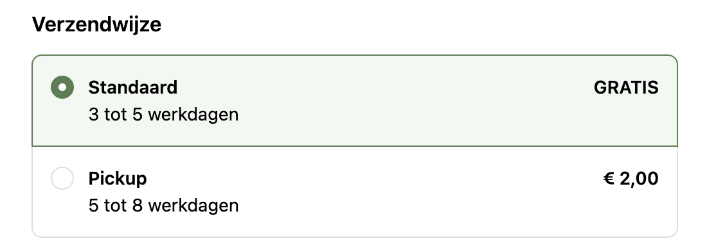

- **Standaard** (Standard) — Normale consegna a domicilio (nell'esempio: gratuita, 3–5 giorni lavorativi).
- **Pickup** — Ritiro presso un punto vicino (nell'esempio: € 2,00, 5–8 giorni lavorativi).

Se hai abilitato i punti di ritiro ([§5](#5-impostazioni-esportazione-e-zone) e [§6](#6-impostazioni-punti-di-ritiro)), il cliente sceglie un punto di ritiro nella pagina di ringraziamento dopo il checkout. In caso contrario, segue un'email di promemoria. *Prezzi e tempi di consegna sono esempi — dipendono dalle tue impostazioni e dal tuo contratto.*

## 10 · Uso quotidiano
Apri **App → MyParcel**. Arrivi alla schermata **Bestellingen** (Ordini), con schede come *All*, *Paid & Unfulfilled*, *Printed*, *Fulfilled* e *Onvolledig* (Incompleto).

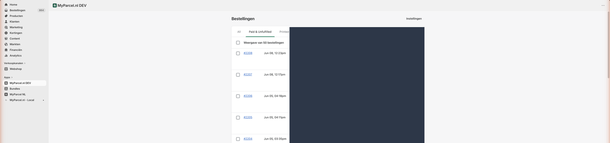 I dati del cliente sono oscurati in questa schermata.

1. Seleziona l'ordine o gli ordini che vuoi elaborare.
2. Usa la barra delle azioni che compare in alto:

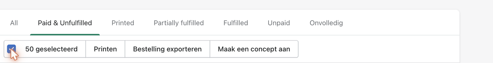

- **Printen** (Stampa) — Crea e stampa le etichette.
- **Bestelling exporteren** (Esporta ordine) — Invia l'ordine o gli ordini a MyParcel.
- **Maak een concept aan** (Crea una bozza) — Crea una spedizione in bozza da completare in seguito.

::: tip Quando vieni fatturato
Vieni fatturato solo quando una spedizione viene effettivamente consegnata al corriere.
:::

## 11 · Qualcosa non funziona — diagnostica
Scorri questa tabella dall'alto in basso — la maggior parte dei problemi si risolve in 5 minuti.

| Sintomo | Cosa controllare |
| --- | --- |
| **La schermata dell'app resta vuota** | Su un development store l'app *MyParcel.nl DEV* / *Local* si carica solo con un dev server attivo. Usa l'app pubblicata **MyParcel NL**. |
| **"Geen exportinstellingen gevonden voor de verzendmethode"** | Il metodo di spedizione di quell'ordine non è collegato. Collega la zona e il metodo corretti in [§5](#5-impostazioni-esportazione-e-zone). |
| **Nessun punto di ritiro al checkout** | Attiva il ritiro nel collegamento della zona ([§5](#5-impostazioni-esportazione-e-zone)) e controlla le impostazioni dei punti di ritiro ([§6](#6-impostazioni-punti-di-ritiro)). |
| **Errore durante la stampa di più etichette** | Un ordine con indirizzo incompleto non può essere esportato. Controlla gli ordini con un avviso (es. *Afhaallocatie niet vermeld*) e correggi l'indirizzo. |
| **La API key non viene accettata** | Reincolla la chiave dal backoffice (*Integrazioni*) senza spazi in più, poi **Opslaan** (Salva). |
| **Spedizione mondiale restituita dalla dogana** | Assicurati che codice HS e peso corrispondano. Imposta valori predefiniti ([§7](#7-impostazioni-spedizioni-mondiali)) o valori precisi per prodotto ([§8](#8-impostazioni-prodotto)). |

## 12 · FAQ

### L'app costa?
No. Paghi solo le spedizioni tramite MyParcel.

### Dove trovo la mia API key?
Nel tuo backoffice MyParcel sotto *Impostazioni negozio → Integrazioni*.

### Quali corrieri posso usare?
I corrieri attivati sul tuo account MyParcel, per zona — ad esempio PostNL, DHL e DPD nei Paesi Bassi, e InPost e Poste Italiane in Italia.

### Come cambio l'indirizzo del mittente sull'etichetta?
Si imposta nel tuo backoffice MyParcel (*Impostazioni negozio → Generale*), non nell'app. Le modifiche valgono subito.

### I miei clienti possono scegliere un punto di ritiro?
Sì — attiva il ritiro nel collegamento della zona ([§5](#5-impostazioni-esportazione-e-zone)). Il cliente sceglie un punto nella pagina di ringraziamento.

### Posso inviare un'etichetta di reso al cliente?
Sì — le etichette di reso possono essere inviate via email al cliente. Vedi il tuo backoffice MyParcel per le opzioni del portale resi.

## Risorse e supporto
- [github.com/myparcelnl/shopify ↗](https://github.com/myparcelnl/shopify) — manuale & issue.
- [apps.shopify.com ↗](https://apps.shopify.com/) — trova e aggiungi l'app MyParcel.
- [backoffice.myparcel.com ↗](https://backoffice.myparcel.com) — account, API key, fatturazione.
