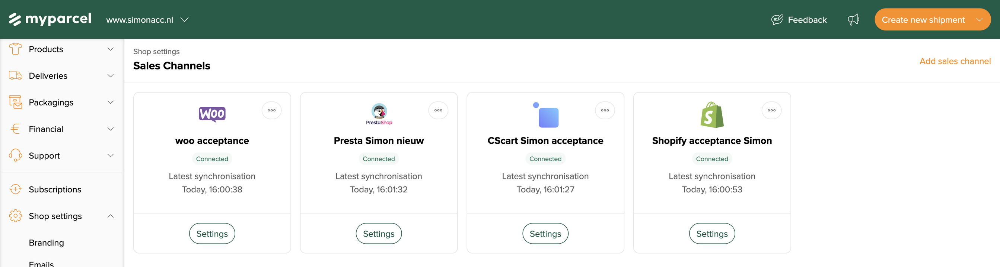
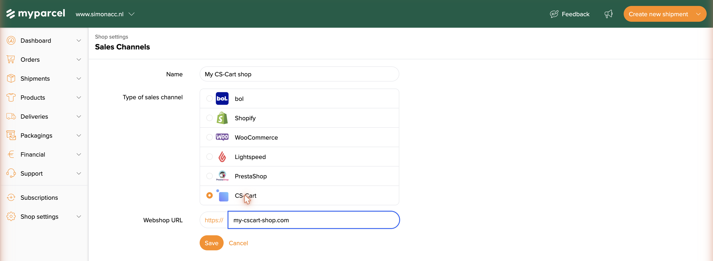
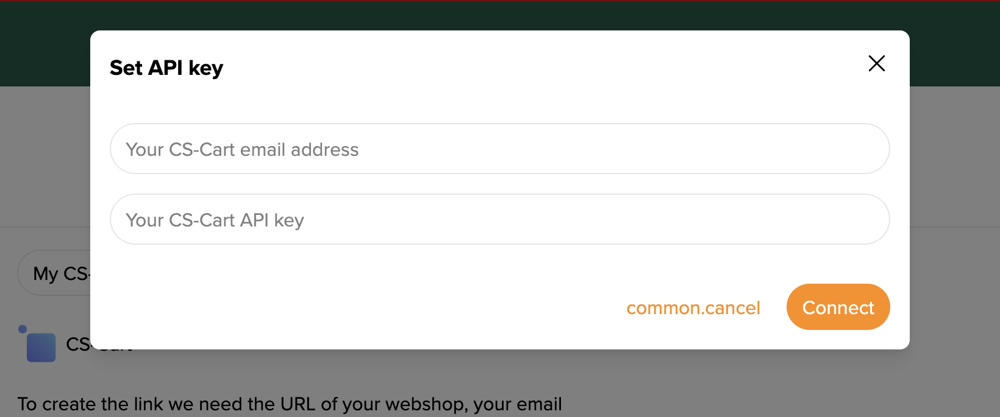

::: tip In het kort
CS-Cart koppel je aan MyParcel via een **Sales channel** die je aanmaakt in de MyParcel-backoffice, er is geen CS-Cart-app of -plugin om te installeren. Zodra de koppeling geauthenticeerd is, leest MyParcel je CS-Cart-bestellingen rechtstreeks uit via de CS-Cart REST API en importeert ze, klaar om te labelen en te verzenden. Je hebt drie dingen nodig uit je CS-Cart back office: de **webshop-URL**, je **CS-Cart-e-mailadres** en een **CS-Cart API-key**.
:::

::: warning Alleen via een Sales channel
Voor CS-Cart is er **geen plugin of app** in een marketplace. De **enige** manier om CS-Cart aan MyParcel te koppelen is door een **Sales channel** van het type *CS-Cart* aan te maken in je MyParcel-backoffice, zoals hieronder beschreven. Zoek je een module om in CS-Cart te installeren: die is er niet, alles wordt aan de MyParcel-kant ingesteld.
:::

## Snelstart, je eerste koppeling in 10 minuten
Genoeg om CS-Cart vandaag aan MyParcel te koppelen. Voor de details, zie [Wat zoek je?](#wat-zoek-je) hieronder.

1. **Account.** Heb je nog geen MyParcel-account? Maak er een aan via [myparcel.nl/register](https://www.myparcel.nl/register).
2. **Gegevens verzamelen.** Noteer in je **CS-Cart back office** je **shop-URL**, je **beheerders-e-mailadres** en genereer/activeer een **API-key** voor die beheerder (zie [Wat je nodig hebt en waar je het vindt](#2-wat-je-nodig-hebt-en-waar-je-het-vindt)).
3. **Sales channel toevoegen.** Ga in [backoffice.myparcel.nl](https://backoffice.myparcel.nl) naar *Shopinstellingen → Sales Channels* → **Add sales channel** → kies **CS-Cart** → vul een naam en je webshop-URL in → **Save**.
4. **Authenticeren.** Open de nieuwe channel, klik op **Set credentials**, plak je **CS-Cart-e-mailadres** en **CS-Cart API-key** en klik op **Connect**.
5. **Klaar.** Het label **Missing data** verdwijnt en de channel staat op **Connected**. MyParcel begint je CS-Cart-bestellingen te importeren.

::: tip Klaar als je dit ziet
- De channel staat op **Connected** in plaats van **Missing data**.
- Op de channel-kaart verschijnt een regel **Latest synchronisation** met een recente tijd.
- Nieuwe CS-Cart-bestellingen verschijnen in je MyParcel-overzicht *Zendingen*.
:::

## Wat zoek je?
| Wat wil je doen? | Ga naar |
| --- | --- |
| Begrijpen hoe de koppeling werkt | [1 · Hoe de koppeling werkt](#1-hoe-de-koppeling-werkt) |
| Precies weten welke gegevens je nodig hebt | [2 · Wat je nodig hebt en waar je het vindt](#2-wat-je-nodig-hebt-en-waar-je-het-vindt) |
| Je MyParcel-account voorbereiden | [3 · Je MyParcel-account voorbereiden](#3-je-myparcel-account-voorbereiden) |
| De sales channel aanmaken | [4 · De sales channel aanmaken](#4-de-sales-channel-aanmaken) |
| Authenticeren met e-mail en API-key | [5 · De koppeling authenticeren](#5-de-koppeling-authenticeren) |
| Bestellingen dagelijks verwerken | [6 · Dagelijks gebruik](#6-dagelijks-gebruik) |
| Er werkt iets niet | [7 · Er werkt iets niet, diagnose](#7-er-werkt-iets-niet-diagnose) |
| Antwoord op een veelgestelde vraag | [8 · FAQ](#8-faq) |

## 1 · Hoe de koppeling werkt
Anders dan WooCommerce, PrestaShop of Magento, die een plugin in de webshop gebruiken, heeft CS-Cart **geen module om te installeren**. In plaats daarvan koppelt MyParcel met CS-Cart zoals een extern systeem dat doet: via de **CS-Cart REST API**.

Je registreert je shop één keer als **Sales channel** in de MyParcel-backoffice en geeft MyParcel toestemming om die uit te lezen (je e-mailadres + een API-key). Vanaf dan **haalt** MyParcel je bestellingen rechtstreeks op uit CS-Cart en importeert ze als zendingen. Labels maken en verzenden doe je vanuit je MyParcel-backoffice, precies zoals bij elke andere channel.

Omdat de koppeling server-naar-server via de API loopt, hoef je niets te onderhouden in CS-Cart zelf en is er geen checkout-module, bezorgopties worden niet aan de CS-Cart-checkout toegevoegd.

## 2 · Wat je nodig hebt en waar je het vindt
Om de koppeling te maken heeft MyParcel drie gegevens uit je **CS-Cart back office** nodig. Dit staat ook in de backoffice als je de channel toevoegt: *"To create the link we need the URL of your webshop, your email address and an API key that can be found in your CS-Cart back office."* (De URL van je webshop, je e-mailadres en een API-key uit je CS-Cart back office.)

| Wat | Wat het is | Waar je het vindt in CS-Cart |
| --- | --- | --- |
| **Webshop-URL** | Het webadres van je CS-Cart-storefront, bijv. `https://jouw-shop.nl`. | Het adres van de voorpagina van je shop. Gebruik hetzelfde domein als je klanten. |
| **CS-Cart-e-mailadres** | Het e-mailadres van een CS-Cart-**beheerdersaccount** met API-toegang. | Het e-mailadres van de beheerder waarmee je in de CS-Cart back office inlogt. |
| **CS-Cart API-key** | Een key die API-toegang geeft voor die beheerder. | Open in het CS-Cart-adminpaneel het profiel van de beheerder (gebruikersmenu rechtsboven, of *Customers → Administrators →* kies de gebruiker). Zet in het onderdeel **API access** de API-toegang aan en kopieer de gegenereerde **API-key**. |

::: tip Zet API-toegang aan voor de gebruiker
In CS-Cart hoort de API-key bij een specifieke beheerder en werkt hij alleen als **API access is ingeschakeld** voor die gebruiker. Zie je geen API-key? Vink dan in het profiel van de beheerder de optie voor API-toegang aan en sla op, CS-Cart toont dan de key. De exacte benaming en plek kunnen per CS-Cart-versie en thema iets verschillen.
:::

::: warning Behandel de API-key als een wachtwoord
Het e-mailadres en de API-key geven samen volledige leestoegang tot je CS-Cart-bestellingen. Deel ze niet en vul ze alleen in de officiële MyParcel-backoffice in ([backoffice.myparcel.nl](https://backoffice.myparcel.nl)).
:::

## 3 · Je MyParcel-account voorbereiden
Regel voordat je de channel toevoegt drie dingen in je MyParcel-backoffice:

1. **Factuur- en retouradres**, *Shopinstellingen → Algemeen*. Dit komt op al je labels.
2. **Vervoerders activeren**, *Shopinstellingen → Vervoerders*. Alleen aangevinkte vervoerders kun je later op je zendingen kiezen.
3. **Standaard pakkettype**, *Accountinstellingen → Zendingen*. Geïmporteerde CS-Cart-orders vallen terug op dit type.

## 4 · De sales channel aanmaken
1. Log in op [backoffice.myparcel.nl](https://backoffice.myparcel.nl) en ga naar **Shopinstellingen → Sales Channels**.
2. Klik op **Add sales channel** (rechtsboven).

3. Vul een **Name** (naam) in waaraan je de channel herkent (bijv. *Mijn CS-Cart shop*).
4. Kies bij **Type of sales channel** de optie **CS-Cart**.
5. Vul bij **Webshop URL** het adres van je CS-Cart-storefront in (bijv. `jouw-shop.nl`).
6. Klik op **Save**. De channel wordt aangemaakt en krijgt het label **Missing data**, dat betekent alleen dat de authenticatiestap nog moet gebeuren.

## 5 · De koppeling authenticeren
Een sales channel heeft toestemming nodig om je CS-Cart-bestellingen te lezen. Voor CS-Cart doe je dit met je **CS-Cart-e-mailadres** en **CS-Cart API-key** (zie [Wat je nodig hebt en waar je het vindt](#2-wat-je-nodig-hebt-en-waar-je-het-vindt)).

1. Open de channel en klik op **Set credentials**.
2. Vul in het venster **Set API key** in:
   - **Your CS-Cart email address**, het beheerders-e-mailadres uit CS-Cart.
   - **Your CS-Cart API key**, de API-key uit het profiel van die beheerder.
3. Klik op **Connect**.

Na het verbinden verdwijnt het label **Missing data**, staat de channel op **Connected** en begint MyParcel je CS-Cart-bestellingen te synchroniseren.

::: warning Lukt het verbinden niet?
Meest voorkomende oorzaken: een extra spatie meegeplakt met het e-mailadres of de API-key · API-toegang niet ingeschakeld voor die beheerder in CS-Cart · een webshop-URL die niet hoort bij de shop van de key · de API-key hoort bij een andere beheerder dan het ingevulde e-mailadres.
:::

## 6 · Dagelijks gebruik
Zodra de channel verbonden is, importeert MyParcel je CS-Cart-bestellingen automatisch:

1. Nieuwe CS-Cart-bestellingen verschijnen als zendingen in je MyParcel-overzicht **Zendingen**.
2. Selecteer de bestellingen, maak labels en bied ze aan bij de vervoerder, allemaal vanuit je MyParcel-backoffice.
3. Je betaalt pas zodra een zending daadwerkelijk aan de vervoerder is overgedragen.

::: tip Bulk verwerken
Selecteer meerdere nieuwe bestellingen met de checkbox bovenaan het zendingenoverzicht en gebruik *Verwerken* + *Labels printen* om een hele batch in één keer af te handelen.
:::

## 7 · Er werkt iets niet, diagnose
Loop deze tabel van boven naar onder door, de meeste problemen zijn binnen een paar minuten opgelost.

| Symptoom | Wat te checken |
| --- | --- |
| **Channel blijft op "Missing data" staan** | De authenticatiestap is niet afgerond. Open de channel, klik op **Set credentials** en vul je CS-Cart-e-mail en API-key in ([§5](#5-de-koppeling-authenticeren)). |
| **"Connect" wordt geweigerd** | Plak het e-mailadres en de API-key opnieuw zonder extra spaties. Controleer of **API access is ingeschakeld** voor die beheerder in CS-Cart en of het e-mailadres en de key bij **dezelfde** beheerder horen. |
| **Er worden geen bestellingen geïmporteerd** | Controleer of de **Webshop URL** klopt en bereikbaar is (`https://…`), en of de beheerder van wie je de key gebruikt de bestellingen in CS-Cart kan zien. |
| **Sommige bestellingen ontbreken** | MyParcel importeert bestellingen die het via de API kan lezen. Zorg dat de bestellingen bestaan en zichtbaar zijn voor de API-gebruiker in CS-Cart. |
| **Verkeerd pakkettype op bestellingen** | Geïmporteerde bestellingen vallen terug op je **standaard pakkettype** in *Accountinstellingen → Zendingen*. Pas het daar aan, of wijzig losse zendingen vóór verwerking. |

## 8 · FAQ

### Is er een CS-Cart-plugin?
Nee. CS-Cart koppelt alleen via een **Sales channel** in de MyParcel-backoffice, over de CS-Cart REST API. Er is niets te installeren in CS-Cart zelf.

### Waar vind ik mijn CS-Cart API-key?
In het CS-Cart-adminpaneel, in het profiel van de beheerder onder het onderdeel **API access**. Zet API-toegang aan voor de gebruiker en CS-Cart toont de key. Het e-mailadres is het login-e-mailadres van diezelfde beheerder. Zie [§2](#2-wat-je-nodig-hebt-en-waar-je-het-vindt).

### Kan ik MyParcel-bezorgopties tonen in de CS-Cart-checkout?
Nee. De koppeling is server-naar-server voor het importeren van bestellingen; ze voegt geen bezorgopties toe aan de CS-Cart-checkout.

### Kost de koppeling geld?
Nee. De koppeling is gratis. Je betaalt alleen voor de zendingen via je MyParcel-tarief.

### Hoe wijzig ik het afzenderadres op het label?
Dat stel je in je MyParcel-backoffice in (*Shopinstellingen → Algemeen*), niet in CS-Cart. Wijzigingen zijn meteen actief.

## Bronnen & support
- [backoffice.myparcel.nl ↗](https://backoffice.myparcel.nl), sales channels, account, API-key, facturatie.
- [Contact MyParcel-support](../../contact.md), **023 - 30 30 315** · [info@myparcel.nl](mailto:info@myparcel.nl).

Deze handleiding beschrijft de huidige CS-Cart sales channel in de MyParcel-backoffice. Schermen aan de CS-Cart-kant kunnen er per versie of thema iets anders uitzien; de gegevens die je nodig hebt (webshop-URL, e-mail, API-key) blijven hetzelfde.
