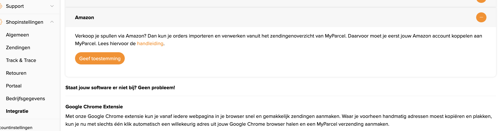
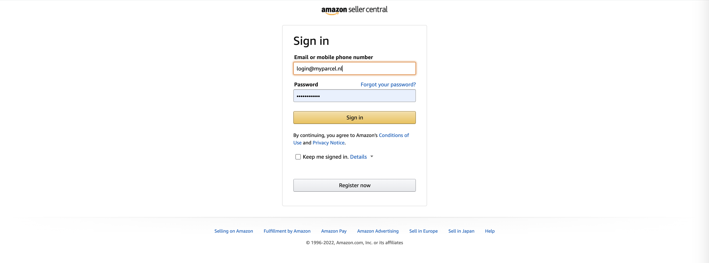
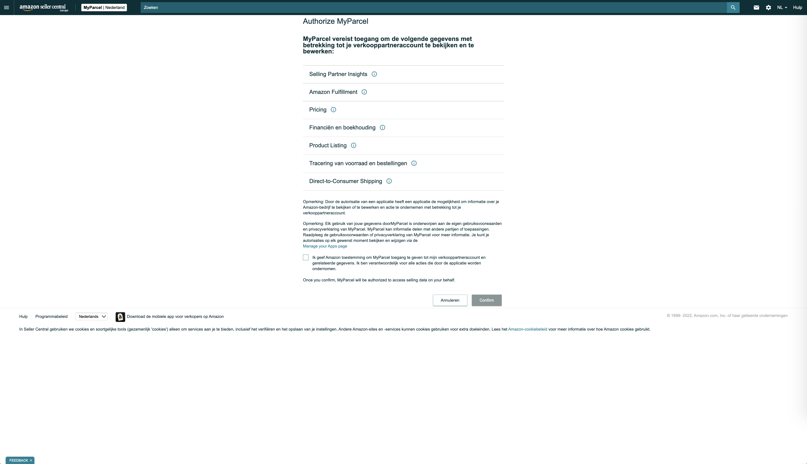
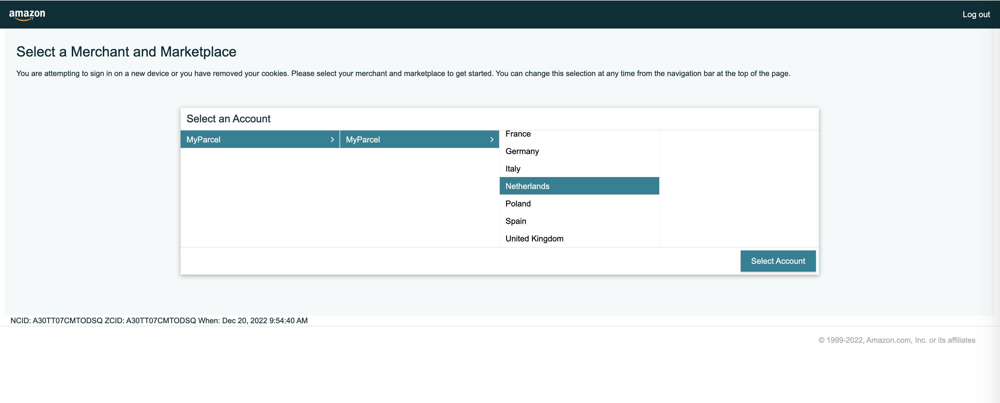
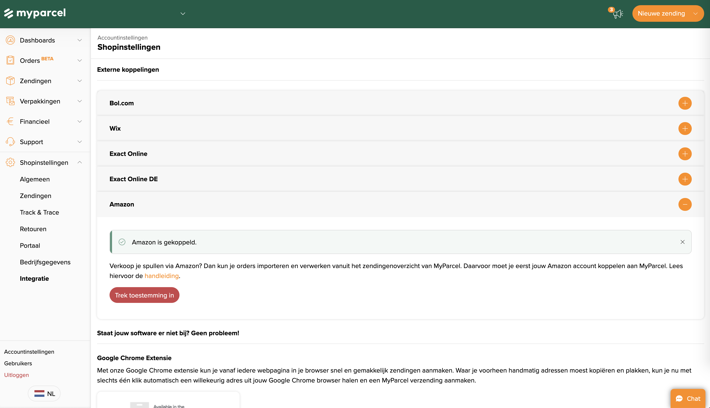

::: tip In het kort
De Amazon-integratie verbindt je Amazon Seller-account met MyParcel via OAuth. Geen plugin, geen code — je geeft één keer toestemming, exporteert je niet-verzonden bestellingen uit Seller Central en upload het bestand in MyParcel. Wij maken concept-zendingen, jij print labels in bulk en de track & trace gaat automatisch terug naar Amazon.
:::

::: warning Vereiste van Amazon
Amazon staat een API-koppeling alleen toe op een **Professional selling plan**. Op het Individual plan werkt de koppeling niet — upgraden doe je in Amazon Seller Central onder *Account info → Your Services*.
:::

## Snelstart — in 15 minuten je eerste Amazon-label
Genoeg om vandaag je eerste Amazon-bestelling te versturen. Dieper finetunen doe je later via [Wat zoek je?](#wat-zoek-je) hieronder.

1. **Account.** Heb je nog geen MyParcel-account? Maak er een aan via [myparcel.nl/register](https://www.myparcel.nl/register).
2. **Koppelen.** Log in op [backoffice.myparcel.nl](https://backoffice.myparcel.nl) → *Shopinstellingen → Integratie* → scroll naar Amazon → klik **Geef toestemming**. Volg de Amazon-login en kies je markt.
3. **Standaard pakkettype kiezen.** *Accountinstellingen → Zendingen* → stel het pakkettype in dat geïmporteerde Amazon-orders standaard krijgen (vaak *Pakket*).
4. **Orderbestand exporteren.** In Amazon Seller Central: *Bestellingen → Besteloverzichten → Niet-verzonden bestellingen* → **Aanvraag** → wacht (max 15 minuten) → download het `.txt`-bestand.
5. **Importeren & printen.** In MyParcel: *Zendingen* → **Upload Amazon orders** → kies het bestand. Concepten verschijnen in je zendingenoverzicht — verwerk en print de labels in bulk.

::: tip Klaar als je dit ziet
- In *Shopinstellingen → Integratie* staat onder Amazon: *gekoppeld*.
- Een nieuwe Amazon-order verschijnt na upload als concept-zending.
- Het label rolt eruit en de Amazon-bestelling krijgt automatisch status *verzonden*.
:::

## Wat zoek je?
| Wat wil je doen? | Ga naar |
| --- | --- |
| Voor het eerst koppelen | [Snelstart](#snelstart-in-15-minuten-je-eerste-amazon-label) |
| Stap-voor-stap koppel-flow met screenshots | [3 · Amazon koppelen (OAuth)](#3-amazon-koppelen-oauth) |
| Een orderbestand exporteren uit Amazon | [5 · Een orderbestand maken in Amazon](#5-een-orderbestand-maken-in-amazon) |
| Orders importeren in MyParcel | [6 · Orders importeren in MyParcel](#6-orders-importeren-in-myparcel) |
| Standaard pakkettype kiezen voor Amazon-orders | [7 · Standaard pakkettype](#7-standaard-pakkettype) |
| Welke instellingen passen bij mijn type verkoop? | [4 · Welk verkoper-profiel ben jij?](#4-welk-verkoper-profiel-ben-jij) |
| Bulkverwerking voor 50+ orders/dag | [8 · Dagelijks gebruik](#8-dagelijks-gebruik) |
| Iets werkt niet | [9 · Iets werkt niet — diagnose](#9-iets-werkt-niet-diagnose) |
| Antwoord op een veelgestelde vraag | [10 · FAQ](#10-faq) |

## 1 · Voorbereiden in Amazon Seller Central
Voordat je in MyParcel begint, regel je drie dingen aan de Amazon-kant:

1. **Professional selling plan.** Verifieer onder *Settings → Account Info* dat je op het Professional plan zit. Zonder dit plan blokkeert Amazon de API-koppeling.
2. **Optionele kolommen uitzetten.** Ga in Seller Central naar *Bestellingen → Besteloverzichten → Niet-verzonden bestellingen* en zet **alle optionele kolommen uit** — voor *elk* land waar je verkoopt, ook landen die je nog niet bedient. MyParcel kan optionele kolommen niet uitlezen, en het besteloverzicht wordt dan onbruikbaar.
3. **Verkooplanden helder.** Schrijf op welke Amazon-marktplaatsen actief zijn: NL, DE, ES, IT, UK, FR. Dit gebruik je in [§3](#3-amazon-koppelen-oauth) bij *Selecteer een markt*.

## 2 · Voorbereiden in je MyParcel-account
1. **Factuur- en retouradres** — *Shopinstellingen → Algemeen*. Dit komt op al je labels.
2. **Vervoerders activeren** — *Shopinstellingen → Vervoerders*. Alleen aangevinkte vervoerders kun je later kiezen op je zendingen.
3. **Standaard pakkettype** — *Accountinstellingen → Zendingen*. Geïmporteerde Amazon-orders krijgen dit type — zie [§7](#7-standaard-pakkettype).

::: tip Géén API-key nodig
Anders dan bij plugin-integraties (WooCommerce/PrestaShop/Magento) gebruikt Amazon **OAuth**, niet een API-key. Je geeft eenmalig toestemming via de Amazon-login en de koppeling staat. Niets te kopiëren of plakken.
:::

## 3 · Amazon koppelen (OAuth)
De koppel-flow loopt vijf schermen door — drie aan de MyParcel-kant en twee aan de Amazon-kant. Volg ze achter elkaar; tussentijds afsluiten betekent opnieuw beginnen.

### Stap 1 — Amazon-integratie selecteren
Open *Shopinstellingen → Integratie* in je MyParcel-backoffice en scroll naar Amazon. Klik op **Geef toestemming**.

### Stap 2 — Inloggen bij Amazon
Je springt naar Amazon. Log in met je **Seller Central**-credentials — niet je gewone klantaccount.

::: warning MyParcel ziet je wachtwoord niet
Je logt rechtstreeks bij Amazon in. MyParcel ziet alleen het OAuth-token dat Amazon teruggeeft — geen wachtwoord, geen accountdetails buiten wat nodig is voor orders.
:::

### Stap 3 — Privacy-toestemming bevestigen
Amazon toont een toestemmingsscherm waarin staat dat MyParcel voldoet aan Amazon's Data Protection Policy. Vink het bevestigingsvakje aan en klik door.

### Stap 4 — Markt selecteren
Kies welk Amazon-verkoopland je wilt koppelen. Je kunt de marktplaatsen NL, DE, ES, IT, UK en FR selecteren. Verkoop je op meerdere markten? Doorloop deze stap dan per markt — herhaal de hele OAuth-flow voor elk land.

### Stap 5 — Bevestiging in MyParcel
Je springt automatisch terug naar de MyParcel-backoffice. Onder Amazon staat nu de status *gekoppeld* met de gekoppelde markt(en).

::: tip Koppeling losmaken
Wil je de koppeling later verbreken? Klik in *Shopinstellingen → Integratie* op het Amazon-blok en kies **Koppeling verwijderen**. Je kunt daarna opnieuw beginnen met *Geef toestemming*.
:::

## 4 · Welk verkoper-profiel ben jij?
Drie typische profielen met aanbevolen instellingen. Eén kiezen, instellingen overnemen, dan met [§5](#5-een-orderbestand-maken-in-amazon) tot [§7](#7-standaard-pakkettype) finetunen.

### NL-only — paar Amazon-orders per dag
| Instelling | Aanbevolen | Waarom |
| --- | --- | --- |
| Gekoppelde markt(en) | Alleen Amazon.nl | Hou het simpel zolang je nationaal verkoopt |
| Standaard pakkettype | Pakket | Veilige default voor de meeste artikelen |
| Vervoerder | PostNL | Standaard NL-vervoerder |
| Export-frequentie | 1× per dag (einde van de dag) | Eén batch labels printen |

### Multi-EU — NL + DE/FR/IT/ES
| Instelling | Aanbevolen | Waarom |
| --- | --- | --- |
| Gekoppelde markt(en) | Per land apart koppelen | Je doorloopt de OAuth-flow per markt |
| Standaard pakkettype | Pakket | Brievenbuspakje werkt niet over de grens |
| Vervoerders | PostNL + DHL Parcel Connect | Brede dekking binnen EU |
| Optionele kolommen | Allemaal uit (in élk land) | Eén land aan = onbruikbare export |

### Wereldwijd — ook UK/buiten EU
| Instelling | Aanbevolen | Waarom |
| --- | --- | --- |
| Gekoppelde markt(en) | NL + relevante EU + UK | Per markt apart koppelen |
| Standaard pakkettype | Pakket | Brievenbuspakje is niet wereldwijd geldig |
| Vervoerders | PostNL + DHL Parcel Connect + UPS | UPS voor wereldzendingen |
| Douaneformulier | Handmatig aanvullen per zending | Amazon-export levert geen complete douanedata — zie [§10](#10-faq) |

## 5 · Een orderbestand maken in Amazon
Een gekoppelde markt is nog geen automatische orderstroom — Amazon levert je orders in een tekstbestand dat je zelf exporteert.

1. In Amazon Seller Central: open **Bestellingen → Besteloverzichten → Niet-verzonden bestellingen**.
2. Bij *Overzichten aanvragen* klik je op de gele knop **Aanvraag**.
3. Wacht tot het overzicht klaarstaat — meestal binnen een paar minuten, soms tot 15 minuten. Klik op **Vernieuwen** om te zien of het laatste overzicht beschikbaar is.
4. Download het nieuwste bestand uit de tabel *Overzicht downloaden*. Het is een `.txt`-bestand.

::: warning Alleen "Niet-verzonden bestellingen" werkt
MyParcel kan uitsluitend dit specifieke besteloverzicht inlezen. Andere overzichten (Alle bestellingen, Verzonden, Geannuleerd) hebben een afwijkende kolomstructuur en geven importfouten.
:::

::: warning Optionele kolommen = mislukte import
Heb je in Seller Central optionele kolommen aanstaan voor één van je landen? Dan loopt de import vast — ook voor orders uit andere landen. Zet *alle* optionele kolommen uit, in *elk* land waarop je verkoopt, óók landen waar je niet actief bent.
:::

## 6 · Orders importeren in MyParcel
Met het `.txt`-bestand op je computer kun je in MyParcel uploaden:

1. Open in de MyParcel-backoffice **Zendingen**.
2. Klik bovenin op **Upload Amazon orders**.
3. Kies het zojuist gedownloade Amazon-besteloverzicht.
4. De orders verschijnen als **concept-zendingen** in je zendingenoverzicht — klaar om te verwerken en aan te bieden bij de vervoerder.

::: tip Bulk verwerken
Selecteer in het zendingenoverzicht alle nieuwe concepten met de checkbox bovenaan en gebruik *Verwerken* + *Labels printen* om in één klik álle Amazon-orders van die dag af te handelen.
:::

## 7 · Standaard pakkettype
Geïmporteerde Amazon-orders krijgen geen specifiek pakkettype mee uit Amazon — daarom valt MyParcel terug op je **standaard pakkettype**.

Open *Accountinstellingen → Zendingen* en kies één van:

| Pakkettype | Wanneer kiezen |
| --- | --- |
| **Pakket** | Veilige default. Werkt voor alle vervoerders en alle bestemmingslanden. |
| **Klein pakket** | Compacte producten (boeken, kleine elektronica). Goedkoper bij PostNL/DHL. |
| **Brievenbuspakje** | Plat product < 3,2 cm, alleen NL/BE. Verzekering en bezorgopties zijn dan niet beschikbaar. |
| **Digitale postzegel** | Alleen voor zeer lichte zendingen tot 2 kg, geen track & trace. |

::: warning Eén type voor álle Amazon-orders
Het standaard pakkettype geldt voor élke order die via de Amazon-koppeling binnenkomt. Verkoop je zowel boeken (klein pakket) als grote producten (pakket)? Stel dan in op *Pakket* en pas afwijkende orders handmatig aan in het zendingenoverzicht voordat je ze verwerkt.
:::

## 8 · Dagelijks gebruik

### Workflow — één keer per dag
1. **Aan het einde van de dag** in Seller Central: *Bestellingen → Besteloverzichten → Niet-verzonden bestellingen → Aanvraag*.
2. Wacht enkele minuten en download het `.txt`-bestand.
3. In MyParcel: **Zendingen → Upload Amazon orders** → bestand kiezen.
4. Selecteer de nieuwe concepten en klik **Verwerken** + **Labels printen**.
5. Plak de labels op de pakketten en geef aan de vervoerder.
6. Amazon ontvangt automatisch de barcodes terug — bestellingen krijgen status *verzonden*.

### Workflow — meerdere batches per dag
Bij 50+ orders/dag kun je meerdere keren per dag een nieuw besteloverzicht aanvragen. Amazon zet alleen *niet-verzonden* orders in de export, dus elke nieuwe aanvraag bevat alleen wat sinds de vorige run is binnengekomen.

::: tip Pas op voor dubbele orders
Vraag tussen twee uploads minstens 15 minuten ruimte voor Amazon om de eerder gemarkeerde orders als verzonden te verwerken. Anders zie je dezelfde order opnieuw in je nieuwe export.
:::

### Retouren
Amazon-retouren handel je af in Seller Central. MyParcel maakt geen retourlabels aan via de Amazon-koppeling — wil je je klanten een retourlabel meesturen, gebruik dan de retourfunctie in je MyParcel-backoffice naast de Amazon-flow.

## 9 · Iets werkt niet — diagnose
Werkt iets niet zoals verwacht? Loop deze tabel van boven naar onder door — drie op de vier issues zijn in een paar minuten opgelost.

| Symptoom | Wat te checken |
| --- | --- |
| **"Geef toestemming" doet niets / popup-blocker** | OAuth-flow opent in een nieuw tabblad. Sta popups toe voor `backoffice.myparcel.nl`, klik opnieuw. |
| **Amazon weigert de koppeling — *"You don't have a Professional selling plan"*** | Je zit op het Individual plan. Upgrade in Seller Central onder *Account info → Your Services* en herhaal [§3](#3-amazon-koppelen-oauth). |
| **`.txt`-import faalt of importeert nul orders** | Bijna altijd: optionele kolommen aan in Seller Central. Zet alle optionele kolommen uit voor *elk* verkoopland en exporteer opnieuw. Zie [§5](#5-een-orderbestand-maken-in-amazon). |
| **Niet alle markten verschijnen na koppeling** | OAuth-flow gaat per markt. Herhaal *Geef toestemming* in MyParcel voor elk land waarin je verkoopt. |
| **Orders verschijnen niet als concept** | (1) Heb je het juiste overzicht *Niet-verzonden bestellingen* gebruikt? Andere overzichten werken niet. (2) Check of de upload een succes-melding gaf. |
| **Wereldzending: douaneformulier leeg** | Bekend gedrag. Amazon levert geen volledige douanedata. Vul HS-code, herkomstland en goederenomschrijving handmatig aan vóór je het label print. |
| **Amazon ziet de zending niet als verzonden** | Barcodes worden teruggekoppeld zodra je het label print. Wacht 5–15 minuten; controleer in Seller Central onder *Bestellingen*. Druk je een label opnieuw, dan stuurt MyParcel niet nogmaals een update. |
| **Verkeerd pakkettype op alle orders** | Pakkettype komt uit *Accountinstellingen → Zendingen*. Zie [§7](#7-standaard-pakkettype). |

## 10 · FAQ

### Worden de barcodes teruggekoppeld naar Amazon?
Ja. Zodra je een label print, stuurt MyParcel de barcode terug naar Amazon en krijgt de bestelling automatisch de status *verzonden* in Seller Central.

### Kan ik een ander besteloverzicht gebruiken?
Nee. Alleen het overzicht **Niet-verzonden bestellingen** uit Seller Central kan worden uitgelezen. Gebruik altijd dat type — andere bestanden geven importfouten.

### Kan ik wereldzendingen importeren via de Amazon-koppeling?
Ja, maar het douaneformulier wordt niet volledig gevuld. HS-code, herkomstland en de goederenomschrijving moet je per zending handmatig aanvullen voordat je het label print.

### Het importeren van het `.txt`-bestand lukt niet — wat nu?
Hoogstwaarschijnlijk staan er optionele kolommen aan in Seller Central. MyParcel kan die niet uitlezen. Zet alle optionele kolommen uit — *voor elk land*, óók landen waarin je niet verkoopt — en exporteer een nieuw besteloverzicht.

### Heb ik een API-key nodig zoals bij WooCommerce of PrestaShop?
Nee. Amazon werkt met OAuth, niet met API-keys. Je geeft via *Geef toestemming* éénmalig toestemming en de koppeling staat — er is niets te kopiëren of in te plakken.

### Werkt de koppeling met Amazon.com (Verenigde Staten)?
De koppeling ondersteunt Amazon.nl, Amazon.de, Amazon.es, Amazon.it, Amazon.co.uk en Amazon.fr. Amazon.com (VS) wordt op dit moment niet ondersteund.

### Kost de Amazon-koppeling geld?
Nee. De koppeling is gratis. Je betaalt alleen voor de zendingen via je MyParcel-tarief.

### Kan ik bezorgopties (avondbezorging, afhaalpunten) tonen aan Amazon-klanten?
Nee. De checkout draait op Amazon — daar heeft MyParcel geen invloed op. Bezorgopties van MyParcel werken alleen op je eigen webshop (WooCommerce, Magento, PrestaShop, etc.).

### Plugin-update of nieuwe Amazon-vereisten — moet ik iets doen?
Nee onderhoud nodig aan jouw kant. Updates aan de OAuth-koppeling regelen wij. Verandert Amazon hun export-formaat? Dan krijg je daar bericht over via je MyParcel-account.

## Bronnen & support
- [backoffice.myparcel.nl ↗](https://backoffice.myparcel.nl) — koppeling beheren, account, facturatie.
- [sellercentral.amazon.nl ↗](https://sellercentral.amazon.nl) — besteloverzichten exporteren, plan beheren.
- [Contact MyParcel-support](../contact.md) — **023 - 30 30 315** · [info@myparcel.nl](mailto:info@myparcel.nl).

Deze handleiding is geschreven voor de huidige Amazon-koppeling van MyParcel. Schermen aan de Amazon-kant kunnen er per land of update licht anders uitzien; de stappen blijven hetzelfde.
