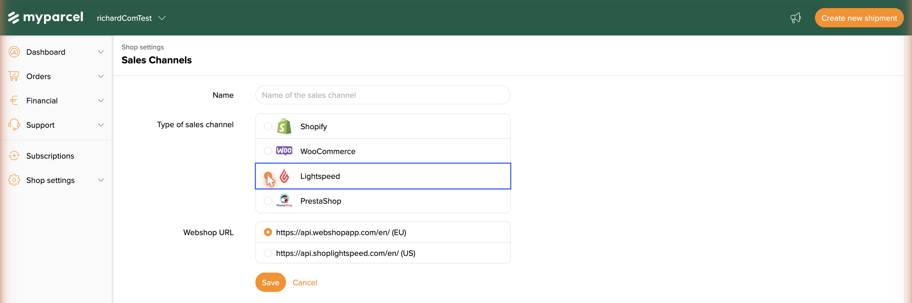
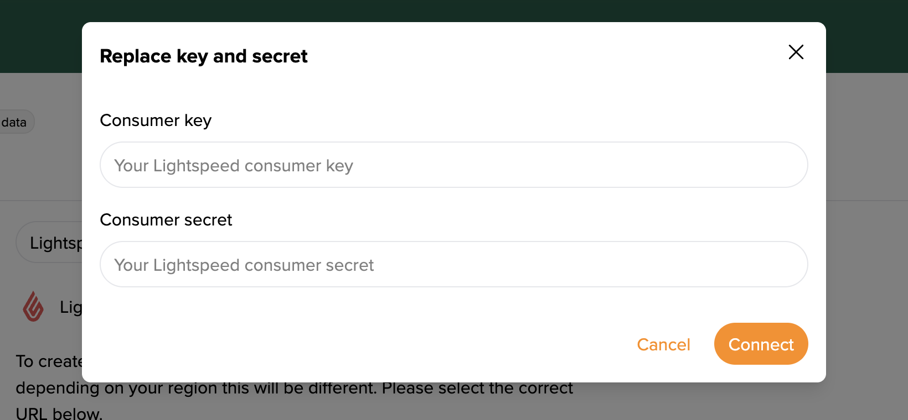
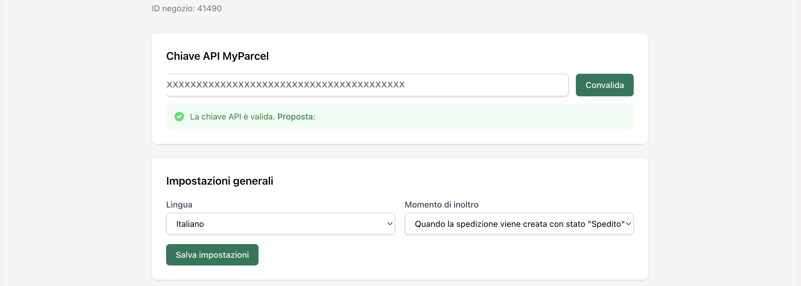
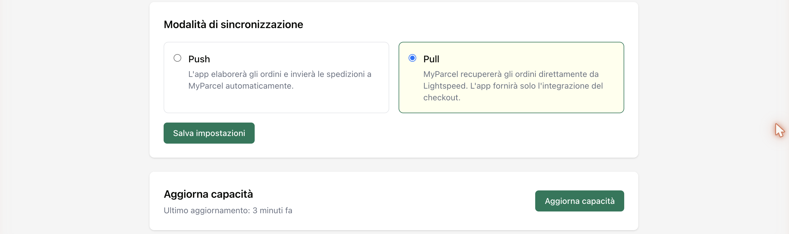
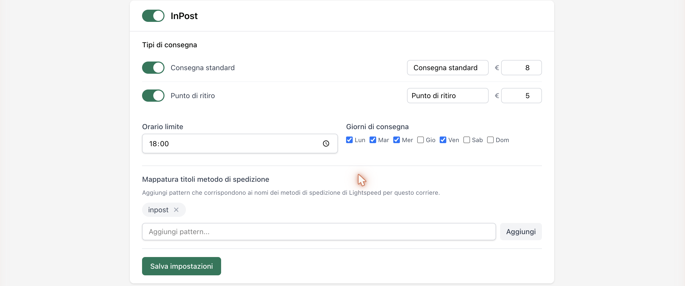
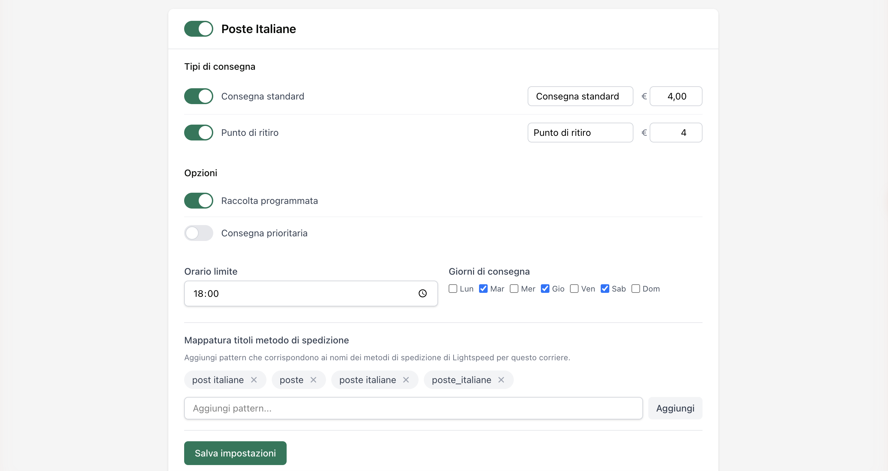

::: tip In short
The MyParcel app connects your Lightspeed shop to MyParcel. You enable your carriers, set the delivery options you want to offer and link them to your Lightspeed shipping methods. Delivery options then show at checkout and your orders are ready to ship through MyParcel. No code needed — everything runs from the app's settings page.
:::

## Quickstart — your first parcel in 15 minutes
Enough to ship your first real order today. For deeper configuration, see [Looking for…](#looking-for) below.

1. **Account.** Don't have a MyParcel account yet? Create one at [myparcel.com/register](https://www.myparcel.com/register).
2. **Copy the API key.** Log in to [backoffice.myparcel.com](https://backoffice.myparcel.com) → *Shop settings → Integrations* → copy the API key.
3. **Add the app.** In your Lightspeed back office, open the **App Store**, search *MyParcel* and install it.
4. **Connect the app.** Open the MyParcel app settings, paste the key in **Chiave API MyParcel** (MyParcel API key) and click **Convalida** (Validate).
5. **Enable a carrier.** Switch on a carrier (e.g. InPost or Poste Italiane), turn on at least one delivery type and add a shipping-method pattern under **Mappatura titoli** (Method title mapping). Click **Salva impostazioni** (Save settings).

::: tip You're done when you see this
- The green message **La chiave API è valida** (The API key is valid) appears under the key field
- At least one carrier is switched on with a delivery type enabled
- The carrier's **Mappatura titoli** matches the names of your Lightspeed shipping methods
:::

## Looking for…
| What do you want to do? | Go to |
| --- | --- |
| First-time setup | [Quickstart](#quickstart-your-first-parcel-in-15-minutes) |
| Connect your account | [3 · Connecting the app](#3-connecting-the-app-api-key) |
| Connect from the backoffice instead of the app | [Sales channel via the MyParcel Backoffice](#sales-channel-via-the-myparcel-backoffice-alternative) |
| Choose the app language or when orders are sent | [4 · Settings · General](#4-settings-general) |
| Choose how orders sync (Push or Pull) | [5 · Settings · Sync mode](#5-settings-sync-mode) |
| Refresh carriers and options | [6 · Settings · Updating capacity](#6-settings-updating-capacity) |
| Enable a carrier and link shipping methods | [7 · Settings · Carriers](#7-settings-carriers) |
| A different setting per product | [8 · Product settings](#8-product-settings) |
| What the customer sees at checkout | [9 · The checkout experience](#9-the-checkout-experience) |
| Process orders day to day | [10 · Daily use](#10-daily-use) |
| Something's not working | [11 · Something's not working — diagnostics](#11-somethings-not-working-diagnostics) |
| Answer to a frequently asked question | [12 · FAQ](#12-faq) |

## 1 · Preparing your MyParcel account
Before you start in Lightspeed, take care of three things in your MyParcel backoffice:

1. **Billing and return address** — *Shop settings → General*. This appears on every label.
2. **Activate carriers** — *Shop settings → Carriers*. Only enabled carriers appear in the app later.
3. **Generate an API key** — *Shop settings → Integrations*.

You also need your **shipping methods** set up in Lightspeed. The app links to these methods by name (see [§7](#7-settings-carriers)).

## 2 · Installing the app
1. Open the **App Store** in your Lightspeed back office and search *MyParcel*.
2. Install the app and allow the connection to your shop.
3. Open the app to reach the settings page. It updates itself automatically from then on.

## Sales channel via the MyParcel Backoffice (alternative)
Alongside the App Store app, you can connect Lightspeed straight from your MyParcel backoffice as a **Sales channel**. MyParcel then talks to your Lightspeed shop directly over its API and imports your orders, without the app handling the hand-off. Choose this if you prefer to manage the connection from MyParcel.

::: tip Which method do I use?
- With the **App Store app** (see [Installing the app](#2-installing-the-app)) you add delivery options to the Lightspeed checkout and forward orders from Lightspeed.
- With a **Sales channel** (this section) MyParcel pulls your orders from Lightspeed directly. This method does not add delivery options to the checkout.
:::

### Create the sales channel
1. Log in to [backoffice.myparcel.com](https://backoffice.myparcel.com) and go to **Shop settings → Sales Channels**.
2. Click **Add sales channel** (top right).

3. Fill in a **Name** that helps you recognise the channel (e.g. *My Lightspeed shop*).
4. Under **Type of sales channel**, choose **Lightspeed**. (Shopify, WooCommerce and PrestaShop are the other options.)
5. Under **Webshop URL**, pick the region that matches your Lightspeed shop:
   - **https://api.webshopapp.com/en/ (EU)** — for European Lightspeed (eCom) shops.
   - **https://api.shoplightspeed.com/en/ (US)** — for US Lightspeed shops.
6. Click **Save**. The channel is created and appears with a **Missing data** badge — that simply means the authentication step still has to be done.

### Authenticate the channel (Lightspeed key & secret)
A sales channel needs permission to read your Lightspeed orders. For Lightspeed this is done with a **Consumer key** and **Consumer secret** from your Lightspeed account.

1. Open the channel and click **Set credentials**.
2. In the **Replace key and secret** dialog, paste your Lightspeed **Consumer key** and **Consumer secret**.
3. Click **Connect**.

Once connected, the **Missing data** badge disappears, the channel shows **Connected** and MyParcel starts synchronising your Lightspeed orders.

::: tip Where do I find the key and secret?
You generate the Consumer key and secret in your **Lightspeed back office**, under its API/developer settings. If you can't find them, ask Lightspeed support to enable API access for your account. Treat them like a password — don't share them.
:::

::: warning Not connecting?
Most common causes: an extra space pasted with the key or secret · the wrong **Webshop URL** region chosen (EU vs US) · a key/secret that belongs to a different Lightspeed shop or has expired.
:::

## 3 · Connecting the app (API key)
The settings live on a single page. At the top you'll find your shop ID and the **Chiave API MyParcel** (MyParcel API key) block.

 The API key is hidden in this screenshot.

1. Paste the key from your MyParcel backoffice into **Chiave API MyParcel**.
2. Click **Convalida** (Validate).
3. A valid key shows the green message **La chiave API è valida** (The API key is valid).

::: warning Not working?
Most common causes: a space copied before/after the key · a key from a different shop · a key from a different environment (live vs sandbox) than your MyParcel account.
:::

## 4 · Settings · General
The **Impostazioni generali** (General settings) block sets the app language and when an order is sent to MyParcel.

- **Lingua** (Language) — The language of the app. Choose from *English*, *Italiano*, *Nederlands* or *Français*. Set it to the language you want to work in.
- **Momento di inoltro** (Forwarding moment) — When an order is sent to MyParcel. Choose *Quando la spedizione viene creata con stato "Spedito"* (when the shipment is created with status *Shipped*) or *...con stato "Non spedito"* (with status *Not shipped*). Pick the point in your process where the label should be created.
- **Salva impostazioni** (Save settings) — Click to store your choices.

## 5 · Settings · Sync mode
In **Modalità di sincronizzazione** (Sync mode) you choose how orders move between Lightspeed and MyParcel.

- **Push** — The app processes your orders and sends the shipments to MyParcel automatically. Choose this if you want the app to do the work for you.
- **Pull** — MyParcel fetches the orders directly from Lightspeed. The app then only provides the checkout integration. Choose this if you drive the order import from MyParcel.

Click **Salva impostazioni** (Save settings) after your choice.

## 6 · Settings · Updating capacity
- **Aggiorna capacità** (Update capacity) — Fetches the latest carriers and delivery options from MyParcel. Click this whenever you've just changed something in your MyParcel account and don't see it in the app yet. The line **Ultimo aggiornamento** (Last updated) shows when this last happened.

## 7 · Settings · Carriers
Below the general settings, each carrier has its own block. Use the switch at the top of a block to turn the carrier on or off. Which carriers appear depends on what's enabled in your MyParcel account — in the example shop these are **InPost** and **Poste Italiane**.

Per carrier you set the same things: which delivery types you offer, the name and price the customer sees, the cut-off time, the delivery days, and the link to your Lightspeed shipping methods.

### InPost

- **Tipi di consegna** (Delivery types) — The ways this carrier delivers. Per type you switch it on or off, fill in the name the customer sees and set the price.
  - **Consegna standard** (Standard delivery) — Home delivery on a normal working day (in the example: € 8).
  - **Punto di ritiro** (Pickup point) — The customer collects the parcel at a nearby pickup point (in the example: € 5).
- **Orario limite** (Cut-off time) — The time by which an order is still processed the same day (in the example: 18:00). Orders after this move to the next delivery day.
- **Giorni di consegna** (Delivery days) — Tick the days this carrier delivers (in the example: Mon, Tue, Wed, Fri).
- **Mappatura titoli metodo di spedizione** (Method title mapping) — Links your Lightspeed shipping methods to this carrier. Add a pattern that appears in the name of your Lightspeed shipping method, so the app knows which method belongs to which carrier. Type a pattern and click **Aggiungi** (Add).
- **Salva impostazioni** (Save settings) — Stores the changes for this carrier.

### Poste Italiane

Poste Italiane has the same layout as InPost, with one extra block: **Opzioni** (Options).

- **Tipi di consegna** (Delivery types) — *Consegna standard* (Standard delivery, in the example € 4,00) and *Punto di ritiro* (Pickup point, in the example € 4).
- **Opzioni** (Options) — Extra possibilities this carrier offers.
  - **Raccolta programmata** (Scheduled pickup) — The carrier collects your parcels at an agreed time. Switch this on if you have your parcels picked up instead of dropping them off yourself.
  - **Consegna prioritaria** (Priority delivery) — A faster delivery. Switch this on to offer your customers a priority option.
- **Orario limite** (Cut-off time) and **Giorni di consegna** (Delivery days) — Same as InPost.
- **Mappatura titoli metodo di spedizione** (Method title mapping) — Add one or more patterns (e.g. `poste`, `poste italiane`) that match the names of your Lightspeed shipping methods for this carrier.

::: warning Don't forget to save
Each carrier block has its own **Salva impostazioni** (Save settings) button. Save the block you've just edited.
:::

## 8 · Product settings
The MyParcel app does **not** add fields to the Lightspeed product page. All shipping behaviour is controlled from the app settings (see [§7](#7-settings-carriers)).

## 9 · The checkout experience
What your customer sees once the delivery address is filled in. The options depend on the carriers and delivery types you enabled in [§7](#7-settings-carriers). The name and price the customer sees are the ones you set per delivery type.

<!-- screenshot: ./images/lightspeed/checkout-delivery.png — add a checkout screenshot once a test order is placed in the storefront -->

Based on the example settings, a customer can come across:

- **Standard delivery** (*Consegna standard*) — The default. The parcel is delivered to the customer's address on a normal delivery day.
- **Pickup point** (*Punto di ritiro*) — The customer collects the parcel at a nearby pickup point instead of receiving it at home.

*Prices (such as € 8 or € 4) are examples — they depend on your own settings and your contract with the carrier.*

## 10 · Daily use
How you process orders depends on the sync mode you chose in [§5](#5-settings-sync-mode):

- **Push** — Orders are sent to MyParcel automatically at the moment you set under **Momento di inoltro** ([§4](#4-settings-general)). You then create labels and ship from your MyParcel backoffice.
- **Pull** — MyParcel fetches the orders from Lightspeed itself. You work entirely from your MyParcel backoffice to create labels and ship.

::: tip When you're billed
You're only billed once a shipment is actually handed over to the carrier.
:::

## 11 · Something's not working — diagnostics
Run through this table top to bottom — most issues are fixed within 5 minutes.

| Symptom | What to check |
| --- | --- |
| **API key isn't accepted** | Re-paste the key from the backoffice (*Integrations*) without extra spaces, then click **Convalida** (Validate). |
| **No delivery options at checkout** | Is the carrier switched on with at least one delivery type enabled ([§7](#7-settings-carriers))? Does the **Mappatura titoli** match the names of your Lightspeed shipping methods? Then click **Aggiorna capacità** (Update capacity). |
| **A new carrier or option doesn't show** | Click **Aggiorna capacità** (Update capacity) so the app fetches the latest data from your MyParcel account. |
| **Orders are linked to the wrong carrier** | Adjust the **Mappatura titoli metodo di spedizione**. Make the patterns unique per carrier and match them exactly to your Lightspeed shipping-method names. |
| **Orders aren't reaching MyParcel** | Check the sync mode ([§5](#5-settings-sync-mode)) and the **Momento di inoltro** ([§4](#4-settings-general)). In Push mode the order is sent at the chosen status. |

## 12 · FAQ

### Does the app cost money?
No. You only pay for the shipments via MyParcel.

### Where do I find my API key?
In your MyParcel backoffice under *Shop settings → Integrations*.

### Which carriers can I use?
The carriers enabled on your MyParcel account — for example InPost and Poste Italiane in Italy.

### What's the difference between Push and Pull?
In **Push** the app sends your orders to MyParcel automatically. In **Pull** MyParcel fetches the orders itself and the app only provides the delivery options at checkout. See [§5](#5-settings-sync-mode).

### Why don't my customers see any delivery options at checkout?
Make sure the carrier is on with a delivery type enabled, and that the **Mappatura titoli** matches your Lightspeed shipping-method names. Then click **Aggiorna capacità** (Update capacity). See [§7](#7-settings-carriers).

### How do I change the sender address on the label?
That's set in your MyParcel backoffice (*Shop settings → General*), not in the app. Changes apply immediately.

## Resources & support
- [github.com/myparcelnl/lightspeed ↗](https://github.com/myparcelnl/lightspeed) — manual & issues.
- [backoffice.myparcel.com ↗](https://backoffice.myparcel.com) — account, API key, billing.
