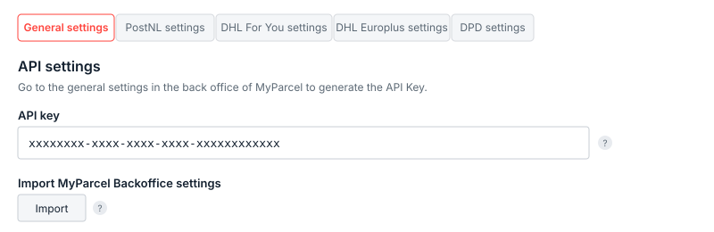
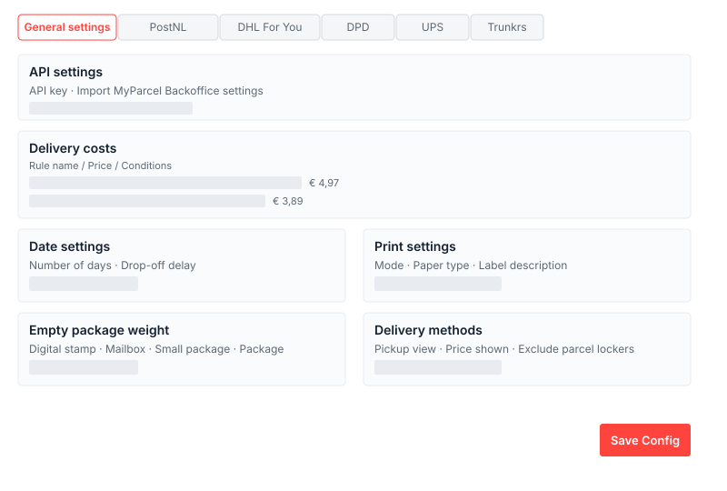
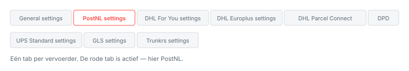
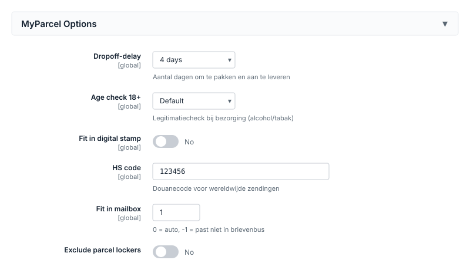
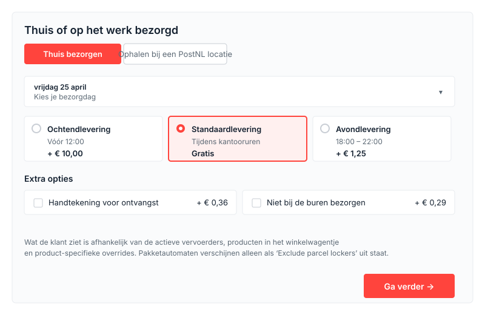

## Voorbereiden in je MyParcel-account
Voordat je de plugin activeert, regel je een paar zaken in je MyParcel-backoffice. Zo voorkom je dat je halverwege moet wisselen.

1. **Account aanmaken.** Meld je (gratis) aan via [myparcel.nl/register](https://www.myparcel.nl/register).
2. **Factuur- en retouradres** instellen in *Shopinstellingen → Algemeen*. Dit adres komt op al je labels.
3. **Vervoerders activeren** in *Shopinstellingen → Vervoerders*. Alleen aangevinkte vervoerders verschijnen in de plugin.
4. **API key genereren** onder *Shopinstellingen → Integratie*. Deze heb je in stap 2 nodig.

## 1 · Plugin installeren
De Magento-plugin wordt via Composer geïnstalleerd. Laat je developer of hostingpartij de volgende commando's uitvoeren op de server:

```
composer require myparcelnl/magento
bin/magento setup:upgrade
bin/magento setup:di:compile
bin/magento cache:flush
```

Gebruik je de **Hyvä-checkout**? Installeer dan ook de compatibility-module:

```
composer require hyva-themes/magento2-hyva-checkout-myparcelnl
bin/magento setup:upgrade
```

Na installatie vind je de plugin onder **Stores → Configuration → MyParcel**.

::: tip Draait de oude PakjeGemak-module nog?
Zet die uit voordat je met deze plugin start. Twee MyParcel-plugins tegelijk leidt tot dubbele labels.
:::

## 2 · Account koppelen (API key)
Open **Stores → Configuration → MyParcel → Settings** en plak je API key bovenaan in het veld *API key*. Klik daarna op **Save Config**.

1. Log in op de MyParcel-backoffice.
2. Ga naar *Shopinstellingen → Integratie*.
3. Kopieer de API key (meestal 40 tekens).
4. Plak deze in Magento en sla op.

Met de knop **Import MyParcel Backoffice settings** haal je je contract- en vervoerderinstellingen in één klik op.

 API-settings bovenaan de Settings-tab. Na een geldige key verschijnen de vervoerder-tabs.

### Werkt het niet?

- Niet op *Save Config* geklikt.
- Spatie meegekopieerd vóór of na de key.
- Key van een andere shop gebruikt — elke MyParcel-shop heeft zijn eigen key.
- Cache niet geleegd: `bin/magento cache:flush`.

## 3 · Overzicht van de plugin
De plugin voegt drie plekken toe aan je Magento-admin:

| Waar? | Wat kun je er? |
| --- | --- |
| **Stores → Configuration → MyParcel** | Alle instellingen — *Version and support* en *Settings* (met één tab per vervoerder). |
| **Sales → Orders → [order] → Print MyParcel Label** | Label aanmaken voor een specifieke bestelling, inclusief aanpassen van pakkettype en opties per order. |
| **Catalog → Products → [product] → MyParcel Options** | Product-specifieke instellingen (dropoff-delay, age check, mailbox-fit, HS-code, etc.) die de globale defaults overschrijven. |

## 4 · Settings · General
De algemene tab regelt de koppeling, de verzendkostenregels, bezorgdagen, printinstellingen en hoe het MyParcel-blok in de checkout er uitziet.

 De General settings tab — eerste stop na installatie.

### API settings

- **API key** — Koppelt je shop aan MyParcel. Zonder geldige key werken de bezorgopties niet.
- **Import MyParcel Backoffice settings** — Haalt je actuele contract- en vervoerderinstellingen op uit MyParcel.

### Delivery costs

Hier definieer je welke verzendprijs klanten in de checkout zien. Elke regel bestaat uit een *Rule name*, een *Price* en één of meer condities (gewicht, pakkettype, land). Je kunt bijvoorbeeld een regel *"Brievenbuspakje binnen Nederland < 12kg"* met prijs €4,97 aanmaken.

- **Show or hide JSON textarea** — geavanceerde weergave voor wie regels als JSON wil bewerken.
- **Use Free Shipping** — respecteer Magento's gratis-verzending-regels.

### Date settings

- **Number of days** — Het aantal dagen vooruit dat klanten een bezorgdag kunnen kiezen. Standaard 7.
- **Drop-off delay** — Hoeveel werkdagen je nodig hebt tussen bestelling en aanleveren. Zet op 1 als je bestellingen pas de volgende dag verwerkt.

### Print settings

- **Mode** — Directe verzending of eerst als concept in de MyParcel backoffice.
- **Paper type** — A4 (standaard printer) of A6 (labelprinter).
- **Label description** — Tekst op het label, met variabelen zoals `%order_nr%`.
- **Country of origin** — Herkomstland voor internationale zendingen. Standaard NL.
- **Create Concept** — Maak labels eerst als concept zodat je nog kunt wijzigen voordat ze definitief worden.
- **Return in the box** — Voegt automatisch een retourlabel bij.
- **I use the following weight type** — Gram of kilogram — kies de eenheid waarin je in Magento gewichten invoert.

### Empty package weight

Elk pakkettype heeft een leeg-gewicht; MyParcel telt dit op bij het productgewicht.

| Pakkettype | Typisch leeg-gewicht |
| --- | --- |
| Package (bruine doos) | 200 – 400 g |
| Small package | 100 – 200 g |
| Mailbox (brievenbuspakje) | 50 – 100 g |
| Digital stamp | 10 – 30 g |

### Delivery methods

- **Show details in summary** — Toont de gekozen bezorgoptie in het besteloverzicht van de klant.
- **Preferred pickup locations view** — Lijst of kaart als standaardweergave van afhaalpunten.
- **Switching the view is allowed** — Laat klanten zelf schakelen tussen lijst en kaart.
- **Price shown in delivery options** — Laat de meerprijs per bezorgoptie zien in de checkout.
- **Exclude parcel lockers** — Verberg pakketautomaten. Zet aan als je pakketten te groot zijn voor de automaten.

## 5 · Settings · Vervoerders
Per vervoerder een eigen tab. Welke tabs zichtbaar zijn hangt af van wat in je MyParcel-contract staat. Hieronder loop ik **PostNL** als voorbeeld door — DHL For You, DHL Europlus, DHL Parcel Connect, DPD, UPS, GLS en Trunkrs volgen dezelfde opbouw (met elk eigen specifieke opties).

 De negen tabs boven in de Settings-sectie — één per vervoerder.

### PostNL settings

#### Bezorgtitels

De teksten die je klant in de checkout ziet. Laat ze op standaard staan tenzij je eigen bewoordingen wilt gebruiken.

- **Delivery title** — kop boven het PostNL-blok. Standaard: *Thuis of op het werk bezorgd*.
- **Standard / Signature on receipt / Receipt code / Home address only / Priority / Morning / Evening / Mailbox / Digital stamp / Pickup title** — tekst per bezorgoptie.

#### Drop-off days & Cut-off times

- **Drop-off days** — Vink de dagen aan waarop je aanlevert bij PostNL.
- **Cut-off time (per dag)** — Tot welk tijdstip een bestelling nog dezelfde dag meegaat. Standaard 15:30.

#### Default shipping options

Pas opties automatisch toe boven een drempelprijs. Gebruik dit als je bijvoorbeeld bij bestellingen boven €250 altijd een handtekening wilt.

- **Automate 'Signature on receipt' / From price**
- **Automate 'Collect package' / From price**
- **Automate 'Home address only' / From price**
- **Automate 'Larger than 100 × 70 × 58 cm' / From price**
- **Automate 'Age check 18+'**

#### Verzekering

- **Insure orders from (€)** — drempel waarboven automatisch verzekerd.
- **Insure orders up to** (NL) / **up to (BE)** / **up to (EU)** / **up to (ROW)** — maximumdekking per regio.
- **Insure orders for percentage** — verzeker een percentage van de orderwaarde (bijv. 100%).

#### Digital stamp settings

- **Automate digital stamp** — Verzend automatisch als digitale postzegel bij lichte, platte producten.
- **Default weight** — Standaardgewicht voor digitale-postzegelzendingen.

#### Mailbox settings

- **Automate mailbox** — Verzend automatisch als brievenbuspakje als gewicht en afmetingen passen.
- **Mailbox weight** — Maximumgewicht voor brievenbuspakje (standaard 2000 g).
- **Priority delivery (Prio 24 uur)** + **Priority delivery fee**.
- **International mailbox** — Brievenbuspakjes naar het buitenland (indien contract dit dekt).

#### Small Package settings

- **Automate Small Package** — Verzend lichte pakketten als "pakje".
- **Small Package weight** — Drempelgewicht.

#### Bezorgmomenten

- **Morning delivery active / fee** — PostNL ochtendlevering + meerprijs.
- **Evening delivery active / fee** — Avondlevering + meerprijs.
- **Pickup active / fee** — Ophalen bij een PostNL-locatie (afhaalpunt of pakketautomaat).

#### Delivery settings

- **Delivery enabled** — PostNL master-toggle.
- **Signature on receipt / fee** — Handtekening bij bezorging + meerprijs.
- **Home address only / fee** — Niet bij de buren + meerprijs.
- **Saturday delivery / fee** — Zaterdaglevering.

### Andere vervoerders — verschillen in het kort

| Vervoerder | Bijzonderheden |
| --- | --- |
| **DHL For You** | Brievenbuspakjes ondersteund. Afhalen bij DHL-servicepoint. Geen ochtend/avondlevering. |
| **DHL Europlus** | Zakelijke EU-zendingen. Verzekering per regio (Local/BE/EU/ROW). |
| **DHL Parcel Connect** | Consumentenzendingen binnen Europa. Pickup mogelijk. |
| **DPD** | NL pakket + brievenbuspakje (sinds v4.15). Afhalen bij DPD ParcelShop. |
| **UPS Standard** | Internationaal zakelijk. Minder opties, 3-dagen bezorgvenster standaard. |
| **GLS** | NL/BE. Signature, Only recipient, Saturday delivery. Pickup bij GLS-punt. |
| **Trunkrs** | Snelle NL-bezorger. Receipt code, Fresh food, Frozen, Priority delivery. |

## 6 · MyParcel-instellingen op productniveau
Op elk product verschijnt een sectie **MyParcel Options** op de edit-pagina. Deze overschrijft de globale defaults uit hoofdstuk 5 per product — handig voor producten met bijzondere eisen (alcohol, verspakketten, producten die niet in een pakketautomaat passen).

 MyParcel Options op de product-edit-pagina.

- **Dropoff-delay** — Extra werkdagen om dit product te pakken en aan te leveren. Gebruik dit voor producten die niet op voorraad liggen (bijv. made-to-order of dropship).
- **Age check 18+** — Verplicht legitimatiecheck bij bezorging. Zet aan voor alcohol, tabak, messen. Kan niet samen met ochtend-/avondlevering.
- **Fit in digital stamp** — Mag dit product als digitale postzegel (plat, licht)?
- **HS code** — Douanecode voor wereldwijde zendingen. Zoek op [tarief.douane.nl](https://tarief.douane.nl).
- **Fit in mailbox** — Hoeveel stuks passen in één brievenbuspakje? Gebruik `0` voor "automatisch op basis van gewicht", `-1` voor "past niet in brievenbus".
- **Disable delivery options** — Verbergt het MyParcel-bezorgoptieblok volledig als dit product in het mandje ligt (bijv. digitale producten, cadeaubonnen).
- **Exclude parcel lockers** — Verbergt pakketautomaten als afhaalpunt voor dit product. Gebruik dit voor producten die niet door een automaat-loket passen.

## 7 · Wat je klanten in de checkout zien
Zodra de klant een bezorgadres invult, verschijnt het MyParcel-blok met bezorgopties. Welke opties er staan hangt af van: de actieve vervoerders, de producten in het winkelwagentje en de product-specifieke overrides uit hoofdstuk 6.

 Het MyParcel-blok in de checkout nadat een bezorgadres is ingevuld.

### Bezorgopties

- **Standaardlevering** — bezorging tijdens kantooruren.
- **Ochtendlevering** — PostNL bezorgt 's ochtends (meerprijs).
- **Avondlevering** — tussen 18:00 en 22:00 (meerprijs).
- **Zaterdaglevering** — alleen zichtbaar als je dit per vervoerder hebt aangezet.
- **Handtekening voor ontvangst** — bezorger laat klant tekenen.
- **Niet bij de buren bezorgen** — alleen aan ontvanger.
- **18+ legitimatiecheck** — verschijnt automatisch als een product dit vereist.
- **Ophalen bij een PostNL-locatie** — lijst of kaart; pakketautomaten tonen afhankelijk van *Exclude parcel lockers*.
- **Brievenbuspakje** — als het winkelwagentje binnen de maatvoering past.
- **Digitale postzegel** — voor platte, lichte zendingen.
- **Prio 24 uur** — prioriteitsbezorging (alleen indien geactiveerd).

## 8 · Dagelijks gebruik
### Label aanmaken vanuit een order

1. Ga naar *Sales → Orders* en open een bestelling.
2. Klik op **Print MyParcel Label**.
3. Pas eventueel pakkettype, verzekering of bezorgopties aan voor deze specifieke order.
4. Klik op **Create**. Het label wordt in de MyParcel-backoffice aangemaakt.

### Bulk-label aanmaken

1. Ga naar *Sales → Orders*.
2. Selecteer meerdere orders met de checkboxes.
3. Kies onder *Actions* de optie **Create & print MyParcel track(s)**.

### Track & Trace in bevestigingsmail

Onder *Stores → Configuration → Sales → Sales Emails → MyParcel Track* zet je de tracking-link in de verzendmail. Zie [FAQ](#faq) voor mail-template-conflicten.

## 9 · Diagnose-checklist
Werkt iets niet zoals verwacht? Loop deze checklist van boven naar onder door.

| Symptoom | Waar te kijken |
| --- | --- |
| Geen bezorgopties in de checkout | (1) API key correct? (2) Minstens één vervoerder op *Delivery enabled = Yes*? (3) Bezorgadres binnen *Ship to Specific Countries*? (4) `bin/magento cache:flush` |
| Cannot select MyParcel na andere shipping method | Upgrade naar v5.5.2; dit is in recente releases verbeterd. Blijft het: MyParcel-support. |
| "This address can not be split" | Postcode-checker-plugin gebruikt? Configureer deze zo dat straat en huisnummer als aparte velden blijven bestaan. |
| "API key invalid" | Spatie in key? Key van juiste shop? Opnieuw kopiëren uit MyParcel-backoffice *Shopinstellingen → Integratie*. |
| "Can't get setting with path" in logs | Vervoerder staat in logging maar niet actief — onschuldige melding. Wordt verholpen in nieuwere releases. |
| Shipping methods blijven laden | Ander shipping method actief met *Show Method if Not Applicable = Yes*? Zet deze optie uit op de andere methoden. |
| Labels kloppen niet met instellingen | Klik *Import MyParcel Backoffice settings* opnieuw. Na upgrade: cache flushen. |

## 10 · Veelgestelde vragen
### Hoe wissel ik het pakkettype voor één specifieke bestelling?

Open de order, klik *Print MyParcel Label* en pas in het popup-venster het pakkettype aan voordat je het label aanmaakt.

### Mag ik meerdere vervoerders tegelijk gebruiken?

Ja, als ze in je MyParcel-contract staan. Activeer elke vervoerder in zijn eigen tab. Klanten zien dan meerdere bezorgblokken in de checkout.

### Ik wil geen pakketautomaten aanbieden. Kan dat?

Ga naar *General settings → Delivery methods → Exclude parcel lockers* en zet die aan. Per product kun je dit ook regelen via het veld *Exclude parcel lockers* op de product-edit-pagina.

### Werkt de plugin met third-party checkouts?

Officieel ondersteund zijn de standaard Magento-checkout en de Hyvä-checkout (met de `hyva-themes/magento2-hyva-checkout-myparcelnl` module). Andere checkouts werken mogelijk niet volledig — test altijd vóór live.

### Hoe rol ik terug naar een oudere versie?

Composer: `composer require myparcelnl/magento:5.4.0` gevolgd door `bin/magento setup:upgrade` en `cache:flush`. Meld de bug op [github.com/myparcelnl/magento/issues](https://github.com/myparcelnl/magento/issues).

### Mijn klanten krijgen geen bezorgopties als ze postcode eerst invullen.

Bekend issue met sommige Postcode-checker plugins. Configureer de checker zo dat straat en huisnummer als aparte velden behouden blijven.

## Bronnen & support
- [github.com/myparcelnl/magento ↗](https://github.com/myparcelnl/magento) — broncode, releases, issues.
- [developer.myparcel.nl — Magento 2 ↗](https://developer.myparcel.nl/nl/documentatie/13.magento2.html) — officiële installatie- en configuratiehandleiding.
- [backoffice.myparcel.nl ↗](https://backoffice.myparcel.nl) — account, API key, facturatie.
- [Contact MyParcel support](../contact.md) — **023 - 30 30 315** · [info@myparcel.nl](mailto:info@myparcel.nl).
