::: tip In short
The MyParcel extension connects your OpenCart 4 shop to MyParcel. Customers pick a delivery moment or pickup point in the checkout, you export orders and print labels from the OpenCart admin, and Track & Trace is generated automatically. No code needed, everything runs from **Extensions** in your admin. The extension comes in two parts: a **Shipping method** (the checkout rate) and a **Module** (all the settings, carriers and label handling).
:::

::: warning Pre-release
The OpenCart 4 extension is currently in pre-release (version `0.2.0`). It requires **OpenCart 4.1.0.3 or newer** and **PHP 8.2 or newer**. Screens and field names may still change between releases.
:::

## Quickstart, your first parcel in 15 minutes
Enough to ship your first real order today. For deeper configuration, see [Looking for…](#looking-for) below.

1. **Get your API key.** Log in to [backoffice.myparcel.com](https://backoffice.myparcel.com), go to *Settings → API access* and copy your API key.
2. **Install the extension.** In OpenCart go to **Extensions → Installer** and upload the `.ocmod.zip` package. Then open **Extensions → Extensions**, install the MyParcel **Module** and the MyParcel **Shipping** method, and refresh the modifications cache when prompted.
3. **Enter the API key.** Open the MyParcel module settings, paste your API key on the **General** tab and click **Save**.
4. **Import your carriers.** On the **Carriers** tab, click **Import carrier configuration**. Your carriers appear with their available services.
5. **Ship an order.** Open **Sales → Orders**, click the green export button on an order, then the label button to download the PDF.

::: tip You're done when you see this
- The MyParcel module status shows **enabled** and **Test API key** confirms the key works
- Your carriers are listed on the Carriers tab
- An exported order shows a barcode and a **Ready** tracking status
:::

## Looking for…
| What do you want to do? | Go to |
| --- | --- |
| First-time setup | [Quickstart](#quickstart-your-first-parcel-in-15-minutes) |
| Understand the two plugin parts | [4 · The two parts explained](#4-the-two-parts-explained) |
| Enter or test the API key | [5 · Settings · General](#5-settings-general) |
| Set label format and fallback size/weight | [6 · Settings · Shipment defaults](#6-settings-shipment-defaults) |
| Turn carriers and services on or off | [7 · Settings · Carriers](#7-settings-carriers) |
| Change what customers see in the checkout | [8 · Settings · Checkout](#8-settings-checkout) |
| Set HS codes for customs | [9 · Settings · Customs](#9-settings-customs) and [10 · Product settings](#10-product-settings) |
| Export orders and print labels | [11 · The orders list](#11-the-orders-list) and [12 · The order detail page](#12-the-order-detail-page) |
| See what a customer experiences | [13 · The checkout experience](#13-the-checkout-experience) |
| Something isn't working | [15 · Something isn't working, diagnostics](#15-something-isnt-working-diagnostics) |

## 1 · Preparing your MyParcel account
Before you start in OpenCart, take care of two things in your MyParcel backoffice:

1. **Copy your API key.** Log in to [backoffice.myparcel.com](https://backoffice.myparcel.com), go to *Settings → API access* and copy the key. Keep it private, it grants access to your account.
2. **Activate your carriers.** Under *Settings → Carriers*, make sure the carriers you want to ship with are active on your account. Only active carriers can be imported into the extension later.

## 2 · Installing the extension
The MyParcel extension is delivered as an OpenCart modification package (`.ocmod.zip`).

1. Download the latest `myparcel.ocmod.zip` from [github.com/myparcelnl/opencart4/releases](https://github.com/myparcelnl/opencart4/releases).
2. In your OpenCart admin go to **Extensions → Installer** and upload the package.
3. Go to **Extensions → Extensions** and choose **Modules** from the *Choose the extension type* dropdown. Find **MyParcel** and click the green install button.
4. On the same page choose **Shipping** from the dropdown. Find **MyParcel** and click install, then open its settings to set the rate, geo zone and status (see [4 · The two parts explained](#4-the-two-parts-explained)).
5. When OpenCart asks, refresh the modifications cache (**Extensions → Modifications → Refresh**).

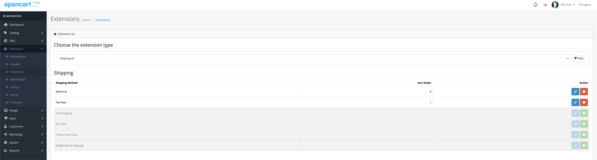

## 3 · Connecting the extension (API key)
Open the MyParcel **Module** (**Extensions → Extensions → Modules → MyParcel**, edit button) and go to the **General** tab.

1. Set **Status** to enabled.
2. Paste your **API key**.
3. Leave **Environment** on *Production* for live shipping. Use *Acceptance (test)* only when you are testing against the MyParcel test environment.
4. Click **Save**, then click **Test API key** to confirm the connection.

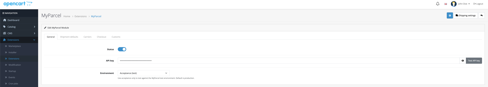

::: warning Not connecting?
The most common causes are an extra space pasted with the key, or the key belonging to the wrong environment (a production key with the Environment set to Acceptance, or the other way around).
:::

## 4 · The two parts explained
Unlike a single all-in-one plugin, MyParcel for OpenCart lives in two places under **Extensions**. You use both.

- **Shipping method** (*Extensions → Extensions → Shipping → MyParcel*) is what your customer picks and pays for in the checkout. Here you set the **Display name** shown to customers, the **Rate**, the **Tax Class**, the **Geo Zone** it applies to, its **Status** and **Sort Order**.
- **Module** (*Extensions → Extensions → Modules → MyParcel*) is the control centre: API key, carriers, checkout behaviour, customs and label defaults. This is where you spend most of your time.

You can jump between the two with the **Shipping settings** and **Module settings** buttons at the top right of each screen.

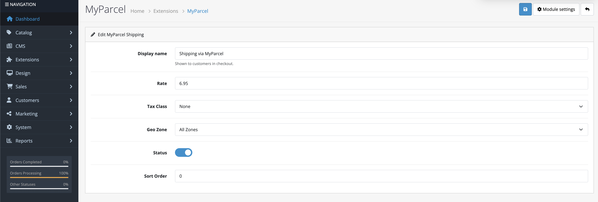

## 5 · Settings · General
On the **Module → General** tab:

| Setting | What it does |
| --- | --- |
| **Status** | Turns the whole MyParcel module on or off. |
| **API key** | The key from your MyParcel backoffice. Use the eye icon to reveal it and **Test API key** to verify it. |
| **Environment** | *Production* for real shipments (the default), or *Acceptance (test)* to test against the MyParcel test environment. |

## 6 · Settings · Shipment defaults
These values are used when an order does not carry its own data. On the **Shipment defaults** tab:

| Setting | What it does | Recommended |
| --- | --- | --- |
| **Default package type** | The package type used when an order has no delivery option chosen at checkout. | Package |
| **Label format** | *A6* prints one label per page. *A4* places labels on a sheet. | A6 |
| **Label position** | Position on the A4 sheet (1 to 4). Ignored for A6. | 1 |
| **Fallback package size** | Length, width and height in cm, used only when the order's products have no usable dimensions. Some carriers (for example Poste Italiane and InPost) require them. | Fill in for parcel-locker carriers |
| **Fallback weight** | Weight in grams, used only when the order's products have no weight. Leave at 0 to use a technical minimum of 1 g. Some carriers require more, such as UPS (at least 50 g). | Leave at 0 unless a carrier needs more |

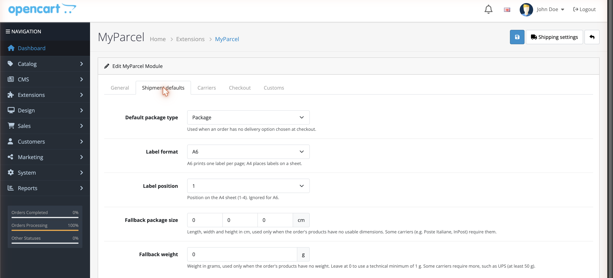

## 7 · Settings · Carriers
The Carriers tab reflects the carriers that are active on your MyParcel account.

1. Click **Import carrier configuration** to fetch your carriers. Save your API key first, capabilities are fetched with the saved key. The screen shows how many carriers were imported and when.
2. Each carrier has an on/off toggle. Turn on the carriers you want to offer.
3. Per carrier, enable the **Services** you want, such as *Standard delivery* and *Pickup locations*. Standard delivery and pickup are enabled by default, premium services must be enabled deliberately.

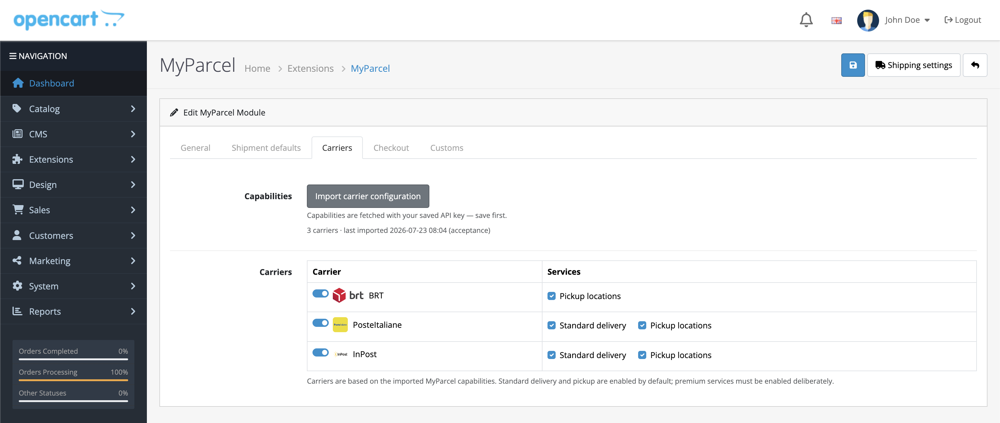

::: tip Which carriers appear?
Only carriers that are active on your MyParcel account can be imported. If a carrier is missing, activate it in the backoffice first, then import again.
:::

## 8 · Settings · Checkout
The Checkout tab controls the MyParcel delivery options widget that customers see. On the **Checkout** tab:

| Setting | What it does |
| --- | --- |
| **Delivery options** | Shows the MyParcel delivery options widget in the checkout. Turn this off to sell without delivery options. |
| **Show delivery date** | Lets the customer pick a delivery date. |
| **Delivery days window** | Number of days ahead the customer can choose a delivery date within (0 = widget default). |
| **Drop-off delay** | Days between the order and hand-off to the carrier (0 = none). Raise it if you need extra time to pack. |
| **Pickup locations view** | Show pickup points as a *List* or a *Map*. |
| **Allow list/map switch** | Lets the customer switch between the list and map view themselves. |
| **Exclude parcel lockers** | Hides automated parcel lockers from the pickup options. |
| **Compact view** | A denser layout for the widget. |
| **Pickup map in pop-up** | Opens the pickup map in a pop-up instead of inline. |

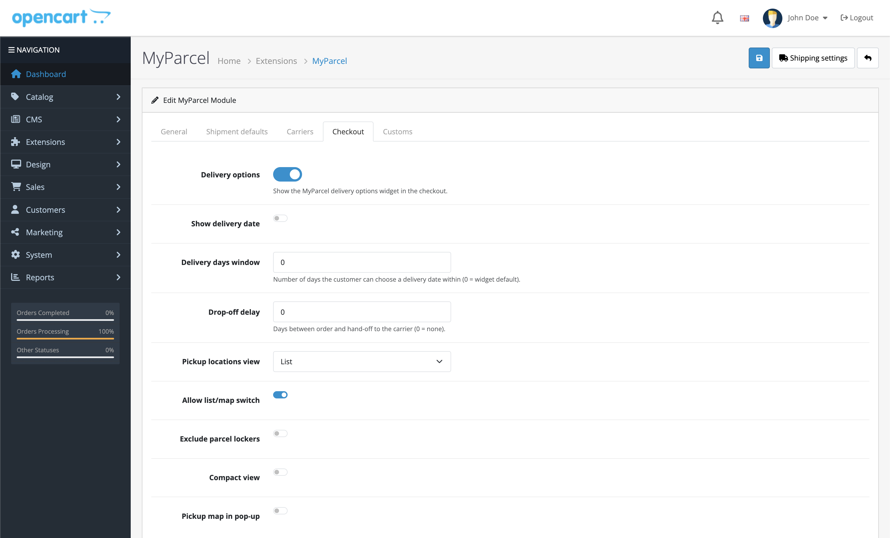

## 9 · Settings · Customs
Needed when you ship outside the EU. On the **Customs** tab:

| Setting | What it does |
| --- | --- |
| **Product customs fields** | Adds **HS code** and **Country of origin** fields to the product editor for customs mapping (see [10 · Product settings](#10-product-settings)). |
| **Default country of origin** | Fallback country of origin used for customs mapping when a product has none. |
| **Default HS code** | Fallback HS (harmonised system) code used for customs mapping when a product has none. |

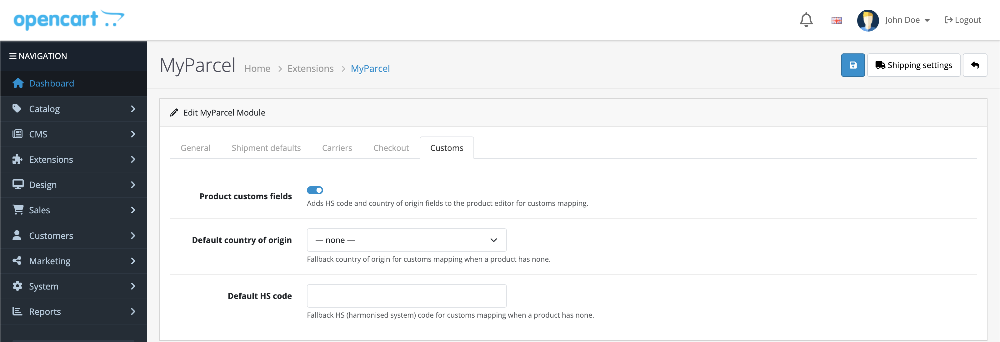

## 10 · Product settings
When **Product customs fields** is enabled, a **MyParcel customs** section appears at the top of a product's **Data** tab (**Catalog → Products →** edit a product **→ Data**).

- **HS code**, the harmonised system code for this product.
- **Country of origin**, where the product was made.

MyParcel also uses the standard OpenCart **Dimensions (L x W x H)** and **Weight** from the same Data tab to calculate the shipment. Fill these in for accurate labels, they fall back to the values from [Shipment defaults](#6-settings-shipment-defaults) when empty.

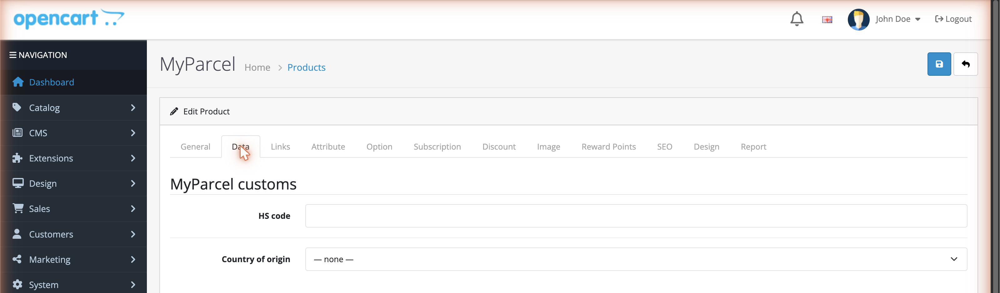

## 11 · The orders list
Open **Sales → Orders**. The MyParcel extension adds action buttons to each order row:

| Button | What it does |
| --- | --- |
| **Green truck** | Export the order to MyParcel and create a shipment (a concept shipment). |
| **Blue PDF** | Download the shipping label for the newest shipment. |
| **Grey pin** | Show the pickup location the customer chose, if any. |
| **Shipment / carrier badge** | Shows how many shipments the order has and the carrier. |
| **Blue eye** | Open the standard OpenCart order detail page. |

The toolbar at the top right offers the same actions in bulk for selected orders.

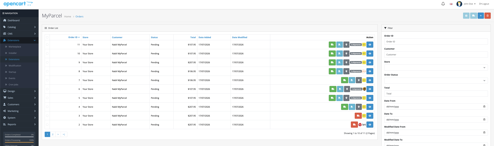

## 12 · The order detail page
Open an order (the blue eye button). At the top you'll find the **MyParcel shipments** panel.

- Every export creates a separate shipment, an order can have several. The toolbar actions use the newest shipment, the actions in the table act on a specific shipment.
- Each row shows the **Shipment** number, the **Barcode**, the **Tracking** status (for example *Not available yet* or *Ready*), the **Created** time and per-shipment actions to **download the label** and **view the pickup location**.

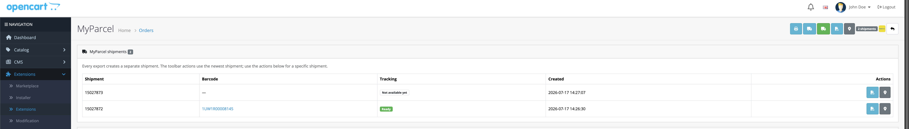

::: tip Multiple parcels for one order
Click the export button again to create an extra, independent shipment for the same order, handy when an order ships in more than one box.
:::

## 13 · The checkout experience
With **Delivery options** enabled, customers see the MyParcel widget in the checkout after they enter their address. They can choose between the carriers and services you enabled on the [Carriers tab](#7-settings-carriers).

Depending on the carrier and your settings, a customer can pick:

- **Standard delivery**, delivery to the address.
- **Priority delivery** or other premium services, when enabled for the carrier.
- A **Pickup location**, a nearby pickup point, shown as a list or on a map. Pickup points can carry an **Eco-friendly** label.

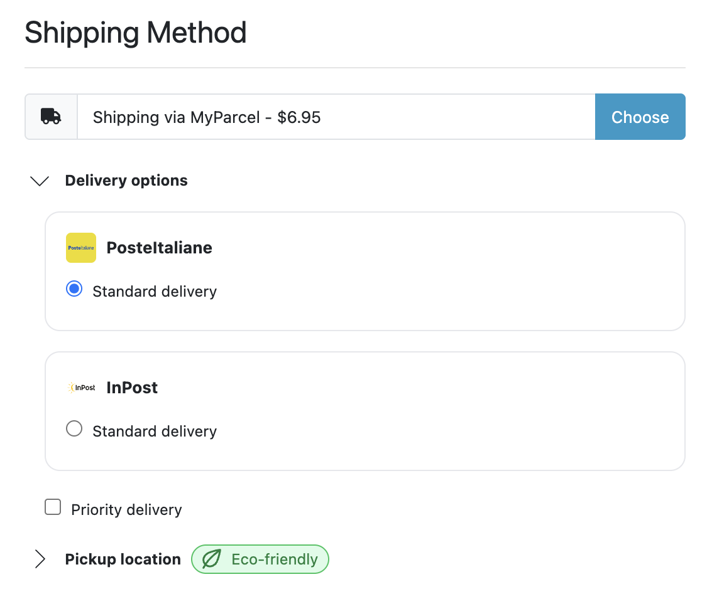

The customer's choice is passed to the order, so when you export it the correct carrier, service and pickup point are already filled in.

## 14 · Daily use
A typical shipping day:

1. Open **Sales → Orders** and filter on new orders.
2. Select the orders you want to ship and use the toolbar export button, or export them one by one with the green truck button.
3. Download the labels (single PDF or in bulk) and print them.
4. Hand the parcels to the carrier. Track & Trace is generated automatically and, where supported, shared with your customer.

## 15 · Something isn't working, diagnostics
| Symptom | Likely cause and fix |
| --- | --- |
| **Test API key fails** | Wrong or mistyped key, or the Environment does not match the key. Re-copy the key from the backoffice and check Production vs Acceptance. |
| **No carriers on the Carriers tab** | Save the API key first, then click **Import carrier configuration**. If a carrier is still missing, activate it in the MyParcel backoffice. |
| **No delivery options in the checkout** | The **Delivery options** toggle is off, the MyParcel **Shipping method** is disabled or outside its Geo Zone, or no carrier/service is enabled. |
| **Export fails for a carrier that needs dimensions** | Some carriers (Poste Italiane, InPost) need a package size. Fill in the product dimensions or a **Fallback package size**. |
| **Label button does nothing** | The shipment has no barcode yet (tracking shows *Not available yet*). Wait a moment and refresh, or re-export. |
| **Settings or buttons look outdated after an update** | Refresh the modifications cache under **Extensions → Modifications → Refresh**. |

## 16 · FAQ
**Do I need both the Module and the Shipping method?**
Yes. The Shipping method is the rate customers pick in the checkout, the Module holds the API key, carriers and label handling. Install and enable both.

**Where do I set the shipping price?**
On the MyParcel **Shipping method** (*Extensions → Extensions → Shipping → MyParcel*), in the **Rate** field.

**Can one order have more than one parcel?**
Yes. Each export creates a separate, independent shipment. Export again to add another parcel to the same order.

**Do I have to enter weights and sizes per product?**
It helps accuracy. When a product has no weight or dimensions, MyParcel uses the **Fallback weight** and **Fallback package size** from [Shipment defaults](#6-settings-shipment-defaults). Some carriers require real dimensions.

**Is my customer's pickup choice kept?**
Yes. The pickup point a customer selects in the checkout is stored on the order and used when you export it.
