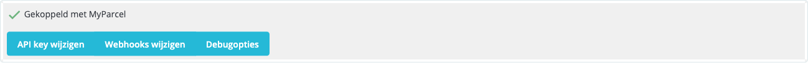
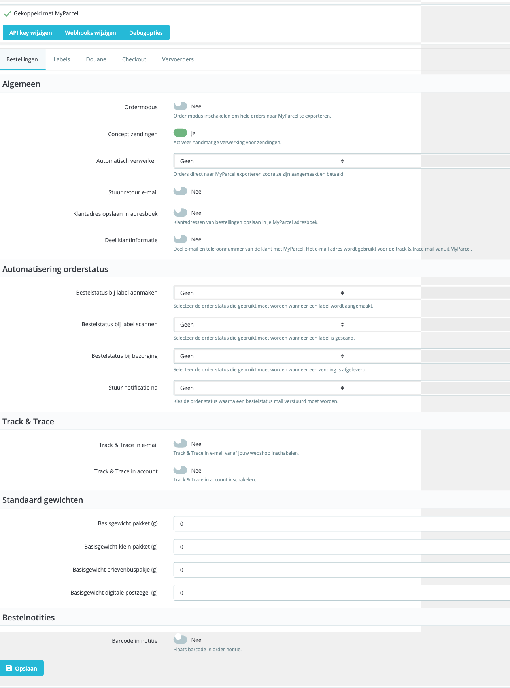
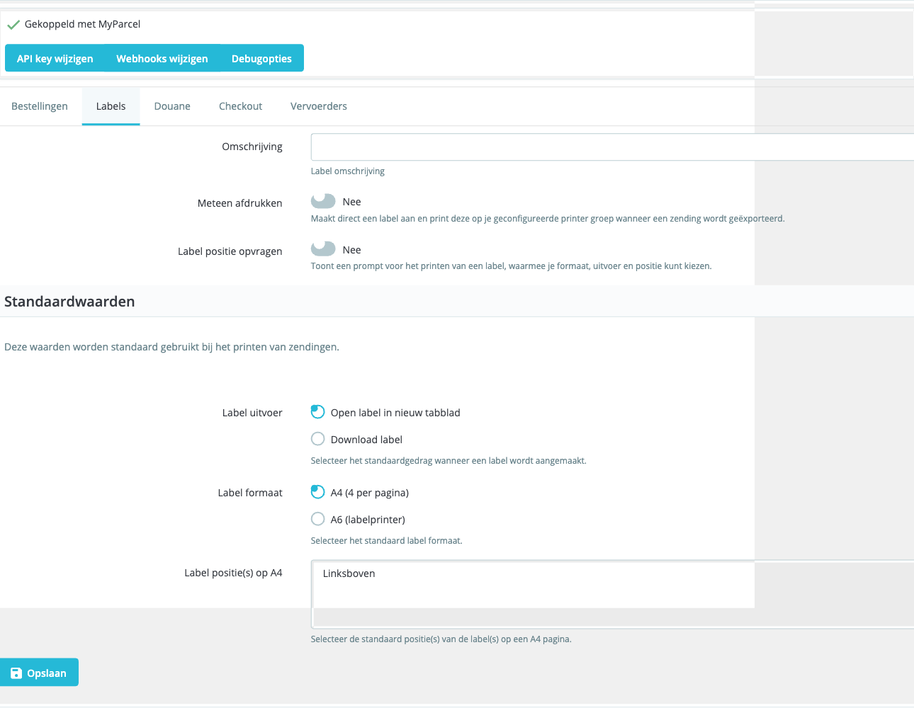
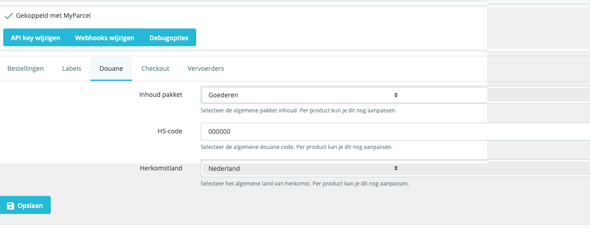
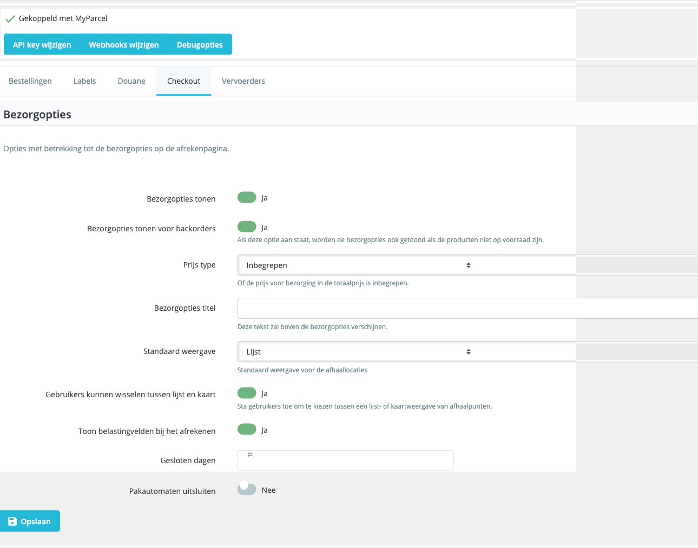
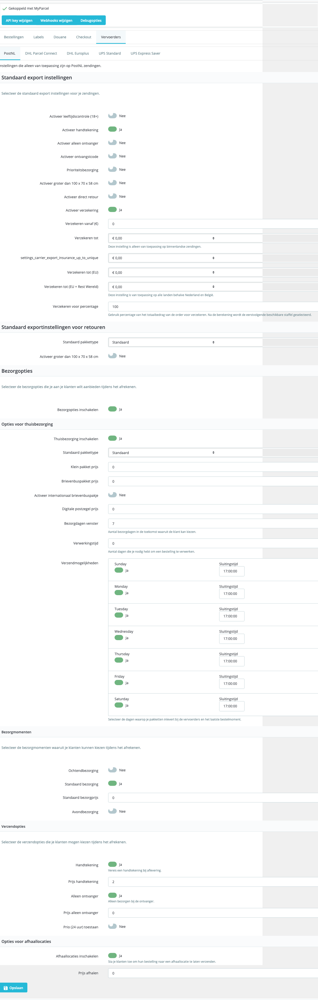
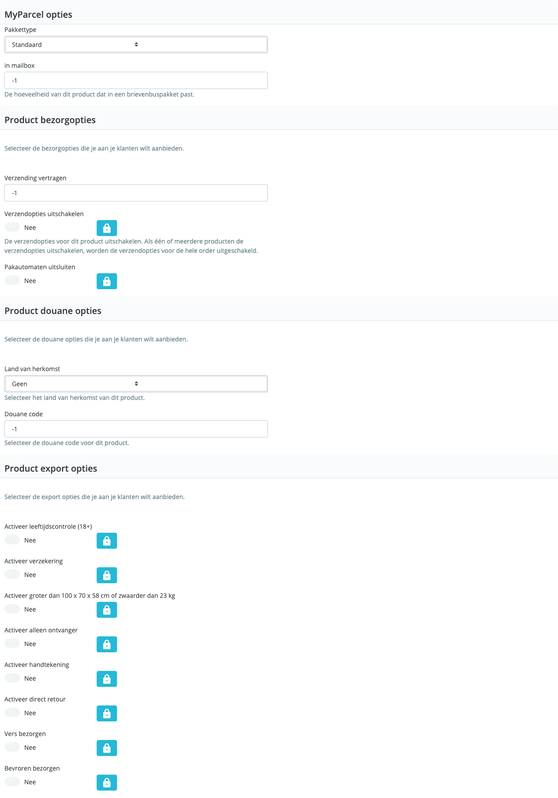

::: tip In short
The MyParcel plugin connects your PrestaShop shop to MyParcel. Customers pick a delivery moment or pickup point in the checkout, you print labels from PrestaShop, and Track & Trace is sent to the customer automatically. No code needed — everything runs from the back office.
:::

## Quickstart — your first parcel in 15 minutes
Enough to ship your first real order today. For deeper configuration, see [Looking for…](#looking-for) below.

1. **Account.** Don't have a MyParcel account yet? Create one at [myparcel.nl/register](https://www.myparcel.nl/register).
2. **Copy the API key.** Log in to [backoffice.myparcel.nl](https://backoffice.myparcel.nl) → *Shop settings → Integration* → copy the API key.
3. **Install the plugin.** Download the release ZIP from [github.com/myparcelnl/prestashop/releases](https://github.com/myparcelnl/prestashop/releases). In PrestaShop: **Modules → Module manager → Upload a module** → drag the ZIP.
4. **Connect the plugin.** After installation, search for `myparcel`, click **Configure**, paste your API key under *Change API key* and click **Save**. The status badge at the top should show *Connected to MyParcel*.
5. **First label.** Open a paid order, go to the MyParcel block at the bottom, click **Export** and then **Print label**. Your PDF rolls out.

::: tip You're done when you see this
- At the top of the plugin: a green *Connected to MyParcel* status
- You can export a test order to MyParcel
- Your PDF label opens (or lands in your downloads folder)
:::

## Looking for…
| What do you want to do? | Go to |
| --- | --- |
| First-time setup | [Quickstart](#quickstart-your-first-parcel-in-15-minutes) |
| Recommended settings for your type of shop | [4 · Which shop profile are you?](#4-which-shop-profile-are-you) |
| Look up a specific setting | [5 · Settings · Orders](#5-settings-orders) to [9 · Settings · Carriers](#9-settings-carriers) |
| A different setting per product | [10 · Product settings](#10-product-settings) |
| What the customer sees in the checkout | [12 · The checkout experience](#12-the-checkout-experience) |
| Process 50+ orders per day | [13 · Daily use](#13-daily-use) |
| Something's not working | [14 · Something's not working — diagnostics](#14-somethings-not-working-diagnostics) |
| Answer to a frequently asked question | [15 · FAQ](#15-faq) |

## 1 · Preparing your MyParcel account
Before you start in PrestaShop, take care of four things in your MyParcel backoffice:

1. **Billing and return address** — *Shop settings → General*. This appears on every label.
2. **Activate carriers** — *Shop settings → Carriers*. Only enabled carriers appear in the plugin later.
3. **Generate an API key** — *Shop settings → Integration*.
4. **Import order information** (optional) — turn on if you want to use [order mode](#5-settings-orders).

## 2 · Installing the plugin
::: warning Version requirements
Plugin 5.0.x works on **PrestaShop 1.7.8 through 8.x** with **PHP 7.4+** (8.1/8.2 recommended). PrestaShop 9 isn't supported yet — see [issue #415](https://github.com/myparcelnl/prestashop/issues/415).
:::

1. Download the release ZIP from [github.com/myparcelnl/prestashop/releases](https://github.com/myparcelnl/prestashop/releases).
2. **Modules → Module manager → Upload a module** → drag the ZIP.
3. Wait for the install to finish, search for `myparcel` and click **Configure**.

::: details Installation fails with "Pdk instance must be set to use facades"
Remove earlier MyParcel modules completely (including database tables via *Module Manager → Uninstall*). Make a database backup first, then manually clear tables that start with `ps_myparcelnl_` and reinstall 5.0.x.
:::

## 3 · Connecting the plugin (API key)
Open **Modules → Module manager → MyParcelNL → Configure**. At the top you'll see three buttons — *Change API key*, *Change webhooks*, *Debug options* — plus the status badge.

 The connection bar appears on every plugin page.

1. Click **Change API key**.
2. Paste the key from your MyParcel backoffice.
3. Click **Save** — within seconds the status switches to *Connected to MyParcel*.

::: warning Not working?
Most common causes: didn't click *Save* · a space copied before/after the key · key from a different shop · shop runs on a different environment (live vs sandbox) than your MyParcel account.
:::

## 4 · Which shop profile are you?
Three typical profiles with recommended settings. Pick one, copy the settings, then fine-tune via [5 · Settings](#5-settings-orders).

### Small — 1–10 orders/day, NL only
| Setting | Recommended | Why |
| --- | --- | --- |
| Order mode | On | Full order to MyParcel — better for pickup points and international later |
| Concept shipments | On | Keeps you in control while you learn |
| Auto-process | None | Click *Export* yourself per order |
| Label format | A4 (4 per page) | No label printer needed |
| Track & Trace in email | On | Customer gets tracking automatically |
| PostNL — *Enable delivery options* | On | Standard NL carrier |
| Insurance — *Insure from €* | 250 | Parcels above €250 are insured automatically |

### Medium — 10–50 orders/day, NL + BE
| Setting | Recommended | Why |
| --- | --- | --- |
| Concept shipments | Off | Faster — labels are final immediately |
| Auto-process | *Processing* (after payment) | No more clicking per order |
| Label format | A6 (label printer) | Brother/Zebra label printer |
| Print immediately | On | Print flow without clicks |
| PostNL + DHL Parcel Connect | Both on | NL and BE covered |
| Insurance | From €250, up to €500 | Scales with order value |

### Mailbox-only — coffee, cards, cosmetics
| Setting | Recommended | Why |
| --- | --- | --- |
| Per product *Package type* | Mailbox parcel | Required — otherwise everything ships as a parcel |
| Per product *in mailbox* | Realistic (e.g. 5) | Number of items per mailbox parcel |
| Default weight *mailbox parcel* | 50–100 g | Don't set too high — otherwise MyParcel falls back to parcel |
| Delivery options | Off | No time slot for mailbox |
| Insurance | Off | Not available for mailbox parcels |

::: tip Other scenarios?
For expensive jewellery, international, or special requirements — see [15 · FAQ](#15-faq) or the shop profiles in the [WooCommerce manual](./woocommerce.html#4-which-shop-profile-are-you) (applicable across platforms).
:::

## 5 · Settings · Orders
The first tab — this is where you set how orders flow through your shop.

### General
- **Order mode** — On: full order (customer data, line items, notes) to MyParcel. Off: only a label. *Recommended on*, provided *Import order information* is also on in your MyParcel account.
- **Concept shipments** — On: shipment stays as concept in MyParcel, you can still adjust. Off: registered with the carrier directly. *On during setup, off once everything runs steadily.*
- **Auto-process** — Which PrestaShop order status triggers an export? *None* / *Pending payment* / *Processing* / *Shipped*. Start with *None*.
- **Send return email** — The customer automatically receives a return link.
- **Save customer address to address book** — Addresses end up in your MyParcel address book.
- **Share customer information** — Email + phone number to MyParcel. Required for Track & Trace email from MyParcel and for international shipments. *Recommended on.*

### Order status automation
Link MyParcel events to PrestaShop statuses — parcel status stays in sync without manual work.

- **Order status when label is created** — often *Shipment in preparation*.
- **Order status when label is scanned** — often *Shipped*.
- **Order status on delivery** — often *Delivered*.
- **Send notification after** — from which status a customer email is sent. Set to *Shipped* so customers receive their Track & Trace immediately.

### Track & Trace
- **Track & Trace in email** — link in PrestaShop order emails. *Recommended on.*
- **Track & Trace in account** — also visible in the customer account on the webshop.

### Default weights
A safety net for products without a weight in the catalogue.

| Package type | Typical empty weight |
| --- | --- |
| Parcel | 200 – 400 g |
| Small package | 100 – 200 g |
| Mailbox parcel | 50 – 100 g |
| Digital stamp | 10 – 30 g |

### Order notes
- **Barcode in note** — Track & Trace barcode added to the order note automatically. Handy for warehouse pickers.
- **Barcode in note title** — heading above the barcode, e.g. *Track & Trace*.

## 6 · Settings · Labels
How shipping labels look and how they are printed.

### Description on the label
- **Description** — free text, e.g. order number or internal reference.

### Print behaviour
- **Print immediately** — label sent straight to your printer group as soon as you export a shipment. *Recommended on* with a label printer.
- **Ask label position** — prompt for format, output and position per label. On for flexibility; off for speed with a fixed format.

### Defaults
- **Label output** — *Open in new tab* (fastest for manual) or *Download label*.
- **Label format** — *A4 (4 per page)* or *A6 (label printer)*.
- **Label position(s) on A4** — multi-select *Top left*/*Top right*/*Bottom left*/*Bottom right* to use sheets fully.

## 7 · Settings · Customs
Required for shipments outside the EU. Can be overridden per product — see [10 · Product settings](#10-product-settings).

- **Package contents** — *Goods* (default for webshops), *Documents*, *Gift*, *Commercial sample*, *Return shipment*.
- **HS code** — harmonised customs code. Look up at [tarief.douane.nl](https://tarief.douane.nl). Examples: `6109.10` (T-shirts), `9503.00` (toys), `3304.99` (make-up).
- **Country of origin** — where the product comes from (not where you store it).

## 8 · Settings · Checkout
What your customer sees in the checkout — or rather doesn't see.

### Delivery options
- **Show delivery options** — main toggle for the MyParcel checkout widget. *Recommended on.*
- **Show delivery options for backorders** — off: for out-of-stock products the plugin hides the delivery options. On if lead times are reliable.
- **Price type** — *Included* (in total price) or *Separate* (shown apart). *Included avoids surprises.*
- **Delivery options title** — heading above the MyParcel block. E.g. *How would you like your parcel?*
- **Show tax fields at checkout** — VAT fields for business orders.
- **Closed days** — date picker for holidays. On these days the checkout hides delivery options.

### Pickup points
- **Default view** — *List* (clearer) or *Map* (more visual).
- **Users can switch between list and map** — *Recommended on.*
- **Exclude parcel lockers** — hide parcel lockers as a delivery option. On if products are too big.

## 9 · Settings · Carriers
The biggest tab. Sub-tabs for every carrier your MyParcel account supports: PostNL, DHL Parcel Connect, DHL Europlus, UPS Standard, UPS Express Saver, plus optionally DHL For You / DPD / Bol Parcel Carrier depending on your contract.

::: tip All carriers are structured the same
I walk through **PostNL** as an example — other carriers follow exactly the same structure, with their own specific options (e.g. DHL has *Tracked*, Trunkrs has *Fresh*).
:::

### Default export settings
The options applied automatically to every new shipment.

- **Enable age check (18+)** — for alcohol/tobacco/knives.
- **Enable signature** — for valuable shipments.
- **Enable only recipient** — no neighbours.
- **Enable receipt code** — extra certainty.
- **Enable larger than 100 × 70 × 58 cm** — flag oversized; carrier surcharge possible.
- **Enable direct return** — automatic return label for clothing/electronics.
- **Enable insurance** — turns insurance on.

### Insurance
- **Insure from (€)** — threshold amount.
- **Insure up to** / **(NL)** / **(EU)** / **(EU + Rest of World)** — maximums per region.
- **Insure for percentage** — e.g. 100% of the order value.

### Default export settings for returns
- **Default package type** — Parcel / Small package / Mailbox parcel / Digital stamp.
- **Enable larger than 100 × 70 × 58 cm** — for oversized returns.

### Delivery options (main toggle)
- **Enable delivery options** — without this toggle the carrier doesn't appear in the checkout at all.

::: details Home delivery options — all fields
- **Enable home delivery** — show home delivery as an option.
- **Default package type** — usually *Parcel*.
- **Small package price**, **Mailbox parcel price**, **Digital stamp price** — shipping prices per type.
- **Enable international mailbox parcel** + **Price** — for mailbox parcels outside NL/BE.
- **Delivery days window** — number of days ahead the customer can pick from.
- **Processing time** — working days you need; counts forward in the window.
- **Shipping options** — tick the days you actually ship.
- **Standard delivery** + price — base option without time slot.
- **Morning delivery** + price — before 12:00.
- **Evening delivery** + price — 18:00–22:00.
- **Monday delivery** + price — for Saturday drop-off.
- **Saturday delivery** + price.
- **Signature** + price — signature with optional surcharge.
- **Only recipient** + price — only-recipient with optional surcharge.
:::

::: details Pickup location options
- **Enable pickup locations** — customers can pick a pickup point.
- **Pickup price** — often lower than home delivery.
:::

::: warning Don't forget to save
Always click **Save** at the bottom of each carrier tab before switching to another tab. Otherwise your changes are lost.
:::

## 10 · Product settings
Open a product, go to **Modules** and click **Configure** at MyParcelNL. Here you override the global [Carriers](#9-settings-carriers) and [Customs](#7-settings-customs) settings per product.

### MyParcel options
- **Package type** — *Default* or force a type for this product.
- **in mailbox** — how many of this product fit in one mailbox parcel. `5` = five fit. `-1` = use default. If a customer orders more than fits, the order automatically becomes a Parcel.

### Product delivery options
- **Delay shipping** — extra working days for made-to-order / dropship products.
- **Disable shipping options** — hides the entire MyParcel delivery widget when this product is in the cart. For gift cards or digital products.
- **Exclude parcel lockers** — exclude parcel lockers for this product.

### Product customs options
- **Country of origin** — overrides [§7](#7-settings-customs). E.g. globally *Netherlands*, dropship product *China*.
- **Customs code** — product-specific HS code.

### Product export options
- **Enable age check (18+)**, **Enable insurance**, **Enable larger than 100 × 70 × 58 cm**, **Enable only recipient**, **Enable signature**, **Enable direct return** — force per product.

::: tip Lock icon next to an option?
That option is only available for specific carriers or contracts. Click the lock for an explanation.
:::

## 11 · The order detail page
Open an individual order. Below the standard PrestaShop details you see a **MyParcel** block with:

- Carrier and package type for this shipment
- Insurance on/off + insured amount
- Selected delivery options (evening delivery, signature, only recipient…)
- Buttons: *Export* · *Print label* · *View Track & Trace*

::: warning Save changes before printing
Adjusted a field? **Save** before printing a label — otherwise MyParcel processes the old values.
:::

## 12 · The checkout experience
The MyParcel checkout widget appears once the delivery address is filled in, as soon as at least one carrier is enabled and PrestaShop carriers are linked to the right shipping zone — see [diagnostics](#14-somethings-not-working-diagnostics).

Above the widget the customer picks a carrier + service (e.g. *PostNL — Super fast delivery — €9.95 incl. VAT*). Below it, **Home or work delivery** unfolds with:

- **Date carousel** with the next available working days.
- **Time slot** offered (e.g. *10:45–13:15*).
- **Extra options** like *Signature (€2.00)* or *Only recipient* with separate surcharges.

Below home delivery sits a second block **Pickup at a pickup location**, marked *Most sustainable*. When opened, an interactive map appears with PostNL/DHL points nearby, with opening hours per day. The customer can switch between *List* and *Map* (if enabled in [§8](#8-settings-checkout)).

## 13 · Daily use

### Workflow 1 — per order
1. Open the order detail page.
2. Check package type and delivery options in the MyParcel block.
3. Click **Export** (concept) → check in MyParcel → click **Print label**.

### Workflow 2 — bulk (10+ orders/day)
1. On **Orders** filter a time window (e.g. *Paid today*).
2. Per order, choose **Export** from the action menu.
3. Process shipments in MyParcel (manually or with *Auto-process* from [§5](#5-settings-orders)).
4. Print labels in bulk via MyParcel.

::: tip Fully automatic shipping
With *Auto-process* on *Processing* and *Concept shipments* off, every paid order is created as a label directly without an in-between step.
:::

### Returns
- **Enable direct return** ([§9](#9-settings-carriers)) or the [product override](#10-product-settings) → automatic return label with every shipment.
- **Send return email** ([§5](#5-settings-orders)) → customer can request a return label themselves.

## 14 · Something's not working — diagnostics
Something not behaving as expected? Run through this table top to bottom — three out of four issues are fixed within 5 minutes.

| Symptom | What to check |
| --- | --- |
| **Checkout: "No carriers available"** | PrestaShop carriers linked to a shipping zone with prices for the delivery address? Go to *Shipping → Carriers*. Only then do MyParcel delivery options appear. |
| **No delivery options visible** | (1) [§8](#8-settings-checkout): *Show delivery options* on? (2) [§9](#9-settings-carriers): at least one carrier with *Enable delivery options* on? |
| **Installation fails — *"Pdk instance must be set to use facades"*** | Remove older MyParcel modules completely (incl. database tables `ps_myparcelnl_*`) and reinstall 5.0.x. |
| **Province error: *"state must be at most 2 characters"*** | NL language pack creates provinces as `NL-LI` (4 characters). In *International → Locations → Provinces*, change the iso codes to 2 characters. See [issue #509](https://github.com/myparcelnl/prestashop/issues/509). |
| **"Invalid API key" while connection works** | Close plugin config completely and reopen. If the issue persists: copy the key again from *backoffice.myparcel.nl → Shop settings → Integration*. |
| **PostNL settings not saved** | Click **Save** at the bottom of every tab before switching. Otherwise check *Debug options* for error messages. |
| **Labels are not created** | (1) [§5](#5-settings-orders): *Concept shipments* off for direct creation. (2) [§6](#6-settings-labels): printer group correct? (3) [§9](#9-settings-carriers): carrier selected and *Enable delivery options* on? |
| **Track & Trace not in email** | (1) *Track & Trace in email* on ([§5](#5-settings-orders)). (2) *Send notification after* on the right status (often *Shipped*). (3) *Share customer information* on — otherwise MyParcel doesn't get the email address. |
| **Everything becomes Parcel, never Mailbox** | (1) [§10](#10-product-settings): *Package type* on *Mailbox parcel* + *in mailbox* on a realistic number. (2) [§5](#5-settings-orders): *Default weight mailbox parcel* not set too high (otherwise MyParcel falls back to parcel). |

## 15 · FAQ

### Does the plugin work on PrestaShop 9?
Not yet. Version 5.0.x supports PrestaShop 1.7.8 through 8.x. PrestaShop 9 support is on the roadmap; follow [issue #415](https://github.com/myparcelnl/prestashop/issues/415).

### Can I use multiple carriers at once?
Yes. Activate per carrier under *Carriers → \[Carrier name\] → Delivery options → Enable delivery options*.

### How do I change the sender address on the label?
The sender address comes from your MyParcel backoffice (*Shop settings → General*), not from PrestaShop.

### Which statuses for "Auto-process"?
*Processing* or *Pending payment* works for most shops. Start at *None* during setup; activate when the workflow runs steadily.

### Customer picks a pickup point — how do I see it on the label?
The pickup point appears as the delivery address on the MyParcel label and in the MyParcel block on the order detail page ([§11](#11-the-order-detail-page)). In some PrestaShop themes the pickup point doesn't show on the PDF invoice — theme issue, not a plugin bug ([issue #390](https://github.com/myparcelnl/prestashop/issues/390)).

### I updated the plugin and now something isn't working
Open the plugin again, check the status badge and run through [§14](#14-somethings-not-working-diagnostics). Update issues are often fixed by signing out/in or clearing the browser cache.

### Does the plugin cost money?
No. The plugin is free. You only pay for the shipments via your MyParcel rate.

## Resources & support
- [github.com/myparcelnl/prestashop ↗](https://github.com/myparcelnl/prestashop) — source code, releases, issues.
- [github.com/myparcelnl/prestashop/releases ↗](https://github.com/myparcelnl/prestashop/releases) — changelog & ZIP downloads.
- [backoffice.myparcel.nl ↗](https://backoffice.myparcel.nl) — account, API key, billing.
- [Contact MyParcel support](../contact.md) — **023 - 30 30 315** · [info@myparcel.nl](mailto:info@myparcel.nl).

This manual is written for plugin version **5.0.x**. In newer versions field names or order may shift slightly; the overall plugin layout stays the same.
