::: tip In short
The MyParcel plugin connects your WooCommerce shop to MyParcel. Customers pick a delivery moment or pickup point in the checkout, you print labels from WordPress, and Track & Trace is sent to the customer automatically. No code needed — everything runs from the WordPress admin.
:::

## Quickstart — your first parcel in 15 minutes
Enough to ship your first real order today. For deeper configuration, see [Looking for…](#looking-for) below.

1. **Account.** Don't have a MyParcel account yet? Create one at [myparcel.nl/register](https://www.myparcel.nl/register).
2. **Copy the API key.** Log in to [backoffice.myparcel.nl](https://backoffice.myparcel.nl) → *Shop settings → Integration* → copy the API key.
3. **Install the plugin.** In WordPress: **Plugins → Add new plugin** → search *MyParcel* → **Install now** → **Activate**.
4. **Connect the plugin.** Open **WooCommerce → MyParcel**, click **Change API key**, paste the key and click **Save**. The status badge should show *Connected to MyParcel*.
5. **First label.** Open a paid order, scroll to the MyParcel block and click **Export and print**. Your PDF label rolls out.

::: tip You're done when you see this
- At the top of the plugin: a green *Connected to MyParcel* status
- You can export a test order to MyParcel
- Your PDF label opens (or lands in your downloads folder)
:::

## Looking for…
| What do you want to do? | Go to |
| --- | --- |
| First-time setup | [Quickstart](#quickstart-your-first-parcel-in-15-minutes) |
| Connect from the backoffice instead of the plugin | [Sales channel via the MyParcel Backoffice](#sales-channel-via-the-myparcel-backoffice-alternative) |
| Recommended settings for your type of shop | [4 · Which shop profile are you?](#4-which-shop-profile-are-you) |
| Look up a specific setting | [5 · Settings · Orders](#5-settings-orders) to [9 · Settings · Carriers](#9-settings-carriers) |
| A different setting per product | [10 · Product settings](#10-product-settings) |
| What the customer sees in the checkout | [13 · The checkout experience](#13-the-checkout-experience) |
| Bulk processing for 50+ orders/day | [14 · Daily use](#14-daily-use) |
| Something's not working | [15 · Something's not working — diagnostics](#15-somethings-not-working-diagnostics) |
| Answer to a frequently asked question | [16 · FAQ](#16-faq) |

## 1 · Preparing your MyParcel account
Before you start in WooCommerce, take care of four things in your MyParcel backoffice:

1. **Billing and return address** — *Shop settings → General*. This appears on every label.
2. **Activate carriers** — *Shop settings → Carriers*. Only enabled carriers appear in the plugin later.
3. **Generate an API key** — *Shop settings → Integration*.
4. **Import order information** (optional) — turn on if you want to use [order mode](#5-settings-orders).

## 2 · Installing the plugin
1. In the WordPress admin: **Plugins → Add new plugin**.
2. Search *MyParcel*.
3. Find *WooCommerce MyParcel* and click **Install now**, then **Activate**.
4. A new menu item **WooCommerce → MyParcel** appears.

::: details Prefer to install manually?
Download the release ZIP from [github.com/myparcelnl/woocommerce/releases](https://github.com/myparcelnl/woocommerce/releases) and upload it via **Plugins → Add new plugin → Upload plugin**.
:::

## Sales channel via the MyParcel Backoffice (alternative)
Instead of connecting with the API key inside the plugin (see [Connecting the plugin](#3-connecting-the-plugin-api-key)), you can connect WooCommerce straight from your MyParcel backoffice as a **Sales channel**. MyParcel then talks to your WooCommerce shop directly over its REST API and imports your orders.

::: tip Which method do I use?
- With the **plugin + API key** (see [Connecting the plugin](#3-connecting-the-plugin-api-key)) the plugin adds delivery options to the WooCommerce checkout and you manage shipping from WordPress.
- With a **Sales channel** (this section) MyParcel pulls your orders from WooCommerce directly and you manage the connection from the backoffice.
:::

### Create the sales channel
1. Log in to [backoffice.myparcel.com](https://backoffice.myparcel.com) and go to **Shop settings → Sales Channels**.
2. Click **Add sales channel** (top right).

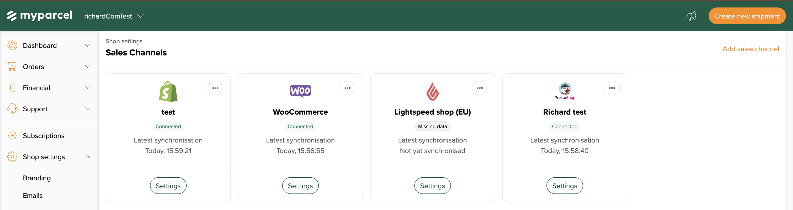

3. Fill in a **Name** that helps you recognise the channel (e.g. *My WooCommerce shop*).
4. Under **Type of sales channel**, choose **WooCommerce**.
5. Fill in your **Webshop URL** — the address of your WooCommerce shop (for example `https://your-shop.com`).
6. Click **Save**. The channel is created and shows a **Missing data** badge until you add the credentials.

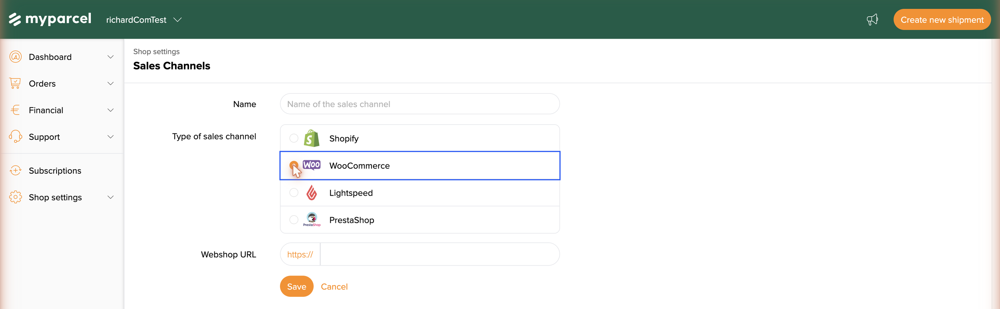

### Authenticate the channel (consumer key & secret)
WooCommerce lets MyParcel read your orders with a **Consumer key** and **Consumer secret** from its REST API.

1. In your **WooCommerce** admin, go to **WooCommerce → Settings → Advanced → REST API** and click **Add key**. Give it a description, set **Permissions** to *Read/Write* and generate the key — WooCommerce shows the Consumer key and Consumer secret only once, so copy them now.
2. Back in the backoffice, open the channel and click **Set credentials**.
3. In the **Replace key and secret** dialog, paste the **Consumer key** and **Consumer secret**.
4. Click **Connect**.

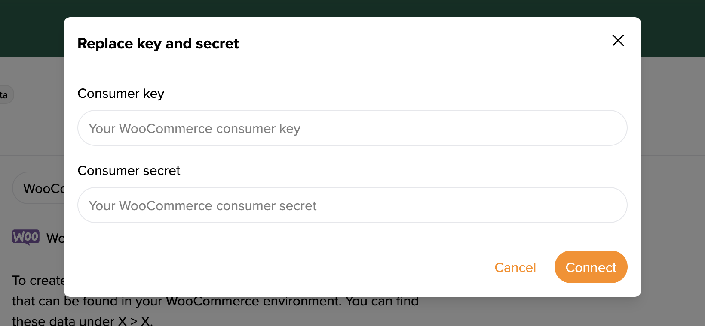

Once connected, the **Missing data** badge disappears, the channel shows **Connected** and MyParcel starts synchronising your WooCommerce orders.

::: warning Not connecting?
Most common causes: an extra space pasted with the key or secret · the REST API key was created with *Read* only instead of *Read/Write* · the **Webshop URL** points to a different shop or is missing `https://`.
:::

## 3 · Connecting the plugin (API key)
Open **WooCommerce → MyParcel**. At the top you'll see three buttons — *Change API key*, *Change webhooks*, *Debug options* — plus the status badge.

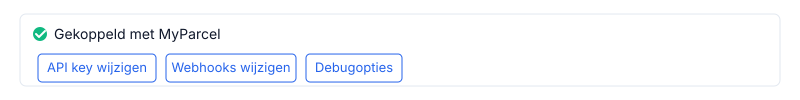 The connection bar appears on every plugin page.

1. Click **Change API key**.
2. Paste the key from your MyParcel backoffice.
3. Click **Save** — within seconds the status switches to *Connected to MyParcel*.

::: warning Not working?
Most common causes: didn't click *Save* · a space copied before/after the key · key from a different shop · plugin runs on a different environment (live vs sandbox) than your MyParcel account.
:::

### What does the plugin do in your WordPress admin?
| Where? | What can you do? |
| --- | --- |
| **WooCommerce → MyParcel** | Settings page with five tabs (Orders, Labels, Customs, Checkout, Carriers). |
| **WooCommerce → Orders** | Extra *MyParcel* column per order + bulk actions for exporting & printing. |
| **Order detail page** | *MyParcel* box to set carrier/package type/insurance per order and create labels. |
| **Product detail page** | *MyParcel* tab in *Product data* for product-specific settings. |

## 4 · Which shop profile are you?
Four typical profiles with recommended settings. Pick one, copy the settings, then fine-tune via [5 · Settings](#5-settings-orders).

### Small — a few orders per day, NL only
| Setting | Recommended | Why |
| --- | --- | --- |
| Order mode | On | Full order to MyParcel |
| Concept shipments | On | Keeps you in control while you learn |
| Auto-process | None | Click *Export* yourself per order |
| Label format | A4 (4 per page) | No label printer needed |
| PostNL only | On | Standard NL carrier |
| Insurance — *Insure from €* | 250 | Parcels above €250 are insured automatically |

### Busy shop — 50+ orders/day
| Setting | Recommended | Why |
| --- | --- | --- |
| Concept shipments | Off | Faster — labels are final immediately |
| Auto-process | *Processing* | No more clicking per order |
| Label format | A6 (Zebra/Brother label printer) | Faster printing |
| Print immediately | On | Print flow without clicks |
| Bulk export | 2–3× per day | From the order list |
| Processing time | 2 days during peaks | Realistic window for the customer |
| PostNL + DHL For You | Both on | Broad coverage |

### Mailbox-only — coffee, cards, cosmetics
| Setting | Recommended | Why |
| --- | --- | --- |
| Shipping class `Mailbox` | Create in *WooCommerce → Shipping → Shipping classes* | Link products to it |
| *Checkout → Allowed shipping methods* | Method → *Mailbox parcel* | One method per package type |
| Show delivery options | Off | No time slot for mailbox |
| Insurance | Off | Not available for mailbox parcels |

### Expensive jewellery / high-value products
| Setting | Recommended | Why |
| --- | --- | --- |
| Default signature | On | The courier asks the customer to sign |
| Default only recipient | On | No neighbours |
| Insurance | From €0, up to €2500, percentage 100% | Full coverage |
| Evening delivery + pickup points | Off | Reduces loss/theft |
| Separate address fields + Address widget | On | Minimises typos |

### Shipping internationally
| Setting | Recommended | Why |
| --- | --- | --- |
| Share customer information | On | Phone is required for customs |
| Customs tab | Fill in completely | HS code, country of origin, *Goods* |
| DHL Parcel Connect | On | For Europe |
| UPS / DHL Express | On | For worldwide |

## 5 · Settings · Orders
The first and most important tab — this is where you set how orders flow through your shop.

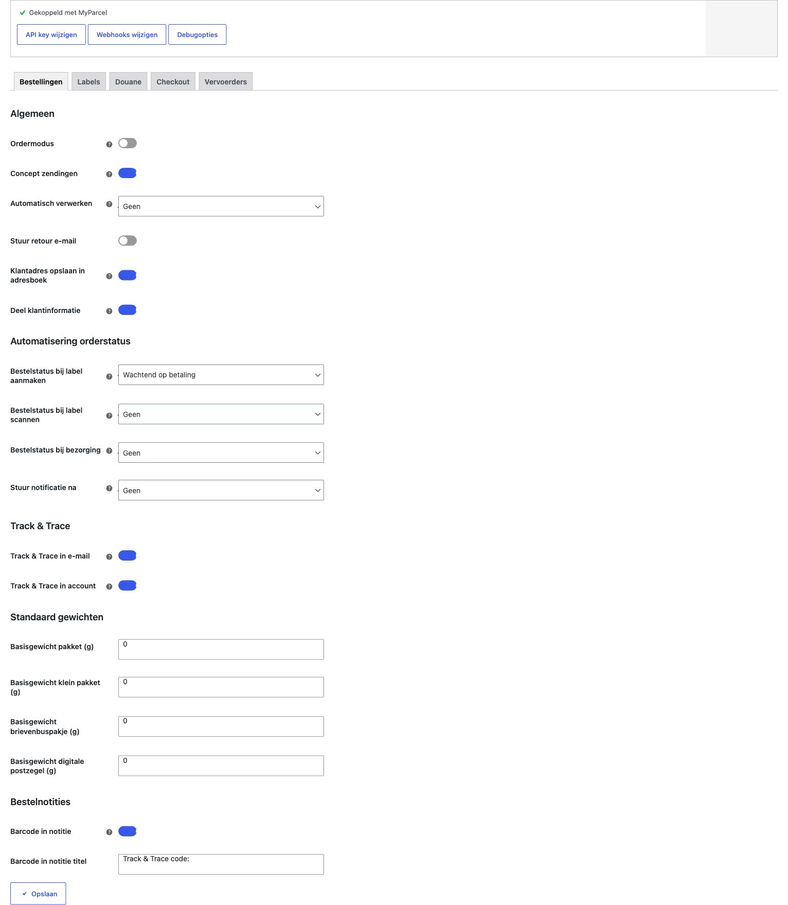

### General
- **Order mode** — On: full order (customer data, line items, notes) to MyParcel. Off: only a label. *Recommended on*, provided *Import order information* is also on in MyParcel.
- **Concept shipments** — On: shipment stays as concept in MyParcel. Off: registered with the carrier directly. *On during setup, off once everything runs.*
- **Auto-process** — Which WooCommerce status triggers an automatic export? *None* / *Pending payment* / *Processing* / *Completed*. Start with *None*.
- **Send return email** — The customer automatically receives a return link. *Recommended for fashion/shoes.*
- **Save customer address to address book** — Addresses end up in your MyParcel address book.
- **Share customer information** — Email + phone to MyParcel. Required for Track & Trace email and mandatory for international. *Recommended on.*

### Order status automation
Let the WooCommerce order status follow the shipping process automatically.

- **Order status when label is created** — typically *Processing*.
- **Order status when label is scanned** — typically *Completed*.
- **Order status on delivery** — *Completed* (if not earlier).
- **Send notification after** — which status transition triggers a WooCommerce email.

### Track & Trace
- **Track & Trace in email** — link in the WooCommerce order confirmation. *Recommended on.*
- **Track & Trace in account** — link on the customer's *My account* page.

### Default weights
Each package type has an empty weight. MyParcel adds it on top of the product weight.

| Package type | Typical empty weight |
| --- | --- |
| Parcel (brown box) | 200 – 400 g |
| Small package | 100 – 200 g |
| Mailbox parcel | 50 – 100 g |
| Digital stamp | 10 – 30 g |

### Order notes
- **Barcode in note** — Track & Trace code as an order note.
- **Barcode in note title** — prefix before the code. Default: `Track & Trace code:`.

## 6 · Settings · Labels
Everything about the label itself — text, format and print behaviour.

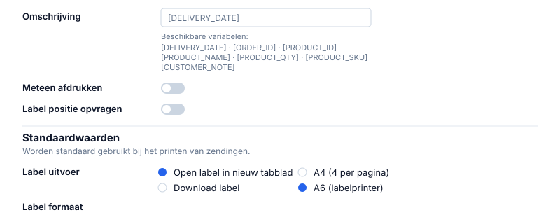

### Description on the label
Variables are filled in automatically when the label is created:

| Variable | Becomes |
| --- | --- |
| `[DELIVERY_DATE]` | Delivery date |
| `[ORDER_ID]` | WooCommerce order number |
| `[PRODUCT_ID]` | Product ID |
| `[PRODUCT_NAME]` | Product name |
| `[PRODUCT_QTY]` | Quantity |
| `[PRODUCT_SKU]` | SKU |
| `[CUSTOMER_NOTE]` | Customer note |

**Examples:** `Order [ORDER_ID]` · `[ORDER_ID] · [PRODUCT_QTY]× [PRODUCT_NAME]`

### Print behaviour
- **Print immediately** — show the PDF directly after export.
- **Ask label position** — ask each time which positions on an A4 sheet to use.

### Defaults
- **Label output** — *Open in new tab* (print manually via the browser) or *Download label*.
- **Label format** — *A4 (4 per page)* for a standard printer, *A6 (label printer)* for Zebra/Brother.

## 7 · Settings · Customs
Required for shipments outside the EU (UK, Switzerland, US, Norway, Canada…). These values appear on the CN22/CN23 form attached to the label.

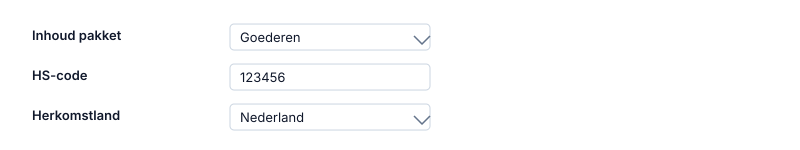

- **Package contents** — *Goods* (default for webshops), *Documents*, *Gift*, *Commercial sample*, *Return shipment*.
- **HS code** — harmonised customs code. Look up at [tarief.douane.nl](https://tarief.douane.nl). Examples: `6109.10` (T-shirts), `9503.00` (toys), `3304.99` (make-up).
- **Country of origin** — where the product comes from (not where you store it).

## 8 · Settings · Checkout
What your customer sees and can choose at checkout.

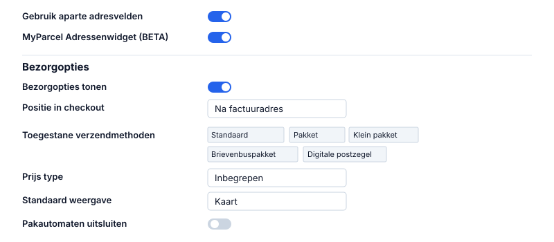

### Address fields
- **Use separate address fields** — splits Street into Street + Number + Suffix. *Recommended on* — prevents undeliverable parcels.
- **MyParcel Address widget (BETA)** — autocomplete for NL postal code + house number.

### Delivery options
- **Show delivery options** — master switch for the checkout widget. *Recommended on.*
- **Show delivery options for backorders** — also show for out-of-stock products.
- **Position in checkout** — *After billing address*, *After shipping address*, or *After order note*.
- **Allowed shipping methods** — link each WooCommerce shipping method to a package type (*Default*, *Parcel*, *Small package*, *Mailbox parcel*, *Digital stamp*, *Unfranked*). *One method = one package type.*
- **Price type** — *Included* (total price) or *Surcharge* (only the difference).
- **Delivery options title** — heading above the widget.
- **Custom CSS** — your own styling.

### Pickup points
- **Default view** — *Map* or *List*.
- **Users can switch between list and map** — *Recommended on.*
- **Exclude parcel lockers** — hide unmanned lockers.
- **Closed days** — days you don't ship.

## 9 · Settings · Carriers
Each carrier has its own sub-tab. Which ones appear depends on what you've activated on your MyParcel account.

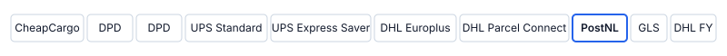

::: tip All carriers are structured the same
Below I walk through **PostNL** as an example — DHL For You, DHL Parcel Connect, DPD, UPS, GLS and Trunkrs work identically (each with their own specific options).
:::

### Default export settings
- **Enable age check (18+)** — required for alcohol/tobacco.
- **Enable signature** — courier asks for a signature.
- **Enable only recipient** — no neighbours.
- **Enable direct return** — undelivered straight back to you.
- **Enable larger than 100 × 70 × 58 cm** — large parcels (surcharge).
- **Enable tracked** / **Enable receipt code** — extra tracking options.

### Insurance
- **Enable insurance** — master toggle.
- **Insure from (€)** — threshold amount.
- **Insure up to** — max coverage NL.
- **Insure up to (EU)** / **(EU + Rest of World)** — maximums per region.
- **Insure for percentage** — e.g. 100% of the order value.

::: details Delivery options — all fields
**Home delivery options**
- **Enable home delivery** — master toggle.
- **Delivery days window** — 1 to 14 days ahead.
- **Processing time** — working days between order and drop-off.
- **Cut-off time** — configurable per day.
- **Shipping options** — tick the days you ship.

**Delivery moments**
- **Standard delivery** + standard delivery price.
- **Morning delivery** + morning delivery price.
- **Evening delivery** + evening delivery price.
- **Monday delivery** + Monday delivery price.

**Shipping options**
- **Only recipient** + surcharge.
- **Signature** + surcharge.
- **Allow Prio (24 hour)** + surcharge — express delivery.

**Pickup location options**
- **Enable pickup locations**.
- **Pickup price** — positive = surcharge, negative = discount.
:::

::: warning Don't forget to save
Always click **Save** at the bottom of each carrier tab before switching to another tab.
:::

## 10 · Product settings
Every product has an extra **MyParcel** tab under *Product data*. Here you override the global settings from [Carriers](#9-settings-carriers) and [Customs](#7-settings-customs) per product. Each field has a 🔒 lock icon — click it open to detach from the global value.

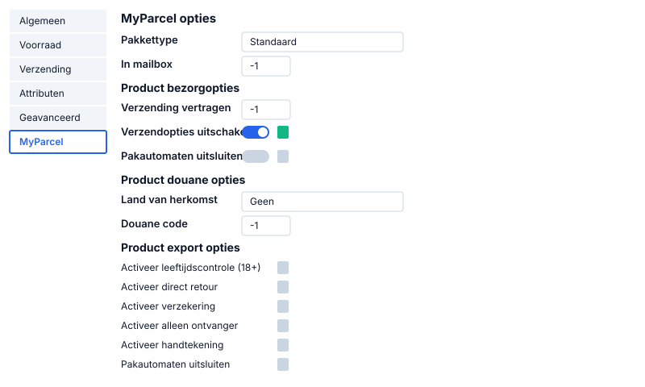

### MyParcel options
- **Package type** — overrides the default package type for this product.
- **In mailbox** — how many of this product fit together in one mailbox parcel. `-1` = not mailbox. Example: stickers where 50 fit in a mailbox parcel → set `50`. If a customer orders 51, the order automatically becomes a Parcel.

### Product delivery options
- **Delay shipping** — extra working days before this product can leave. For made-to-order, external warehouses, etc.
- **Disable shipping options** — hides the entire MyParcel delivery widget at checkout when this product is in the cart. For virtual products or gift cards.
- **Exclude parcel lockers** — hides DHL/PostNL parcel lockers as a pickup point for this product.

### Product customs options
- **Country of origin** — more specific than the global value. E.g. globally *Netherlands*, dropship product *China*.
- **Customs code (HS code)** — product-specific HS code.

### Product export options (all with lock-override)
- **Enable age check (18+)** — e.g. for alcohol.
- **Enable direct return** — undelivered straight back.
- **Enable insurance** — always insure this product.
- **Enable larger than 100 × 70 × 58 cm or heavier than 23 kg** — for oversized.
- **Enable only recipient** / **Enable signature** / **Enable Prio (24 hour)**.
- **Enable tracked** / **Enable receipt code**.
- **Fresh delivery** / **Frozen delivery** — for food shops.

::: tip The lock icon 🔒
Lock closed = product uses the global setting. Lock open = product-specific value is active.
:::

## 11 · The orders list
On **WooCommerce → Orders** the plugin adds a *MyParcel* column and bulk actions. At a glance, you see whether each order has been created and what status it has.

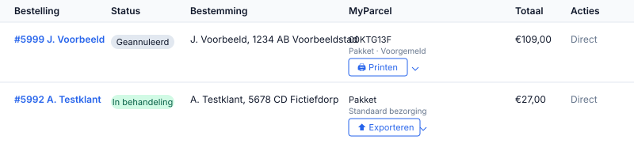

### Bulk actions
Tick orders and pick from the *Bulk actions* dropdown:

- **MyParcel: Export** — creates shipments at MyParcel (concept or direct).
- **MyParcel: Export & Print** — same as above, plus a combined PDF.

::: tip Bulk flow for 50+ orders/day
Process all your daily orders in one click. Combine with *Auto-process* on *Processing* and the plugin runs almost entirely on its own.
:::

## 12 · The order detail page
On the detail page of an individual order a **MyParcel** box appears in which you fine-tune all shipping options for that order.

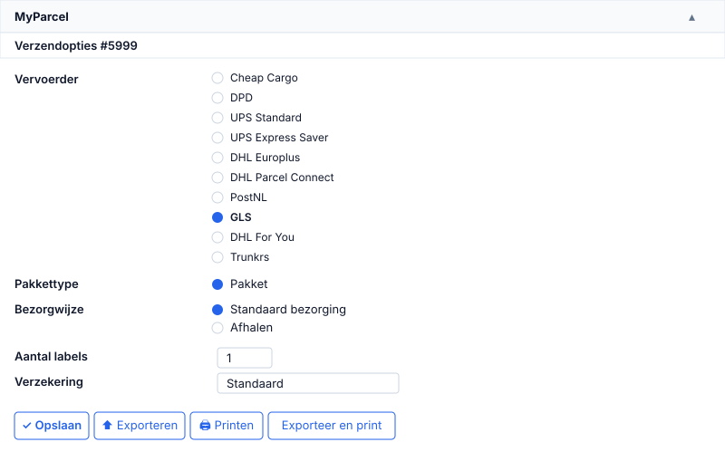

### What's in the box?
- **Carrier** — radio with all available carriers. MyParcel auto-picks the most suitable one; you can override per order.
- **Package type** — override for this order (e.g. mailbox parcel for a small order).
- **Delivery method** — *Standard delivery* or *Pickup* at a pickup point.
- **Number of labels** — split a large order across multiple parcels? Set `2` or `3`.
- **Insurance** — override the global rules for this order.
- **Saturday delivery** / **Signature required** — toggles with lock.

### The four action buttons
- **Save** — stores settings without registering the shipment.
- **Export** — registers the shipment with MyParcel. Generates a barcode.
- **Print** — prints the label of an already exported shipment.
- **Export and print** — everything in one click.

### The Labels table at the bottom of the box
Once an order has been exported, a table with all labels appears below the buttons.

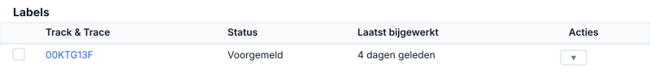

::: tip Actions dropdown per label
*Reprint label* · *Generate return label* · *Cancel shipment* (only possible while the parcel hasn't been scanned by the carrier yet).
:::

## 13 · The checkout experience
What your customer sees once the delivery address is filled in — appears as soon as at least one carrier is enabled and the WooCommerce shipping method is linked to a MyParcel package type ([§8](#8-settings-checkout)).

The customer picks a carrier and delivery moment from a **date carousel**, a **time slot** and optional **extra options** (signature, only recipient). Below home delivery, a **Pickup at a pickup location** block appears with an interactive map, opening hours and a list/map toggle.

## 14 · Daily use

### Workflow 1 — per order
1. Open *WooCommerce → Orders* and click an order.
2. At the bottom: the **MyParcel** box → choose carrier, package type, etc.
3. Click **Export and print**.
4. The PDF opens or downloads — stick the label on the box.

### Workflow 2 — bulk (10+ orders/day)
1. From the order list, tick orders.
2. *Bulk actions* → **MyParcel: Export & Print**.
3. Click *Apply*. One combined PDF with all labels.

::: tip When you're billed
You're only billed once a shipment is actually handed over to the carrier. Digital stamps are the exception — they are charged immediately on export.
:::

### Returns
Three ways, from most to least automated:

1. **Automatic return email** — *Orders → General → Send return email* on. With every export the customer receives a return link.
2. **Manual return label** — in the MyParcel box on the order, choose *Generate return*. Send the label to the customer yourself.
3. **Return portal** — enable in your MyParcel backoffice. The customer goes to a URL, enters the order number, and gets a label instantly.

## 15 · Something's not working — diagnostics
Something not behaving as expected? Run through this table top to bottom — three out of four issues are fixed within 5 minutes.

| Symptom | What to check |
| --- | --- |
| **No status badge or *Not connected*** | (1) Plugin activated? (2) WooCommerce 7.0+ and PHP 8.1+? (*WooCommerce → Status*) (3) Server, LiteSpeed/Redis and browser cache cleared? |
| **Widget doesn't appear at checkout** | (1) [§8](#8-settings-checkout): *Show delivery options* on? (2) Each shipping method linked to a package type? (3) Standard shortcode checkout (`[woocommerce_checkout]`)? (4) JS error in browser console (F12)? |
| **Labels are not created** | (1) Status badge still green? (2) Order has a shipping + customer address? (3) Shipping method present (local pickup doesn't count)? (4) Product weight filled in? (5) Error message on the shipment in the MyParcel backoffice? |
| **Track & Trace not in the email** | (1) [§5](#5-settings-orders): *Track & Trace in email* on? (2) Order already exported? Without a barcode there's no link. (3) Mail sent? (*WooCommerce → Status → Logs*) (4) Customer's spam folder? |
| **Wrong address on the label** | (1) Turn on *Use separate address fields* ([§8](#8-settings-checkout)). (2) Use the *MyParcel Address widget* for NL. (3) The label shows the *Shipping address*, not the billing address. |
| **Everything becomes Parcel, never Mailbox** | (1) [§8](#8-settings-checkout): the mailbox method shouldn't also sit under *Parcel*. (2) One shipping method = one package type. (3) Use shipping classes to link products to package types. |
| **Conflict with another plugin** | Deactivate other shipping/checkout plugins one by one to isolate. Postal-code-checker plugins can split street/number fields that MyParcel expects. |

## 16 · FAQ

### Does the plugin cost money?
No. You only pay for the shipments via MyParcel.

### Can I link two MyParcel accounts to a single WooCommerce shop?
Not out of the box — one API key per shop. For two brands: run two separate WooCommerce shops.

### How do I change the sender address on the label?
That's set in your MyParcel backoffice (*Shop settings → General → Address details*), not in the plugin. Changes apply immediately.

### Which statuses for "Auto-process"?
Mollie/iDEAL? Orders go straight to *Processing*. Bank transfer and manual processing? *Completed*.

### Can I print more than 4 labels per A4?
No — A4 is always 4 per page. Consider an A6 label printer at 20+ orders/day.

### Does it work with Afterpay/Klarna?
Yes — MyParcel is independent from your payment provider.

### Customer picks a pickup point — how do I see it on the label?
The pickup point is sent as the recipient address to MyParcel automatically.

### Evening delivery isn't visible for some addresses
Address-dependent — determined by the carrier, not the plugin.

### I see duplicate DPD tabs
Not a bug — MyParcel distinguishes two DPD contracts. Only enable your active contract.

### Can I have parcels picked up by the carrier?
Yes — under *Carriers → \[carrier\] → Enable carrier pickup*.

### I updated the plugin and now something isn't working
Roll back via [WP Rollback](https://wordpress.org/plugins/wp-rollback/) or the GitHub release. Report the bug at [github.com/myparcelnl/woocommerce/issues](https://github.com/myparcelnl/woocommerce/issues).

## Resources & support
- [github.com/myparcelnl/woocommerce ↗](https://github.com/myparcelnl/woocommerce) — source code, releases, issues.
- [wordpress.org/plugins/woocommerce-myparcel ↗](https://wordpress.org/plugins/woocommerce-myparcel/) — plugin listing.
- [backoffice.myparcel.nl ↗](https://backoffice.myparcel.nl) — account, API key, billing.
- [Contact MyParcel support](../contact.md) — **023 - 30 30 315** · [info@myparcel.nl](mailto:info@myparcel.nl).
